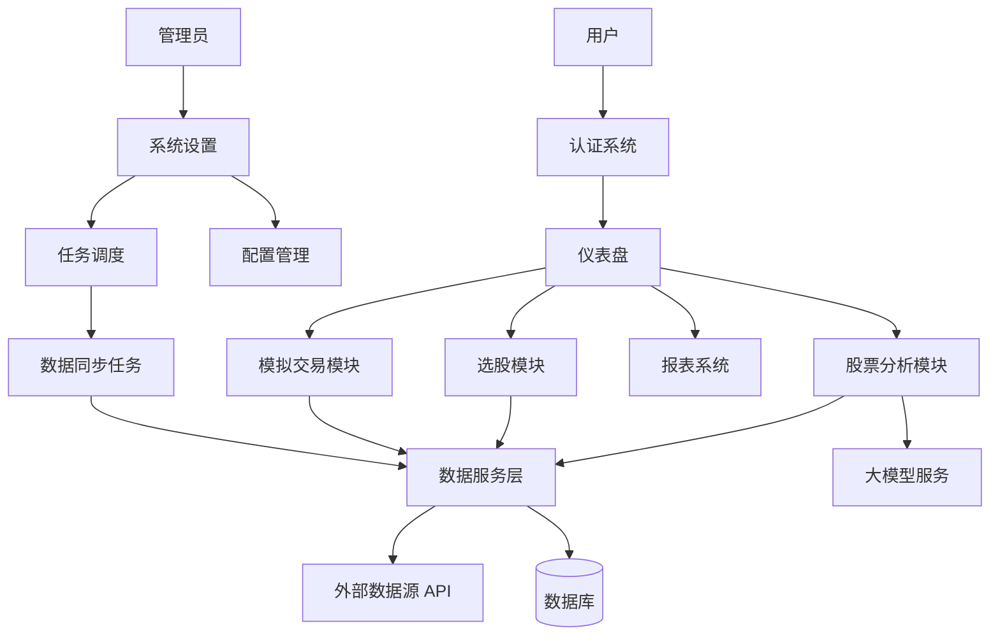

# TradingAgents-CN 系统功能清单

## 1. 功能树状结构图

```
TradingAgents-CN
├── 用户管理 (User Management)
│   ├── 登录认证
│   ├── 个人信息管理
│   └── 权限管理
├── 仪表盘 (Dashboard)
│   ├── 系统概览
│   ├── 数据同步状态
│   └── 快捷入口
├── 股票分析 (Stock Analysis)
│   ├── 单股智能分析
│   ├── 批量智能分析
│   └── 股票行情详情
├── 市场数据 (Market Data)
│   ├── 多源数据同步
│   ├── 实时行情查询 (A股/港股/美股)
│   └── 数据一致性检查
├── 选股系统 (Screening)
│   ├── 条件选股
│   ├── 增强选股
│   └── 自选股管理
├── 报表与统计 (Reports)
│   ├── 分析历史记录
│   ├── 报告详情查看
│   └── Token消耗统计
├── 模拟交易 (Paper Trading)
│   ├── 模拟账户管理
│   ├── 交易下单
│   └── 持仓查询
├── 知识库 (Learning)
│   ├── 投资文章阅读
│   └── 分类浏览
└── 系统设置 (System Settings)
    ├── 基础配置 (LLM/数据源)
    ├── 数据库管理
    ├── 日志管理
    └── 调度任务管理
```

---

## 2. 功能模块详细清单

### 2.1 用户管理 (User Management)

| 功能点 | 功能定位 | 简要用途说明 | 相关数据资源 | 关联功能 |
| :--- | :--- | :--- | :--- | :--- |
| **登录认证** | 核心安全入口 | 提供用户名/密码登录及JWT Token发放，保障系统安全。 | `users` (MongoDB) | 所有受保护的API |
| **个人信息管理** | 用户自助服务 | 查看和修改当前用户的基本信息及偏好设置。 | `users` (MongoDB) | 登录认证 |
| **权限管理** | 系统控制 | 区分普通用户与管理员权限，控制敏感操作（如系统配置）。 | `users` (MongoDB) | 系统设置 |

### 2.2 仪表盘 (Dashboard)

| 功能点 | 功能定位 | 简要用途说明 | 相关数据资源 | 关联功能 |
| :--- | :--- | :--- | :--- | :--- |
| **系统概览** | 信息聚合 | 展示系统整体运行状态、关键指标统计。 | `usage_statistics` | 报表与统计 |
| **数据同步状态** | 监控中心 | 实时展示各数据源（AkShare/Tushare等）的同步进度和健康度。 | `sync_status` | 市场数据 |

### 2.3 股票分析 (Stock Analysis)

| 功能点 | 功能定位 | 简要用途说明 | 相关数据资源 | 关联功能 |
| :--- | :--- | :--- | :--- | :--- |
| **单股智能分析** | 核心业务 | 对指定股票进行全方位AI分析，生成深度报告。 | `analysis_tasks`, `analysis_results`, `stock_data` | 市场数据, 报表与统计 |
| **批量智能分析** | 效率工具 | 支持上传或选择多只股票进行队列化自动分析。 | `analysis_tasks` | 选股系统 |
| **股票行情详情** | 基础信息 | 展示股票的实时价格、K线图及基础财务指标。 | `stock_basic_info`, `daily_prices` | 市场数据 |

### 2.4 市场数据 (Market Data)

| 功能点 | 功能定位 | 简要用途说明 | 相关数据资源 | 关联功能 |
| :--- | :--- | :--- | :--- | :--- |
| **多源数据同步** | 数据基础设施 | 从AkShare, Tushare, Baostock等源同步基础数据和行情。 | `stock_basic_info`, `daily_prices` | 系统设置 (调度) |
| **实时行情查询** | 数据服务 | 提供A股、港股、美股的实时价格查询能力。 | 第三方API (Sina/Tencent/Yahoo) | 股票分析, 模拟交易 |
| **数据一致性检查** | 数据质量保障 | 检查本地数据与远程源的差异，确保数据准确性。 | `data_consistency_logs` | 系统设置 |

### 2.5 选股系统 (Screening)

| 功能点 | 功能定位 | 简要用途说明 | 相关数据资源 | 关联功能 |
| :--- | :--- | :--- | :--- | :--- |
| **条件选股** | 决策辅助 | 基于财务指标（PE, PB等）和技术指标筛选股票。 | `stock_basic_info`, `daily_prices` | 股票分析 |
| **增强选股** | 高级决策 | 利用更复杂的逻辑或AI辅助进行股票筛选。 | `stock_basic_info` | 股票分析 |
| **自选股管理** | 个性化服务 | 添加、删除和管理用户的关注股票列表。 | `favorites` | 股票分析, 仪表盘 |

### 2.6 报表与统计 (Reports)

| 功能点 | 功能定位 | 简要用途说明 | 相关数据资源 | 关联功能 |
| :--- | :--- | :--- | :--- | :--- |
| **分析历史记录** | 档案管理 | 查看过往生成的所有分析报告列表。 | `analysis_results` | 股票分析 |
| **报告详情查看** | 核心产出 | 展示Markdown格式的详细分析报告，支持导出。 | `analysis_results` | 股票分析 |
| **Token消耗统计** | 成本监控 | 统计LLM模型的Token使用情况和成本估算。 | `usage_statistics` | 系统设置 |

### 2.7 模拟交易 (Paper Trading)

| 功能点 | 功能定位 | 简要用途说明 | 相关数据资源 | 关联功能 |
| :--- | :--- | :--- | :--- | :--- |
| **模拟账户管理** | 账户体系 | 管理多币种（CNY/HKD/USD）虚拟资金账户。 | `paper_accounts` | 用户管理 |
| **交易下单** | 交易执行 | 支持买入/卖出操作，自动计算费用和盈亏。 | `paper_orders`, `paper_positions` | 市场数据 |
| **持仓查询** | 资产管理 | 查看当前持仓股票、市值及浮动盈亏。 | `paper_positions` | 市场数据 |

### 2.8 知识库 (Learning)

| 功能点 | 功能定位 | 简要用途说明 | 相关数据资源 | 关联功能 |
| :--- | :--- | :--- | :--- | :--- |
| **投资文章阅读** | 教育培训 | 提供投资相关的文章和教程。 | `articles` (Markdown files) | 仪表盘 |

### 2.9 系统设置 (System Settings)

| 功能点 | 功能定位 | 简要用途说明 | 相关数据资源 | 关联功能 |
| :--- | :--- | :--- | :--- | :--- |
| **基础配置** | 系统核心 | 管理LLM模型参数、数据源API Key等核心配置。 | `system_config`, `providers` | 所有模块 |
| **数据库管理** | 运维工具 | 执行数据库备份、恢复及清理操作。 | MongoDB | 所有模块 |
| **日志管理** | 监控审计 | 查看系统运行日志和用户操作日志。 | `operation_logs`, `system_logs` | 用户管理 |
| **调度任务管理** | 自动化运维 | 管理定时数据同步和分析任务。 | `apscheduler_jobs` | 市场数据 |

---

## 3. 系统级功能交互流程图 (宏观)



## 4. 模块功能关系说明

1.  **数据驱动流程**：
    *   **市场数据模块**是系统的基石，通过**调度任务**定期从外部源同步数据存入数据库。
    *   **选股系统**和**股票分析**直接依赖这些基础数据进行计算和推理。

2.  **分析决策流程**：
    *   用户通过**选股系统**筛选目标股票，或直接输入代码进入**股票分析**。
    *   分析模块调用**数据服务**获取行情，并结合**LLM服务**生成分析报告。
    *   报告生成后存入**报表系统**供查阅，用户可据此在**模拟交易**模块进行验证。

3.  **系统支撑流程**：
    *   **用户管理**贯穿全流程，确保数据隔离和权限控制。
    *   **系统设置**为整个应用提供必要的运行参数（如API Key）和维护工具。

---

## 5. 待补充详情标记

*   [ ] **API接口对应关系**：需进一步梳理每个功能点对应的具体后端API接口。
*   [ ] **前端组件映射**：需补充每个功能点对应的前端Vue组件文件路径。
*   [ ] **数据字典**：需补充数据库表的详细字段定义。
