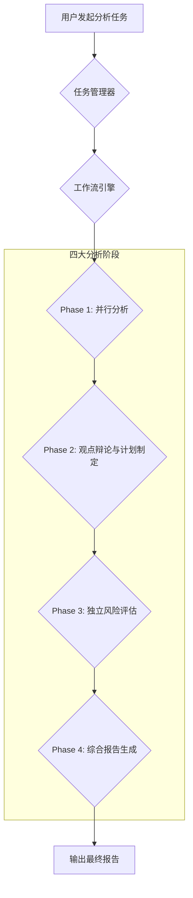
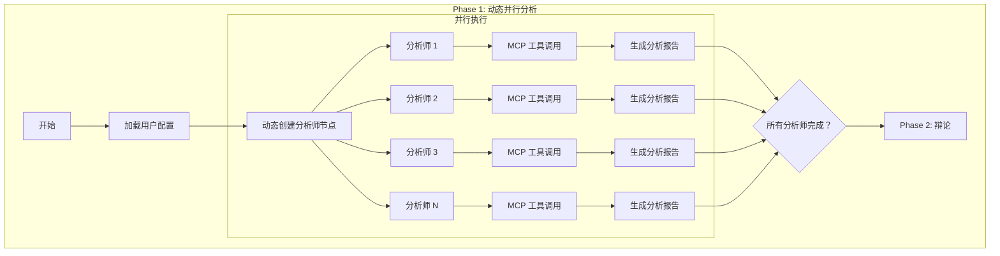
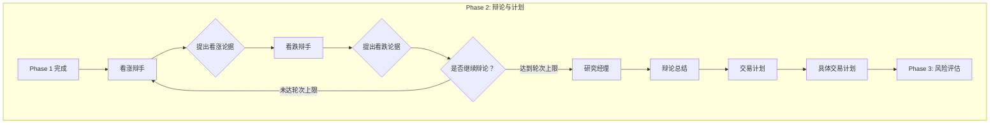
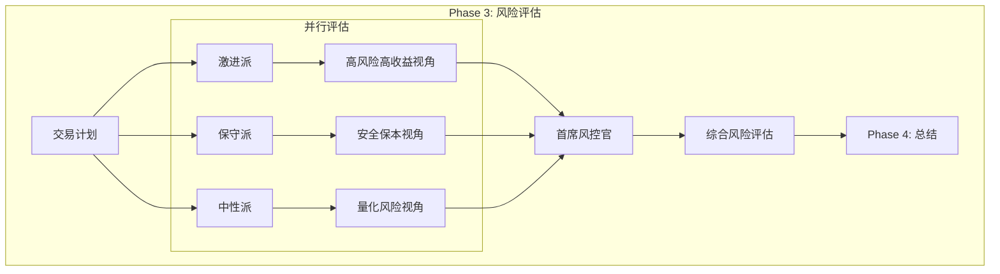
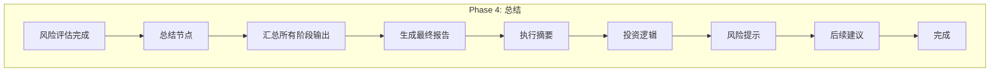

# TradingAgents 模块业务流程

**版本**：v2.0  
**最后更新**：2026-01-10  
**状态**：最新

---

## 文档概述

本文档描述 TradingAgents 智能体分析系统的完整业务流程、四阶段工作流设计、核心组件职责以及与其他模块的集成方式。

**阅读对象**：
- 产品经理：了解业务流程和用户价值
- 开发人员：理解模块架构和交互流程
- 运维人员：了解任务管理和并发控制机制

**相关文档**：
- [任务详情可观测性设计.md](任务详情可观测性设计.md) - 任务执行细节的前端展示方案
- [工具模块设计方案.md](工具模块设计方案.md) - MCP 工具接口规范
- [MCP模块完整文档.md](../MCP/MCP模块完整文档.md) - MCP 连接池与并发控制

## 目录

- [一、核心设计思想](#一核心设计思想)
- [二、整体业务流程](#二整体业务流程)
- [三、四阶段工作流详解](#三四阶段工作流详解)
- [四、状态管理机制](#四状态管理机制)
- [五、AI 模型配置策略](#五ai-模型配置策略)
- [六、MCP 工具集成](#六mcp-工具集成)
- [七、任务管理与生命周期](#七任务管理与生命周期)
- [八、并发控制策略](#八并发控制策略)
- [九、批量任务处理](#九批量任务处理)
- [十、任务恢复机制](#十任务恢复机制)
- [十一、错误处理与容错](#十一错误处理与容错)
- [十二、前端集成](#十二前端集成)
- [十三、性能优化](#十三性能优化)
- [十四、总结](#十四总结)

---

## 一、核心设计思想

### 1.1 业务理念

TradingAgents 模块模拟专业投资分析团队的工作模式，通过结构化的多阶段分析流程，对投资标的（如股票）进行深度研究，最终形成兼具深度、广度和风险考量的投资决策建议。

**核心工作模式**：
- **并行研究**：多个不同领域的分析师同时从各自的专业角度进行初步分析
- **交叉辩论**：设立正反方角色，通过多轮辩论深挖潜在机会和风险
- **多层决策**：设置"经理"角色，对下级辩论进行总结和裁决
- **风险前置**：在形成最终决策前，进行独立的多视角风险评估
- **统一输出**：汇总所有过程信息，生成结构化的最终报告

### 1.2 技术架构

**工作流引擎**：基于 LangGraph StateGraph 实现四阶段协作工作流

**核心特性**：
- **状态机编排**：使用 StateGraph 定义状态转换逻辑
- **自动累积**：采用 Reducer 模式自动累积各阶段输出
- **断点续传**：支持 Checkpoint 持久化，实现任务恢复
- **并行执行**：关键阶段支持智能体并行运行
- **实时推送**：通过 WebSocket 实时推送任务进度

## 二、整体业务流程

### 2.1 流程概览

当用户发起一个分析任务时，系统创建任务实例，并按顺序执行四个主要阶段：



### 2.2 工作流核心机制

**状态管理**：
- 工作流状态作为数据载体，包含所有中间结果和配置
- 支持自动累积模式（列表字段）和覆盖模式（单值字段）
- 状态持久化到 Redis，支持任务恢复

**节点转换**：
- 确定性转换：固定的执行顺序（Phase 1 → Phase 2）
- 条件转换：基于状态决定路由（辩论是否继续）

**并发执行**：
- Phase 1：多个分析师并行执行
- Phase 3：三个风险评估师并行执行
- 其他阶段：串行执行

### 2.3 阶段可选配置

**灵活的阶段控制**：

每个阶段都可以独立启用或禁用：

| 阶段 | 配置项 | 默认值 | 说明 |
|------|--------|--------|------|
| Phase 1 | enable_phase1 | true | 分析师团队分析 |
| Phase 2 | enable_phase2 | true | 研究员辩论与交易计划 |
| Phase 3 | enable_phase3 | true | 风险评估 |
| Phase 4 | enable_phase4 | true | 最终报告生成 |

**配置场景**：
- 仅需快速分析：只启用 Phase 1 + Phase 4
- 深度分析：启用所有阶段
- 自定义组合：根据需求灵活组合

**阶段跳过逻辑**：
- 禁用的阶段会被自动跳过
- 工作流自动路由到下一个启用的阶段
- 保证流程连贯性

---

## 三、四阶段工作流详解

### 3.1 Phase 1: 并行分析

**阶段目标**：从多个维度对目标股票进行初步的信息收集和分析，为后续阶段提供原始素材和基础观点

#### 3.1.1 核心特性：完全动态化

**配置驱动架构**：
- 所有分析师节点都是动态创建的，从用户配置加载
- 智能体的数量、名称、角色定义、工具权限全部来自配置文件
- 用户可以添加、删除、修改 Phase 1 的分析师

**默认分析师配置**（4 个）：
- 市场技术分析师：关注价格走势、技术指标
- 基本面分析师：关注财务数据、估值分析
- 市场情绪分析师：关注资金流向、投资者情绪
- 新闻分析师：关注公司公告、行业新闻

**数据传递原则**：
- Phase 1 只将最终的分析报告传递给后续阶段
- 不传递中间的工具调用过程和思考链

#### 3.1.2 执行流程

**步骤 1：动态创建分析师节点**
- 从用户配置或系统默认配置读取分析师列表
- 通过工厂函数为每个启用的分析师创建节点
- 配置包括：角色定义、工具权限、MCP 服务器列表

**步骤 2：并行执行分析**
- 所有分析师节点并行执行，互不阻塞
- 每个分析师独立调用 MCP 工具获取数据
- 并行度取决于模型并发配置

**步骤 3：MCP 工具调用**
- 分析师根据角色定义，选择合适的工具
- 通过 MCP 协议调用外部数据源（实时行情、财报数据、新闻等）
- 工具调用结果注入到 AI 模型上下文

**步骤 4：生成分析报告**
- AI 模型基于工具返回的数据生成专业分析
- 报告格式为 Markdown，包含分析结论和数据引用
- 记录 Token 消耗和工具调用统计

**步骤 5：报告累积**
- 各节点的报告自动累积到状态的 `analyst_reports` 列表
- 完成计数器递增，用于判断是否所有分析师都完成
- 完成后自动触发 Phase 2

#### 3.1.3 流程图



**完成判断机制**：
- 通过完成计数器判断：`completed_analysts` == `expected_analysts`
- 所有分析师报告累积到状态中
- 自动触发下一阶段（Phase 2）

---

### 3.2 Phase 2: 观点辩论与计划制定

**阶段目标**：通过设置对立观点进行深入辩论，挖掘潜在风险和被忽视的机会，并基于辩论结果形成具体的交易计划

#### 3.2.1 执行流程

**步骤 1：初始化辩论角色**
- 看涨辩手：聚焦积极因素、增长机会、低估信号
- 看跌辩手：聚焦负面因素、估值风险、竞争压力

**步骤 2：多轮辩论循环**
- 看涨辩手和看跌辩手交替发言（默认 2 轮）
- 每轮基于上一轮的观点提出反驳或新论据
- 引用 Phase 1 的分析师报告作为证据支持
- 辩论内容自动累积到状态中

**步骤 3：研究经理裁决**
- 达到预设辩论轮数后，研究经理节点介入
- 综合正反双方的论据，形成平衡客观的总结
- 识别关键争议点和共识点

**步骤 4：交易计划制定**
- 交易员节点基于研究经理的总结制定具体计划
- 明确投资方向（买入/卖出/持有）
- 建议的价格区间和仓位配置
- 止盈止损策略

#### 3.2.2 流程图



**轮次控制机制**：
- 通过路由函数判断当前辩论轮数
- 未达上限：继续辩论（看涨 ↔ 看跌）
- 达到上限：进入研究经理节点

---

### 3.3 Phase 3: 独立风险评估

**阶段目标**：从多个风险视角对拟议的交易计划进行独立评估，确保决策充分考虑了潜在风险

#### 3.3.1 执行流程

**步骤 1：并行风险评估**

三个不同风险偏好的评估师并行执行：

**激进派评估师**：
- 关注高风险高收益机会
- 对波动有较高容忍度
- 强调"机会成本"和"踏空风险"

**保守派评估师**：
- 关注本金安全和下行保护
- 强调"止损"和"风险分散"
- 对亏损零容忍

**中性派评估师**：
- 在风险和收益之间寻找平衡
- 进行量化风险评估（VaR、最大回撤）
- 客观评估风险收益比

**步骤 2：首席风控官总结**
- 综合三方的观点和建议
- 识别关键风险点和风险等级
- 给出整体风险评级（高/中/低）
- 提出具体的风险管理建议

#### 3.3.2 流程图



**完成判断机制**：
- 通过完成检查函数判断：所有三派评估师都完成
- 风险评估报告累积到状态的 `risk_assessments` 列表
- 自动触发首席风控官节点

---

### 3.4 Phase 4: 综合报告生成

**阶段目标**：将所有阶段的输出进行汇总，生成结构化、易读的最终投资报告

#### 3.4.1 执行流程

**步骤 1：信息汇总**

总结节点接收来自：
- Phase 1：所有分析师的专业报告
- Phase 2：辩论记录和交易计划
- Phase 3：三派风险评估和风控总结

**步骤 2：结构化输出**

生成包含以下部分的最终报告：

**执行摘要**：
- 高层级的投资建议
  - STRONG_BUY（强烈买入）
  - BUY（买入）
  - HOLD（持有）
  - SELL（卖出）
  - STRONG_SELL（强烈卖出）
- 建议的买入价格和卖出价格
- 核心投资逻辑概要

**分析过程回顾**：
- 简要回顾四个阶段的关键发现
- 重要的支持论据和反对论据
- 经理和风控官的裁决要点

**投资逻辑**：
- 解释形成最终建议的核心逻辑
- 关键支撑因素和催化剂
- 估值分析和价格目标

**风险提示**：
- 突出关键风险因素
- 下行风险和止损建议
- 需要关注的指标和信号

**后续建议**：
- 建议的操作时机和方式
- 仓位配置建议
- 需要跟踪的事件和数据

**步骤 3：输出状态**

最终状态包含：
- 最终投资建议
- 结构化报告文本（Markdown格式）
- 各阶段的 Token 消耗统计
- 任务状态（completed/failed）

#### 3.4.2 流程图



---

## 四、状态管理机制

### 4.1 状态结构

工作流状态作为数据载体，贯穿整个分析流程，包含输入、中间结果和输出。

**状态更新模式**：
- **覆盖模式**：单值字段（如 `user_id`、`stock_code`），后续更新直接覆盖
- **累积模式**：列表字段（如 `analyst_reports`、`debate_turns`），后续更新追加到列表

### 4.2 核心状态字段

**输入状态（用户提交）**：
- 用户 ID、股票代码、交易日期
- 四个阶段的启用开关（enable_phase1/2/3/4）
- 辩论轮次配置（max_debate_rounds）
- AI 模型配置
- 智能体配置快照

**累积状态（过程数据）**：
- 分析师报告列表（analyst_reports）
- 辩论轮次记录（debate_turns）
- 风险评估列表（risk_assessments）
- Token 消耗记录（token_usage）
- 工具调用记录（tool_calls）
- 错误记录（errors）

**输出状态（最终结果）**：
- 最终投资建议（final_report）
- 推荐类型（STRONG_BUY/BUY/HOLD/SELL/STRONG_SELL）
- 任务状态（status）
- 开始和结束时间

### 4.3 状态持久化

**Checkpointer 机制**：
- 每个节点执行完成后保存状态快照
- 支持任务恢复和断点续传
- Redis 存储（生产环境）或内存存储（开发环境）

**状态恢复**：
- 系统重启后从最后一个检查点恢复
- 支持暂停后继续执行
- 避免重复执行已完成的节点

---

## 五、AI 模型配置策略

### 5.1 双模型架构

**设计理念**：根据不同阶段的计算特性，使用不同的 AI 模型以优化性能和成本

**模型分类**：

| 模型类型 | 使用阶段 | 典型特征 | 选择建议 |
|---------|---------|---------|---------|
| **数据收集模型** | Phase 1 | 频繁调用工具、处理大量数据、快速响应 | 较强且较快的模型 |
| **辩论模型** | Phase 2/3/4 | 复杂推理、多轮对话、深度分析 | 性价比高或推理能力强的模型 |

**配置灵活性**：
- 两个模型可以配置为同一个（简化配置）
- 两个模型可以配置为不同的（优化成本和性能）
- 用户可以根据需求动态调整

### 5.2 模型选择逻辑

**三层优先级**：

**优先级 1：任务参数**
- 用户创建任务时明确指定的模型配置
- 优先级最高，覆盖其他配置

**优先级 2：用户偏好**
- 用户在 AI 模型设置中配置的默认模型
- 适用于用户的所有任务

**优先级 3：系统默认**
- 系统管理员配置的公共默认模型
- 兜底选择，确保任务可以执行

**回退机制**：
- 用户配置的模型不存在或已禁用 → 自动回退到系统默认模型
- 系统默认模型不可用 → 抛出异常，提示管理员配置

**模型验证**：
- 检查模型是否启用
- 检查 API Key 是否有效
- 检查模型是否有权限访问

### 5.3 模型实例缓存

**缓存策略**：
- 进程级别缓存，避免重复创建模型实例
- 缓存键：用户 ID + 模型 ID

**缓存效果**：
- 首次调用：创建新的模型实例
- 后续调用（相同用户 + 相同模型）：直接使用缓存
- 不同模型：创建不同的实例

**缓存管理**：
- 自动缓存：首次调用时自动缓存
- 手动清除：用于测试或内存管理

### 5.4 AI 系统集成流程

```
智能体节点
    ↓
获取模型实例
    ↓
┌─────────────────────────────────────┐
│ 1. 选择模型 ID                       │
│    - Phase 1 → 数据收集模型          │
│    - Phase 2/3/4 → 辩论模型          │
└─────────────────────────────────────┘
    ↓
┌─────────────────────────────────────┐
│ 2. 检查缓存                          │
│    - 缓存命中 → 直接返回              │
│    - 缓存未命中 → 继续下一步           │
└─────────────────────────────────────┘
    ↓
┌─────────────────────────────────────┐
│ 3. 获取模型配置                      │
│    - 从 MongoDB 读取模型配置          │
│    - API Key 自动解密                 │
│    - 权限检查（用户/系统）             │
└─────────────────────────────────────┘
    ↓
┌─────────────────────────────────────┐
│ 4. 验证模型配置                      │
│    - 检查模型是否启用                 │
│    - 检查 API Key 是否有效            │
└─────────────────────────────────────┘
    ↓
┌─────────────────────────────────────┐
│ 5. 创建模型提供者实例                 │
│    - 支持多种平台（OpenAI/智谱/本地）  │
│    - 配置超时、温度等参数              │
└─────────────────────────────────────┘
    ↓
┌─────────────────────────────────────┐
│ 6. 缓存模型实例                       │
│    - 存入进程级缓存                   │
│    - 下次直接复用                     │
└─────────────────────────────────────┘
```

**集成特性**：
- 完全集成项目核心 AI 模型管理系统
- 支持双模型配置，优化性能和成本
- 进程级缓存优化性能
- 完善的错误处理和回退机制
- 模型状态验证（启用状态、API Key 有效性）
- 异步设计，支持高并发

---

## 六、MCP 工具集成

> 📖 **详细文档**：MCP 模块的完整设计请参考 [MCP模块完整文档.md](../MCP/MCP模块完整文档.md)

### 6.1 工具分类

TradingAgents 通过 MCP (Model Context Protocol) 协议与外部数据源集成，支持以下工具类型：

**市场行情工具**：
- 实时报价、历史行情、K线数据
- 技术指标计算、形态识别

**财务数据工具**：
- 财报数据、财务指标、估值数据
- 同行业对比、历史趋势分析

**公司信息工具**：
- 公司资料、公告、股权结构
- 管理层信息、业务结构

**宏观经济工具**：
- 经济指标、政策数据
- 行业趋势、市场环境

### 6.2 工具调用流程

```
智能体节点启动
    ↓
通过 MCP 工具过滤器获取可用工具
    ↓
AI 模型根据任务需求选择合适的工具
    ↓
通过 MCP 协议调用工具（长连接）
    ↓
工具返回结果注入到 AI 模型上下文
    ↓
AI 模型基于工具结果生成分析
```

### 6.3 容错机制

**必需工具（required=true）**：
- 连接失败时中断任务
- 抛出异常，任务终止
- 适用于核心数据源

**可选工具（required=false）**：
- 连接失败时继续执行
- 记录警告日志
- 适用于辅助数据源

**超时控制**：
- 防止工具调用无限等待
- 配置合理的超时时间
- 超时后返回降级结果或跳过

**连接池管理**：
- 任务级长连接复用
- 并发控制（个人 100/用户，公共 10/用户）
- 自动健康检查和重连

### 6.4 工具权限配置

智能体配置中指定可用的 MCP 服务器：

**配置示例**：
- 技术分析师：启用市场行情工具（必需）、技术指标工具（必需）
- 基本面分析师：启用财务数据工具（必需）、公司信息工具（可选）
- 新闻分析师：启用新闻工具（必需）、公告工具（可选）

**工具发现**：
- 自动发现 MCP 服务器提供的所有工具
- 根据智能体配置过滤可用工具
- 将工具列表提供给 AI 模型

### 6.5 MCP 连接生命周期管理

**任务级长连接**：
- 任务开始时建立 MCP 连接
- 任务执行过程中复用连接（多次工具调用共享）
- 任务结束时延迟释放连接

**延迟释放策略**：

| 任务结束状态 | 延迟时间 | 说明 |
|------------|---------|------|
| **正常完成** | 10 秒 | 确保最后的工具调用完成 |
| **失败/取消** | 30 秒 | 留更多时间处理异常情况 |

**延迟释放的原因**：
- 防止连接被其他任务立即复用时出现冲突
- 确保当前任务的所有工具调用都已完成
- 给予足够的清理时间

---

## 七、任务管理与生命周期

### 7.1 任务生命周期

**任务状态转换**：

```
创建 → PENDING (待执行)
       ↓
    申请资源
       ↓
    RUNNING (运行中)
       ↓
    执行完成
       ↓
    ├─ COMPLETED (已完成)
    ├─ FAILED (失败)
    ├─ CANCELLED (已取消)
    ├─ STOPPED (已停止)
    └─ EXPIRED (已过期，24小时未完成)
```

### 7.2 任务管理功能

**任务创建**：
- 单股分析：创建单个任务
- 批量分析：创建批量任务（1-50只股票）
- 任务配置快照：保存执行时的配置

**任务查询**：
- 按状态查询（pending/running/completed/failed）
- 按股票代码查询
- 按推荐结果查询
- 按风险等级查询

**任务取消和停止**：

两种操作的区别：

| 操作 | 适用状态 | 最终状态 | 说明 |
|------|---------|---------|------|
| **取消（Cancel）** | 任何非完成状态 | CANCELLED | 用户主动取消任务，任务不再执行 |
| **停止（Stop）** | 仅运行中状态 | STOPPED | 中止正在运行的任务，保留已完成的部分 |

**资源释放**：
- 取消/停止后设置中断信号
- 延迟 30 秒释放 MCP 连接（确保当前工具调用完成）
- 立即释放模型并发槽位

**任务恢复**：
- 系统重启后自动恢复运行中的任务
- 从最后一个检查点继续执行
- 避免重复执行已完成的阶段

### 7.3 状态持久化

**MongoDB 存储**：
- 所有任务状态变更保存到数据库
- 支持历史查询和审计

**进度推送**：
- 通过 WebSocket 实时推送任务进度
- 推送内容：当前阶段、当前智能体、进度百分比

### 7.4 任务过期处理

**过期规则**：
- 任务创建后 24 小时未完成自动标记为过期
- 定时任务每小时检查一次

**过期处理**：
- 标记任务状态为 EXPIRED
- 释放相关资源（MCP 连接、模型槽位）
- 清理中间数据

### 7.5 报告归档

**归档策略**：
- 自动归档 30 天前的分析报告
- 定时任务每天凌晨执行

**归档处理**：
- 标记任务为归档状态（archived）
- 保留核心信息（推荐结果、价格、Token 消耗）
- 清理详细报告内容（减少存储占用）
- 支持按需恢复归档数据

### 7.6 Token 消耗追踪

**追踪粒度**：
- 按阶段追踪（phase1/phase2/phase3/phase4）
- 按智能体追踪（每个分析师、辩手、评估师）
- 按模型追踪（数据收集模型、辩论模型）

**Token 统计项**：
- 输入 Token 数（prompt_tokens）
- 输出 Token 数（completion_tokens）
- 总 Token 数（total_tokens）
- 记录时间戳

**成本估算**：
- 前端展示预估 Token 成本
- 任务完成后展示实际消耗
- 支持按用户、按模型统计消耗
- 帮助用户优化模型选择

**统计存储**：
- 累积到状态的 `token_usage` 列表
- 持久化到 MongoDB 任务文档
- 支持历史统计和分析

---

## 八、并发控制策略

### 8.1 三层并发架构

TradingAgents 采用三层并发控制架构，精细管理系统资源：

**第一层：模型级并发（max_concurrency）**
- 限制对单个 AI 模型的最大并发请求数
- 避免超出模型服务商的速率限制
- 示例：某模型配置 max_concurrency=40

**第二层：任务级并发（task_concurrency）**
- 定义单个任务消耗的并发槽位数
- 通常为 2（Phase 1 使用数据收集模型 1 个槽位，Phase 2/3/4 使用辩论模型 1 个槽位）
- 可同时运行的任务数 = max_concurrency / task_concurrency
- 示例：max_concurrency=40, task_concurrency=2 → 可同时运行 20 个任务

**第三层：批量任务并发（batch_concurrency）**
- 限制批量任务中同时执行的子任务数
- 控制批量分析的并发度
- 避免一次性创建过多任务占用资源
- 示例：batch_concurrency=5 → 批量任务最多同时运行 5 个子任务

**三层协作示例**：

假设配置为：
- max_concurrency = 40
- task_concurrency = 2
- batch_concurrency = 5

则：
- 理论最大任务并发数 = 40 / 2 = 20 个任务
- 单个批量任务最多同时运行 5 个子任务
- 如果有 4 个批量任务同时运行，总并发 = 4 × 5 = 20 个子任务

### 8.2 并发控制流程

```
用户提交任务
    ↓
申请模型并发槽位
    ↓
┌─────────────────────────────────────┐
│ 槽位可用？                            │
│  ├─ 是 → 立即执行                    │
│  └─ 否 → 进入队列                    │
└─────────────────────────────────────┘
    ↓
任务执行
    ↓
任务完成，释放槽位
    ↓
从队列中取出下一个任务
```

### 8.3 队列管理

**FIFO 队列**：
- 先进先出，公平调度
- 等待超时：5 分钟
- 超时后任务失败

**资源释放**：
- 任务完成：立即释放模型槽位
- MCP 连接：延迟 10 秒释放（任务完成）
- MCP 连接：延迟 30 秒释放（任务失败）

---

## 九、批量任务处理

### 9.1 批量任务模式

**批量创建策略**：
- 用户提交批量任务（1-50只股票）
- 系统根据批量并发数分批创建任务
- 第一批任务立即开始执行
- 后续任务等待前一批完成后自动创建

**动态触发机制**：
- 批量任务的子任务完成时，自动触发下一批任务创建
- 避免一次性创建过多任务占用资源
- 提高系统资源利用率

### 9.2 批量任务管理

**批量任务 ID**：
- 所有子任务关联同一个批量任务 ID（batch_id）
- 支持按批次查询和管理

**批量任务状态**：
- 统计已完成、运行中、待处理的任务数
- 计算批量任务的整体进度
- 支持批量任务的取消操作

**批量任务限制**：
- 单次批量任务最多 50 只股票
- 每个用户同时最多 5 个批量任务
- 避免资源过度占用

---

## 十、任务恢复机制

### 10.1 Checkpointer 持久化

**状态快照**：
- 每个节点执行完成后保存状态到 Redis
- 状态包含：已完成的报告、Token 消耗、工具调用记录

**状态恢复**：
- 系统重启后从最后一个检查点恢复
- 支持断点续传，避免重复执行已完成的节点

### 10.2 任务恢复流程

```
系统重启
    ↓
查询运行中的任务（status=RUNNING）
    ↓
对每个任务：
  ├─ 读取最后一个检查点
  ├─ 验证智能体配置是否仍然有效
  ├─ 恢复任务执行
  └─ 如果配置已变更 → 标记任务为失败
```

**配置验证**：
- 智能体是否被删除
- MCP 服务器是否仍然可用
- AI 模型是否仍然启用

**恢复策略**：
- 配置有效：从检查点继续执行
- 配置无效：标记任务为失败，记录原因

---

## 十一、错误处理与容错

### 11.1 错误处理策略

**节点级错误**：
- 单个分析师节点失败不影响其他节点（容错）
- 错误记录到状态的 `errors` 列表
- 失败的分析师仍然计入完成计数

**阶段级错误**：
- 关键节点失败导致整个任务失败
- 例如：研究经理、交易计划、首席风控官
- 记录错误信息到任务状态

**工具调用错误**：
- 必需工具失败：任务终止
- 可选工具失败：记录警告，继续执行
- 超时控制：防止工具调用无限等待

**工具循环检测**：
- 检测连续重复的工具调用（阈值：3次）
- 自动中断可能的死循环
- 记录循环行为到日志
- 防止 AI 陷入无限工具调用

### 11.2 重试机制

**AI 模型调用重试**：
- 网络错误：自动重试
- 速率限制：等待后重试
- 最大重试次数：3 次

**MCP 工具调用重试**：
- 连接失败：自动重连
- 超时重试：可配置
- 重试间隔：指数退避

### 11.3 日志记录

**任务级别日志**：
- 任务创建、启动、完成、失败
- 记录关键参数和配置

**阶段级别日志**：
- 各阶段开始和结束时间
- 阶段执行耗时统计

**节点级别日志**：
- 节点执行开始和结束
- Token 消耗和工具调用统计

**错误级别日志**：
- 所有异常和堆栈信息
- 错误上下文和相关参数

---

## 十二、智能体配置管理

> **重要说明**：本章节描述已完整实现的智能体配置管理功能，包括 API 接口、数据模型和验证规则。

### 12.1 配置管理概述

**核心理念**：
- 支持公共配置（模板）和个人配置并存
- 用户可以自定义自己的智能体配置
- Phase 1 完全动态，用户可添加/删除/修改分析师智能体
- Phase 2/3/4 结构固定，但提示词可配置

**配置类型**：

| 配置类型 | 说明 | 使用场景 |
|---------|------|---------|
| **公共配置** | 系统默认配置模板 | 所有用户的默认配置 |
| **个人配置** | 用户自定义配置 | 用户个性化需求 |
| **配置快照** | 任务执行时的配置备份 | 确保任务执行过程中配置不变 |

### 12.2 配置 API 接口

#### 12.2.1 用户配置接口

**获取用户配置**
```http
GET /api/trading-agents/agent-config?include_prompts=false

Query Parameters:
  - include_prompts: 是否包含提示词（默认 false）
    - 普通用户：强制为 false，返回精简配置
    - 管理员：可设为 true，返回完整配置

Response:
{
  "id": "config_id",
  "user_id": "user_123",
  "is_public": false,
  "is_customized": false,
  "phase1": {
    "enabled": true,
    "max_rounds": 1,
    "max_concurrency": 3,
    "agents": [...]
  },
  "phase2": {...},
  "phase3": {...},
  "phase4": {...}
}
```

**更新用户配置**
```http
PUT /api/trading-agents/agent-config

Request Body:
{
  "phase1": {...},
  "phase2": {...},
  "phase3": {...},
  "phase4": {...}
}

Response:
{
  "id": "config_id",
  "user_id": "user_123",
  "is_public": false,
  "is_customized": true,  // 更新后标记为已自定义
  ...
}
```

**重置为默认配置**
```http
POST /api/trading-agents/agent-config/reset

Response:
{
  "id": "config_id",
  "user_id": "user_123",
  ...
}
```

**导出配置**
```http
POST /api/trading-agents/agent-config/export

Response:
{
  "config": {
    "phase1": {...},
    "phase2": {...},
    ...
  }
}
```

**导入配置**
```http
POST /api/trading-agents/agent-config/import

Request Body:
{
  "phase1": {...},
  "phase2": {...},
  ...
}

Response: 导入后的配置
```

#### 12.2.2 公共配置接口（管理员专用）

**获取公共配置**
```http
GET /api/trading-agents/agent-config/public?include_prompts=false

仅管理员可访问。
```

**更新公共配置**
```http
PUT /api/trading-agents/agent-config/public

仅管理员可访问。更新公共配置后，未自定义的用户会使用新配置。
```

**恢复默认配置**
```http
POST /api/admin/trading-agents/agent-config/public/restore

仅管理员可访问。从 YAML 文件重新导入默认配置。
```

### 12.3 配置验证规则

#### 12.3.1 Phase 1 验证规则

**允许的修改**：
- ✅ 添加智能体
- ✅ 删除智能体
- ✅ 修改智能体提示词（role_definition）
- ✅ 修改智能体名称（name）
- ✅ 修改工具权限（enabled_mcp_servers, enabled_local_tools）
- ✅ 修改启用状态（enabled）
- ✅ 修改并发数（max_concurrency）

**验证示例**：
```python
# Phase 1 没有限制，用户可自由配置
# 唯一要求：每个智能体必须有 slug 和 name
```

#### 12.3.2 Phase 2/3/4 验证规则

**允许的修改**：
- ✅ 修改提示词（role_definition）
- ✅ 修改启用状态（enabled）
- ✅ 修改最大轮次（max_rounds，仅 Phase 2/3）
- ✅ 修改并发数（concurrency，仅 Phase 2）
- ✅ 修改风险并发数（max_concurrency，仅 Phase 3）

**禁止的修改**：
- ❌ 添加智能体
- ❌ 删除智能体
- ❌ 修改智能体标识符（slug）
- ❌ 修改智能体名称（name）
- ❌ 修改工具权限

**验证逻辑**（伪代码）：
```python
def validate_phase_update(phase_key, new_data, old_doc):
    # phase1 允许所有修改
    if phase_key == "phase1":
        return
    
    # phase2/3/4 只能修改 role_definition
    if phase_key in ["phase2", "phase3", "phase4"]:
        old_agents = old_doc.get(phase_key).get("agents", [])
        new_agents = new_data.agents or []
        
        # 检查智能体数量是否改变
        if len(old_agents) != len(new_agents):
            raise ValueError(f"{phase_key} 不允许添加或删除智能体")
        
        # 检查智能体 slug 和 name 是否改变
        for old_agent, new_agent in zip(old_agents, new_agents):
            if old_agent.get("slug") != new_agent.slug:
                raise ValueError(f"{phase_key} 不允许修改智能体的 slug")
            
            if old_agent.get("name") != new_agent.name:
                raise ValueError(f"{phase_key} 不允许修改智能体的名称")
            
            # 检查是否修改了其他字段
            allowed_fields = {"slug", "name", "role_definition", "enabled"}
            for field in new_agent.model_dump():
                if field not in allowed_fields and field in new_agent:
                    raise ValueError(f"{phase_key} 不允许修改 {field} 字段")
```

### 12.4 配置数据模型

#### 12.4.1 智能体配置

```python
class AgentConfig(BaseModel):
    """单个智能体配置（完整版）"""
    slug: str                           # 唯一标识符
    name: str                           # 显示名称
    role_definition: Optional[str]        # 角色定义（系统提示词）
    when_to_use: str                    # 使用场景说明
    enabled_mcp_servers: List[MCPServerConfig]  # 启用的 MCP 服务器
    enabled_local_tools: List[str]       # 启用的本地工具
    enabled: bool                        # 是否启用
```

#### 12.4.2 MCP 服务器配置

```python
class MCPServerConfig(BaseModel):
    """MCP 服务器配置（支持容错策略）"""
    name: str                          # 服务器名称
    required: bool = Field(default=True)  # 是否必需（必需服务器失败将阻止任务启动）
```

**容错逻辑**：
- **必需服务器**（required=true）：连接失败时中断任务执行
- **可选服务器**（required=false）：连接失败时记录警告，继续执行

### 12.5 配置管理服务

**核心方法**：

| 方法 | 说明 | 参数 |
|------|------|------|
| `get_effective_config(user_id, include_prompts)` | 获取生效配置（个人或公共） | 用户 ID，是否包含提示词 |
| `update_user_config(user_id, request)` | 更新用户配置 | 用户 ID，更新请求 |
| `reset_to_public_config(user_id)` | 重置为公共配置 | 用户 ID |
| `export_config(user_id)` | 导出配置 | 用户 ID |
| `import_config(user_id, config_data)` | 导入配置 | 用户 ID，配置数据 |
| `get_public_config()` | 获取公共配置 | 无（管理员权限） |
| `update_public_config(request, admin_id)` | 更新公共配置 | 更新请求，管理员 ID |
| `restore_public_config()` | 恢复默认配置 | 无（管理员权限） |

### 12.6 配置加载流程

#### 12.6.1 任务创建时的配置加载

```
用户创建任务
    ↓
获取用户生效配置（个人或公共）
    ↓
从配置加载智能体列表
    ↓
Phase 1: 根据配置动态创建分析师节点
    ↓
Phase 2/3/4: 使用配置中的提示词
    ↓
保存配置快照到任务文档
    ↓
执行任务（使用配置快照，确保配置不变）
```

#### 12.6.2 配置优先级

```
任务参数（data_collection_model, debate_model）
    ↓ 覆盖
用户偏好（TradingAgents 设置）
    ↓ 覆盖
系统默认模型
```

### 12.7 配置管理最佳实践

**用户端**：
1. 首次使用时使用默认配置
2. 根据分析需求调整 Phase 1 的分析师组合
3. 定期根据分析结果优化提示词
4. 使用导出/导入功能快速复用配置

**管理员端**：
1. 定期评估公共配置的有效性
2. 根据市场变化调整提示词
3. 优化智能体工具权限配置
4. 定期备份配置（YAML 文件）

---

## 十三、WebSocket 实时推送详细说明

> 📖 **详细文档**：任务详情的前端展示设计请参考 [任务详情可观测性设计.md](任务详情可观测性设计.md)

### 13.1 WebSocket 事件类型

**完整事件列表**：

| 事件名 | 触发时机 | 数据内容 |
|--------|---------|---------|
| `task_created` | 任务创建 | task_id, user_id |
| `task_started` | 任务开始 | task_id, user_id |
| `task_completed` | 任务完成 | task_id, final_report, token_usage |
| `task_failed` | 任务失败 | task_id, error_message |
| `task_cancelled` | 任务取消 | task_id |
| `task_stopped` | 任务停止 | task_id |
| `phase_started` | 阶段开始 | task_id, phase, phase_name |
| `phase_completed` | 阶段完成 | task_id, phase, phase_name |
| `phase_agents` | 阶段智能体列表 | task_id, phase, agents, execution_mode, max_concurrency |
| `concurrent_group_started` | 并发组开始 | task_id, group_id, phase, agents, max_concurrency |
| `concurrent_group_completed` | 并发组完成 | task_id, group_id, phase, total_agents |
| `agent_started` | 智能体开始 | task_id, agent_slug, agent_name |
| `agent_completed` | 智能体完成 | task_id, agent_slug, agent_name, token_usage |
| `agent_failed` | 智能体失败 | task_id, agent_slug, agent_name, error |
| `tool_called` | 工具调用 | task_id, agent_slug, tool_name, tool_input |
| `tool_result` | 工具结果 | task_id, agent_slug, tool_name, success, output, error |
| `tool_disabled` | 工具禁用 | task_id, agent_slug, tool_name, reason |
| `report_generated` | 报告生成 | task_id, agent_slug, content |
| `agent_message` | 智能体消息 | task_id, agent_slug, agent_name, message_type, content |
| `progress_update` | 进度更新 | task_id, progress, message |

### 13.2 WebSocket 连接管理

#### 13.2.1 连接方式

**按需连接**：
- 用户打开任务详情页时建立 WebSocket 连接
- 关闭页面时自动断开连接
- 单用户最多 5 个并发连接

**连接参数**：
```typescript
// 连接 URL
ws://localhost:8000/ws/trading-agents/{task_id}

// 连接时携带认证 token（通过 query 参数）
ws://localhost:8000/ws/trading-agents/{task_id}?token={jwt_token}
```

#### 13.2.2 连接限制

**单用户最大连接数**：5

**超限处理**：
- 超过限制时，自动断开最早的连接
- 新连接优先，确保用户能看到最新任务的进度

### 13.3 事件数据结构

#### 13.3.1 任务事件

```typescript
// task_started
{
  "event_type": "task_started",
  "task_id": "xxx",
  "timestamp": 1234567890,
  "data": {
    "task_id": "xxx",
    "user_id": "user_123",
    "stock_code": "000001",
    "trade_date": "2023-01-01"
  }
}

// task_completed
{
  "event_type": "task_completed",
  "task_id": "xxx",
  "timestamp": 1234567890,
  "data": {
    "task_id": "xxx",
    "final_recommendation": "BUY",
    "buy_price": 10.5,
    "sell_price": 11.5,
    "total_token_usage": {
      "prompt_tokens": 1000,
      "completion_tokens": 500,
      "total_tokens": 1500
    }
  }
}
```

#### 13.3.2 阶段事件

```typescript
// phase_started
{
  "event_type": "phase_started",
  "task_id": "xxx",
  "timestamp": 1234567890,
  "data": {
    "task_id": "xxx",
    "phase": 1,
    "phase_name": "分析师团队"
  }
}

// phase_agents（关键事件，包含并发信息）
{
  "event_type": "phase_agents",
  "task_id": "xxx",
  "timestamp": 1234567890,
  "data": {
    "task_id": "xxx",
    "phase": 1,
    "phase_name": "分析师团队",
    "execution_mode": "concurrent",  // "concurrent" 或 "serial"
    "max_concurrency": 3,
    "concurrent_group": "phase1_group1",  // 并发组 ID
    "agents": [
      {
        "slug": "market_technical",
        "name": "市场技术分析师",
        "position": 1,  // 在并发组中的位置
        "color": "#409EFF"  // 前端用于区分不同智能体
      },
      // ...
    ]
  }
}
```

#### 13.3.3 并发组事件

```typescript
// concurrent_group_started
{
  "event_type": "concurrent_group_started",
  "task_id": "xxx",
  "timestamp": 1234567890,
  "data": {
    "task_id": "xxx",
    "group_id": "phase1_group1",
    "phase": 1,
    "agents": ["market_technical", "fundamentals_analyst", "sentiment_analyst"],
    "max_concurrency": 3,
    "estimated_duration_sec": 120
  }
}

// concurrent_group_completed
{
  "event_type": "concurrent_group_completed",
  "task_id": "xxx",
  "timestamp": 1234567890,
  "data": {
    "task_id": "xxx",
    "group_id": "phase1_group1",
    "phase": 1,
    "total_agents": 3
  }
}
```

#### 13.3.4 智能体事件

```typescript
// agent_started
{
  "event_type": "agent_started",
  "task_id": "xxx",
  "timestamp": 1234567890,
  "data": {
    "agent_slug": "market_technical",
    "agent_name": "市场技术分析师"
  }
}

// agent_message（LLM 对话流）
{
  "event_type": "agent_message",
  "task_id": "xxx",
  "timestamp": 1234567890,
  "data": {
    "agent_slug": "market_technical",
    "agent_name": "市场技术分析师",
    "message_type": "assistant",  // "system", "user", "assistant", "tool"
    "content": "我需要先获取该股票的 K 线数据...",
    "phase": 1,
    "concurrent_group": "phase1_group1",
    "is_streaming": false
  }
}
```

**注意**：当前版本 `agent_message` 事件已定义，但未在实际代码中实现推送。

### 13.4 并发场景下的事件顺序

#### 13.4.1 Phase 1 并发启动

```
时间轴：
T+0ms: phase_started (phase=1)
T+5ms: phase_agents (包含 3 个智能体信息)
T+10ms: concurrent_group_started (group_id=phase1_group1)
T+15ms: agent_started (market_technical)
T+15ms: agent_started (fundamentals_analyst)
T+15ms: agent_started (sentiment_analyst)
T+1000ms: agent_completed (fundamentals_analyst)
T+1500ms: agent_completed (sentiment_analyst)
T+2000ms: agent_completed (market_technical)
T+2005ms: concurrent_group_completed (group_id=phase1_group1)
T+2010ms: phase_completed (phase=1)
```

**前端处理建议**：
1. 收到 `phase_agents` 后，预先渲染 3 个智能体卡片（状态为 pending）
2. 收到 `concurrent_group_started` 后，用视觉方式（如连线）将它们分组
3. 收到每个 `agent_started` 后，逐个更新卡片状态为 running
4. 收到 `concurrent_group_completed` 后，可以进行阶段切换动画

#### 13.4.2 Phase 2 串行辩论

```
时间轴：
T+0ms: phase_started (phase=2)
T+5ms: phase_agents (execution_mode=serial, 2 个智能体)
T+10ms: agent_started (bull_researcher)
T+5000ms: agent_completed (bull_researcher)
T+5005ms: agent_started (bear_researcher)
T+10000ms: agent_completed (bear_researcher)
T+10010ms: phase_completed (phase=2)
```

### 13.5 消息流持久化说明

**当前设计**：
- LLM 消息流（`agent_messages`）事件已定义，但代码中尚未实现推送
- 状态管理支持 `agent_messages` 字段的累积存储
- 前端可以通过 WebSocket 接收实时消息流

**未来优化方向**：
1. 在节点函数中记录 LLM 对话流
2. 通过 WebSocket 推送 `agent_message` 事件
3. 可选：将 `agent_messages` 持久化到 MongoDB（当前设计为不持久化）

---

## 十四、前端集成

> 📖 **详细文档**：任务详情的前端展示设计请参考 [任务详情可观测性设计.md](任务详情可观测性设计.md)

### 12.1 API 端点

**任务管理**：
- 创建单股分析任务
- 创建批量分析任务
- 查询任务列表（支持过滤和分页）
- 获取任务详情
- 取消正在运行的任务

**配置管理**：
- 获取用户的智能体配置
- 更新智能体配置
- 恢复默认配置
- 获取分析设置

**管理员端点**：
- 查询所有用户的任务
- 管理系统模型配置
- 查看系统统计信息

### 12.2 WebSocket 实时推送

**推送事件类型**：
- 任务状态变更（pending → running → completed/failed）
- 阶段进度更新（当前阶段、当前智能体）
- 节点执行完成（报告生成）
- 错误和警告信息

**连接管理**：
- 按需连接（用户打开任务详情页时连接）
- 心跳保活机制
- 最多 5 个并发连接/用户
- 自动重连机制

### 12.3 前端展示

**任务列表页**：
- 状态筛选（pending/running/completed/failed）
- 进度展示和 Token 消耗统计
- 批量操作支持

**任务详情页**：
- 四阶段执行时间线
- 各智能体的分析报告
- 工具调用统计和 Token 消耗
- 最终投资建议和报告

**实时更新**：
- 进度条实时更新
- 状态指示器变化
- 报告内容逐步展示

---

## 十三、性能优化

### 13.1 并行执行优化

**Phase 1 并行分析**：
- 默认 4 个分析师节点并行执行
- 并行度取决于模型并发配置
- 大幅缩短第一阶段执行时间

**Phase 3 并行风险评估**：
- 3 个风险评估师并行执行
- 减少整体任务执行时间

### 13.2 连接复用

**MCP 长连接**：
- 任务级连接复用，避免重复建立连接
- 同一任务的多次工具调用共享连接
- 连接池管理，提升性能

**AI 模型实例缓存**：
- 进程级缓存，避免重复创建实例
- 相同用户 + 相同模型 = 共享实例
- 显著减少模型初始化开销

### 13.3 智能缓存

**工具调用结果缓存**：
- 相同参数的工具调用结果可缓存
- 避免重复请求外部数据源

**配置快照缓存**：
- 任务创建时保存配置快照
- 避免任务执行时的配置查询

### 13.4 并发控制

**模型级并发限制**：
- 防止对 AI 模型 API 的过载请求
- 避免超出服务商速率限制

**用户级并发限制**：
- 防止单个用户占用过多资源
- 公平分配系统资源

**批量任务分批执行**：
- 避免一次性创建过多任务
- 提高系统资源利用率

---

## 十六、总结

### 14.1 核心优势

**结构化分析流程**：
- 四阶段工作流，模拟专业投研团队
- 状态机架构，清晰的状态转换逻辑
- 并行执行，提升效率

**完全动态化（Phase 1）**：
- 所有分析师智能体从用户配置动态创建
- 支持添加、删除、修改 Phase 1 智能体
- 角色定义、工具配置全部来自配置文件
- 智能体数量不限，用户可灵活自定义

**AI 系统深度集成**：
- 完全集成项目核心 AI 模型管理系统
- 支持双模型配置（数据收集 + 辩论）
- 模型实例缓存，优化性能
- 完善的回退机制和错误处理

**高并发与性能优化**：
- 关键阶段并行化执行
- MCP 长连接复用
- 三层并发控制（模型/任务/批量）
- 智能缓存机制

**完整的可观测性**：
- 实时进度推送（WebSocket）
- Token 消耗追踪
- 工具调用统计
- 完整的日志记录

**强大的容错能力**：
- 多层次错误处理
- 任务恢复机制
- 工具容错（必需/可选）
- 配置验证

### 14.2 关键设计原则

**阶段设计**：
- Phase 1：完全动态，用户可自定义
- Phase 2/3/4：结构固定，提示词可配置

**数据流设计**：
- 只传递最终报告，不传递中间过程
- 状态自动累积，减少手动管理

**模型配置**：
- 三层优先级：任务参数 > 用户偏好 > 系统默认
- 双模型架构：数据收集模型 + 辩论模型
- 灵活配置：支持使用同一个或不同的模型

**工具集成**：
- MCP 协议标准化
- 工具权限可配置（必需/可选）
- 长连接复用，提升性能

### 14.3 技术栈

**工作流引擎**：LangGraph StateGraph

**AI 集成**：
- 项目核心 AI 模型管理系统
- 支持多种 AI 平台（OpenAI/智谱/DeepSeek/本地等）
- 模型提供者工厂模式

**工具协议**：MCP (Model Context Protocol)

**数据存储**：
- MongoDB：业务数据持久化
- Redis：缓存、状态、并发控制

**实时通信**：WebSocket 推送

**配置管理**：YAML 模板 + 用户自定义配置

### 16.4 业务价值

该模块为用户提供了**专业、深度、结构化**的投资分析服务：

- 模拟真实投研团队的工作流程
- 输出兼具深度和广度的投资建议
- 支持用户自定义和灵活配置
- 完整的可观测性和容错能力
- 高性能和高并发支持

---

**文档结束**

*最后更新: 2026-01-10*  
*维护者: StockAnalysis 开发团队*

�的可观测性和容错能力
- 高性能和高并发支持

---

**文档结束**

*最后更新: 2026-01-10*  
*维护者: StockAnalysis 开发团队*

