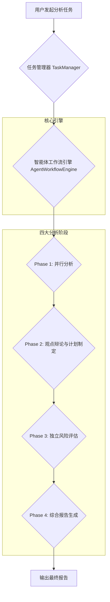
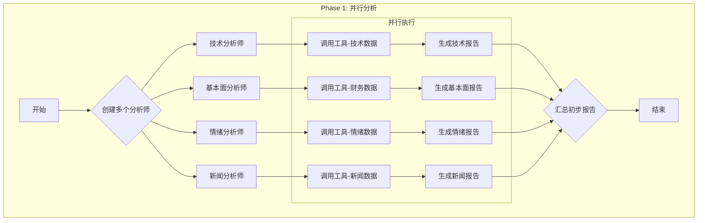
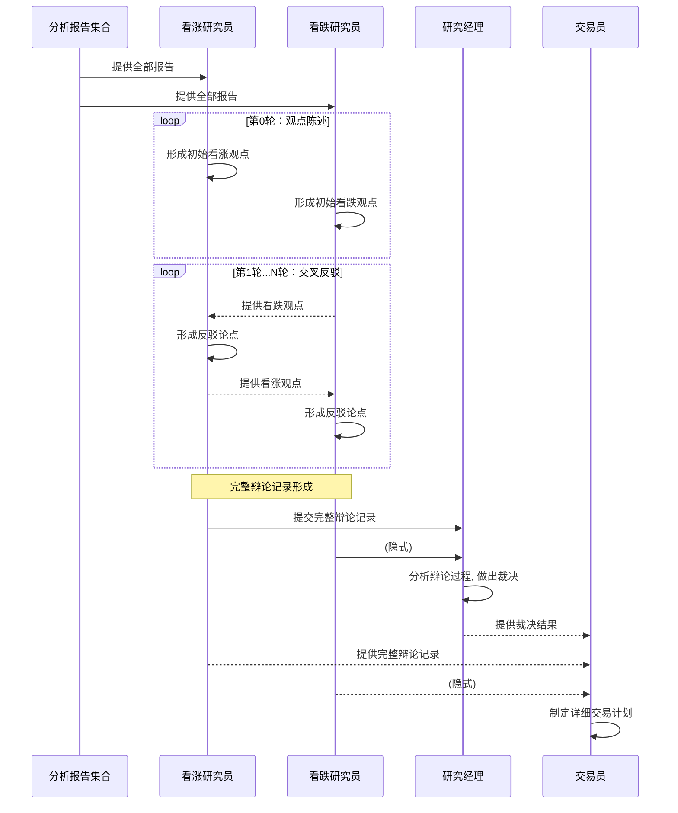

# Trading Agents 模块业务流程与技术实现详解

本文档旨在详细阐述 Trading Agents 模块的核心业务流程、设计思想与技术实现细节，帮助开发人员快速理解并上手该模块。

**文档严格遵循无代码原则，所有实现细节均通过文字描述和图表进行说明。**

## 1. 核心设计思想

Trading Agents 模块的核心思想是模拟一个专业的投资分析团队，通过结构化的、多阶段的分析流程，对单一投资标的（如股票）进行深度研究，最终形成一个兼具深度、广度和风险考量的投资决策建议。

该流程借鉴了现实世界中投研团队的工作模式：
- **并行研究**: 多个不同领域的分析师同时从各自的专业角度出发，进行初步分析。
- **交叉辩论**: 设立正反方角色，通过多轮辩论深挖潜在的机会和风险，挑战初步结论。
- **多层决策**: 设置“经理”角色，对下级辩论或讨论进行总结和裁决，确保信息收敛。
- **风险前置**: 在形成最终决策前，进行独立的、多视角的风险评估。
- **统一输出**: 将所有过程信息汇总，生成一份统一、结构化的最终报告。

## 2. 整体业务流程

整个分析流程由 `AgentWorkflowEngine` 统一编排，当用户发起一个分析任务时，系统会创建一个任务实例，并按顺序触发以下四个主要阶段。

---

## 3. 各阶段详解

### 3.1. Phase 1: 并行分析 (Information Gathering & Initial Analysis)

**目标**: 从多个维度对目标股票进行初步的信息收集和分析，为后续阶段提供原始素材和基础观点。

**业务流程**:
1.  **动态创建分析师**: 系统根据配置，并行创建多个拥有不同“角色”的分析师智能体。默认角色包括：
    *   **市场技术分析师**: 负责K线、成交量、技术指标等分析。
    *   **基本面分析师**: 负责公司财报、估值、行业地位等分析。
    *   **情绪分析师**: 负责市场情绪、社交媒体讨论、资金流向等分析。
    *   **新闻分析师**: 负责相关的公司公告、行业新闻、政策变动等分析。
2.  **并行执行**: 所有被启用的分析师智能体以**并行**的方式独立执行任务，互不干扰。这极大地提升了信息收集的效率。
3.  **使用工具获取数据**: 每个分析师在执行过程中，会调用系统为其配备的各类工具（本地工具或MCP工具）来获取实时或历史数据。
4.  **生成初步报告**: 每个分析师根据其角色设定（`role_definition`）和获取到的数据，调用大语言模型（LLM）生成一份聚焦于自己领域的初步分析报告。
5.  **汇总报告**: 系统收集所有分析师的报告，形成一个初步的报告集合，传递给下一阶段。

**流程图**:

### 3.2. Phase 2: 观点辩论与计划制定 (Debate & Planning)

**目标**: 针对第一阶段的初步结论，通过设置对立观点进行深入辩论，挖掘潜在的风险和被忽视的机会，并基于辩论结果形成具体的交易计划。

**业务流程**:
1.  **设置辩论角色**: 系统初始化两个核心辩论角色：
    *   **看涨研究员 (Bull Debater)**: 负责从所有初步报告中寻找支持股价上涨的论据。
    *   **看跌研究员 (Bear Debater)**: 负责从所有初步报告中寻找导致股价下跌的风险和问题。
2.  **多轮交叉辩论**: 辩论由`DebateManager`进行管理，流程如下：
    *   **第0轮 (观点陈述)**: 看涨和看跌研究员首先各自基于第一阶段的全部报告，独立形成并陈述自己的核心观点。
    *   **第1轮及以后 (交叉反驳)**: 从第二轮开始，系统会将**上一轮对手的完整论述**作为上下文，喂给当前发言的研究员。例如，看涨研究员会拿到看跌研究员上一轮的全部观点，并被要求“针对以上观点进行反驳”。这种机制确保了辩论的焦点和深度。
3.  **研究经理裁决**: 辩论结束后，一个更高层级的角色——**研究经理 (Research Manager)**——会介入。他会拿到整个辩论的**完整过程**（每一轮双方的发言），然后进行总结、权衡，并做出一个倾向性的裁决（例如，“尽管存在风险，但看涨方的逻辑更占优势”）。
4.  **制定交易计划**: 最后，**交易员 (Trade Planner)** 角色登场。他会基于**研究经理的裁决**和**完整的辩论记录**，制定一份具体的、可执行的交易计划，内容包括：操作建议（买入/卖出/持有）、建议价格区间、仓位配置、止损止盈位等。

**辩论机制详解图**:

### 3.3. Phase 3: 独立风险评估 (Risk Assessment)

**目标**: 在已有交易计划的基础上，引入独立的风险评估流程，从不同风险偏好的视角审视该计划，并量化风险。

**业务流程**:
1.  **设置多维视角**: 系统初始化三个代表不同风险偏好的角色，并行运作：
    *   **激进派 (Aggressive Analyst)**: 倾向于高收益，对风险容忍度较高。
    *   **保守派 (Conservative Analyst)**: 倾向于本金安全，对风险极其敏感。
    *   **中性派 (Neutral Analyst)**: 追求风险和收益的平衡。
2.  **并行评估**: 这三个角色会同时拿到**第二阶段形成的完整交易计划**和**所有历史分析/辩论材料**，然后从各自的视角出发，独立给出风险评估报告。
3.  **首席风控官总结**: 所有评估报告完成后，交由最终的决策者——**首席风控官 (Chief Risk Officer, CRO)**。CRO会综合三个不同视角的意见，给出一个最终的、量化的风险评估结论，通常包括：
    *   **风险等级**: 如高、中、低。
    *   **风险评分**: 如 0-100 分。
    *   **核心风险点**: 列出最需要关注的几项风险。
    *   **风险控制建议**: 提出具体的风控措施。

### 3.4. Phase 4: 综合报告生成 (Final Summary)

**目标**: 将前面所有阶段产生的信息进行最终的汇总和提炼，生成一份结构清晰、逻辑连贯、结论明确的最终报告，交付给用户。

**业务流程**:
1.  **信息汇总**: **首席投资顾问 (Final Summarizer)** 角色被激活。系统会将**任务开始以来产生的所有信息**全部提供给他，这包括：
    *   第一阶段的所有分析师报告。
    *   第二阶段的完整辩论记录、经理裁决和交易计划。
    *   第三阶段的所有风险评估报告和CRO的最终结论。
2.  **生成最终报告**: 该智能体调用LLM，根据预设的报告模板，将海量过程信息提炼、总结，填充到报告的各个模块中，形成最终版本。

---

## 4. 关键技术实现机制

### 4.1. 智能体逻辑加载 (模板化设计)

系统的核心之一是智能体逻辑的“模板化加载”，它实现了业务逻辑与代码框架的解耦。

*   **配置文件**: 在 `config/templates/agents.yaml` 文件中，定义了所有智能体的基础模板。每个模板包含：
    *   `slug`: 唯一的内部标识。
    *   `name`: 显示的名称。
    *   `role_definition`: **核心所在**，这是该智能体的**系统提示词 (System Prompt)**。它详细描述了智能体的角色、职责、工作流程和输出格式。智能体的所有行为都围绕此提示词展开。
    *   `when_to_use`: 对智能体使用场景的描述。
    *   `enabled_mcp_servers`: 声明该智能体需要使用哪些MCP服务器上的工具。
    *   `enabled_local_tools`: 声明需要使用哪些项目内部的本地工具。
*   **加载流程**:
    1.  系统启动时，`ConfigLoader` 会加载 `agents.yaml` 文件作为“公共默认配置”。
    2.  `AgentConfigService` 负责管理这些配置。它可以将公共配置复制一份给新用户，或允许用户在此基础上进行自定义修改，并将用户的个性化配置存储在数据库中。
    3.  当 `AgentWorkflowEngine` 需要创建智能体实例时（例如通过 `AnalystFactory`），它会从 `AgentConfigService` 获取当前用户的有效配置。
    4.  工厂类根据获取到的配置（特别是 `role_definition`），实例化一个通用的智能体基类（如 `GenericAnalystTemplate`），从而“注入”了特定的业务逻辑。

这种设计的优势在于，业务人员或Prompt工程师可以直接通过修改YAML或数据库中的 `role_definition` 来调整、优化甚至重塑一个智能体的行为，而无需改动任何Python代码。

### 4.2. 工具集成与扩展性

系统设计了统一且可扩展的工具集成机制，分为MCP工具和本地工具两类。

#### 4.2.1. MCP工具集成

MCP（Model Control Pool）工具是外部、独立部署的工具服务。

*   **连接管理**: `MCPToolFilter` 是连接MCP工具的核心。它与 `MCPConnectionPool` 协作，实现了高效且安全的连接管理。
*   **连接缓存与复用**: 这是MCP集成的一个关键优化。
    1.  当任务中的第一个智能体需要连接某个MCP服务器（例如 “行情数据服务”）时，`MCPToolFilter` 会通过连接池为这个**任务ID**创建一个专用的连接。
    2.  这个连接被缓存在一个以 `task_id` 为键的字典中。
    3.  当该任务中的**其他智能体**也需要连接同一个MCP服务器时，`MCPToolFilter` 会直接从缓存中返回已建立的连接，而**不会创建新连接**。
    4.  当整个任务结束（成功或失败）时，`TaskManager` 会通知 `MCPToolFilter` 释放与该 `task_id` 关联的所有连接。
    *   **效果**: 确保了在一次分析任务的生命周期内，对同一个MCP服务器的连接只建立一次，大大降低了网络开销和认证成本。
*   **容错机制**: 在智能体的配置中，`enabled_mcp_servers` 列表里的每个服务器都可以标记 `required: true` 或 `required: false`。如果一个被标记为 `required: true` 的服务器连接失败，整个任务会立刻失败并终止。如果 `required: false` 的服务器连接失败，任务会记录一个警告然后继续执行。

#### 4.2.2. 本地工具扩展

系统预留了清晰的本地工具接入点。

*   **工具注册**: `ToolRegistry` 是一个全局单例，用于管理所有工具的定义。开发者可以通过 `local_tool` 装饰器或直接调用 `register_local_tool` 函数来注册一个新工具。注册时需要提供工具名、描述、参数结构（JSON Schema）以及一个处理函数。
*   **工具调用**: 当智能体（如第一阶段的分析师）的配置中声明了需要使用某个 `enabled_local_tools` 时，`AnalystFactory` 在创建该智能体实例时，会：
    1.  从 `ToolRegistry` 中查找该工具的定义。
    2.  将其处理函数 (`handler`) 包装成一个大语言模型（如LangChain）可以直接调用的 `StructuredTool` 对象。
    3.  将这个工具对象传递给智能体实例，使其可以在后续的LLM调用中使用。

这意味着，要为系统添加一个新的内部功能（如“从特定数据库查询数据”），开发者只需：
1.  编写一个功能函数。
2.  用 `@local_tool` 装饰器把它注册成一个工具。
3.  在 `agents.yaml` 或用户配置中，将该工具的名称添加到对应智能体的 `enabled_local_tools` 列表中即可。

这种设计具有极高的扩展性，使得添加新功能无需修改核心工作流代码。

---
## 5. 总结

Trading Agents 模块通过**分阶段工作流**、**角色化智能体**、**模板化逻辑加载**和**可扩展工具集**四大支柱，构建了一个强大、灵活且易于维护的自动化投研分析框架。其设计精妙地平衡了业务流程的复杂性与技术实现的模块化，为未来功能的迭代和优化奠定了坚实的基础。
