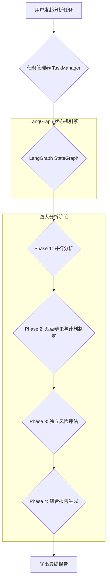
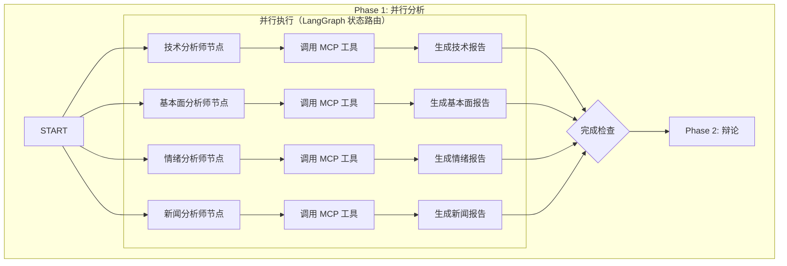
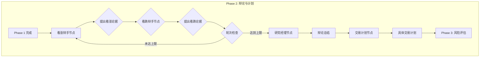
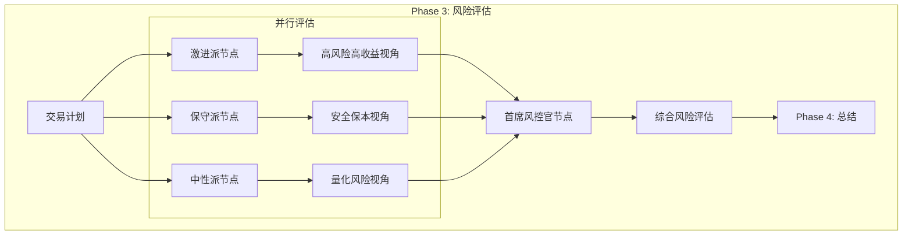
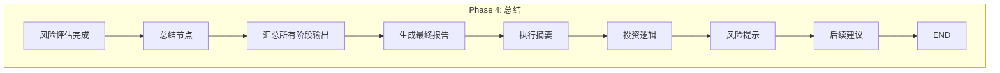

# Trading Agents 模块业务流程与技术实现详解

本文档旨在详细阐述 Trading Agents 模块的核心业务流程、设计思想与技术实现细节，帮助开发人员快速理解并上手该模块。

**文档严格遵循无代码原则，所有实现细节均通过文字描述和图表进行说明。**

## 1. 核心设计思想

Trading Agents 模块的核心思想是模拟一个专业的投资分析团队，通过结构化的、多阶段的分析流程，对单一投资标的（如股票）进行深度研究，最终形成一个兼具深度、广度和风险考量的投资决策建议。

该流程借鉴了现实世界中投研团队的工作模式：
- **并行研究**: 多个不同领域的分析师同时从各自的专业角度出发，进行初步分析。
- **交叉辩论**: 设立正反方角色，通过多轮辩论深挖潜在的机会和风险，挑战初步结论。
- **多层决策**: 设置"经理"角色，对下级辩论或讨论进行总结和裁决，确保信息收敛。
- **风险前置**: 在形成最终决策前，进行独立的、多视角的风险评估。
- **统一输出**: 将所有过程信息汇总，生成一份统一、结构化的最终报告。

**技术架构（LangGraph）**:
- 基于 **LangGraph** 状态机框架实现四阶段工作流
- 使用 **StateGraph** 定义状态转换逻辑
- 采用 **Reducer 模式** 自动累积各阶段输出
- 支持 **Checkpoint 持久化**，实现任务恢复和断点续传

## 2. 整体业务流程

整个分析流程由 **LangGraph StateGraph** 统一编排，当用户发起一个分析任务时，系统会创建一个任务实例，并按顺序触发以下四个主要阶段。



**LangGraph 核心概念**:
- **State（状态）**: 工作流的数据载体，包含所有中间结果和配置
- **Node（节点）**: 执行单元，接收状态并返回状态更新
- **Edge（边）**: 节点之间的转换关系
  - **普通边**: 确定性转换（A → B）
  - **条件边**: 基于状态的路由（A → B 或 C）
- **Checkpointer**: 状态持久化机制，支持任务恢复

---

## 3. 各阶段详解

### 3.1. Phase 1: 并行分析 (Information Gathering & Initial Analysis)

**目标**: 从多个维度对目标股票进行初步的信息收集和分析，为后续阶段提供原始素材和基础观点。

**业务流程**:
1.  **动态创建分析师节点**: 系统根据配置，并行创建多个拥有不同"角色"的分析师节点。默认角色包括：
    *   **技术分析师节点**: 负责K线、成交量、技术指标等分析。
    *   **基本面分析师节点**: 负责公司财报、估值、行业地位等分析。
    *   **情绪分析师节点**: 负责市场情绪、社交媒体讨论、资金流向等分析。
    *   **新闻分析师节点**: 负责相关的公司公告、行业新闻、政策变动等分析。
2.  **并行执行**: 所有分析师节点以**并行**的方式独立执行，这是通过 LangGraph 的状态路由机制实现的。
3.  **使用 MCP 工具获取数据**: 每个分析师节点在执行过程中，通过 MCP (Model Context Protocol) 调用各类工具来获取实时或历史数据。
4.  **生成初步报告**: 每个节点调用大语言模型（LLM）生成一份聚焦于自己领域的初步分析报告。
5.  **状态累积**: 使用 LangGraph 的 Reducer 模式，自动将各节点的报告累积到 `analyst_reports` 列表中。

**流程图**:


**LangGraph 技术实现**:
- **并行路由**: 从 START 节点连接到所有分析师节点
- **状态累积**: 使用 `operator.add` reducer 自动累积报告
- **完成检查**: 通过条件边检查 `completed_analysts` 计数

### 3.2. Phase 2: 观点辩论与计划制定 (Debate & Planning)

**目标**: 针对第一阶段的初步结论，通过设置对立观点进行深入辩论，挖掘潜在的风险和被忽视的机会，并基于辩论结果形成具体的交易计划。

**业务流程**:
1.  **设置辩论角色**: 系统初始化两个核心辩论节点：
    *   **看涨辩手节点 (Bull Debater)**: 聚焦于标的的积极因素、增长机会、低估信号等。
    *   **看跌辩手节点 (Bear Debater)**: 聚焦于标的的负面因素、估值风险、竞争压力等。
2.  **多轮辩论循环**: 两个辩手节点进行多轮辩论，每轮包括：
    *   基于上一轮的辩论内容，结合自身的观点立场，提出新的论据或反驳。
    *   引用第一阶段分析师的报告作为证据支持。
    *   将本轮辩论内容累积到 `debate_turns` 列表中。
3.  **研究经理节点**: 当达到预设的辩论轮数（默认 2 轮）后，研究经理节点介入：
    *   阅读所有辩论内容。
    *   综合正反双方的论据。
    *   形成一个平衡、客观的总结报告。
4.  **交易计划节点**: 基于研究经理的总结，交易计划节点制定具体的交易建议：
    *   明确的投资方向（买入/卖出/持有）。
    *   建议的买入/卖出价格区间。
    *   仓位管理建议。
    *   止盈止损建议。

**流程图**:


**LangGraph 技术实现**:
- **循环路由**: 使用条件边实现辩手之间的循环调用
- **轮次控制**: 通过 `should_continue_debate` 路由函数检查轮数
- **状态累积**: 辩论内容自动累积到 `debate_turns` 列表

### 3.3. Phase 3: 独立风险评估 (Independent Risk Assessment)

**目标**: 从多个风险视角对拟议的交易计划进行独立评估，确保决策充分考虑了潜在风险。

**业务流程**:
1.  **三方风险评估节点**: 系统并行创建三个不同风险偏好的评估节点：
    *   **激进派节点**: 关注高风险高收益机会，对波动有较高容忍度，强调"机会成本"和"踏空风险"。
    *   **保守派节点**: 关注本金安全和下行保护，强调"止损"和"风险分散"，对亏损零容忍。
    *   **中性派节点**: 在风险和收益之间寻找平衡，进行量化风险评估（如 VaR、最大回撤）。
2.  **并行执行**: 三个风险评估节点基于交易计划，独立进行风险分析。
3.  **首席风控官节点**: 三方评估完成后，首席风控官节点介入：
    *   综合三方的观点。
    *   识别关键风险点。
    *   给出整体风险评级（高/中/低）。
    *   提出具体的风险管理建议。

**流程图**:


**LangGraph 技术实现**:
- **并行路由**: 从交易计划节点连接到三个风险评估节点
- **完成检查**: 通过 `check_phase3_completion` 检查是否所有评估完成
- **状态累积**: 风险评估累积到 `risk_assessments` 列表

### 3.4. Phase 4: 综合报告生成 (Final Synthesis)

**目标**: 将所有阶段的输出进行汇总，生成一份结构化、易读的最终投资报告。

**业务流程**:
1.  **信息汇总**: 总结节点接收来自：
    *   Phase 1 的所有分析师报告。
    *   Phase 2 的辩论记录和交易计划。
    *   Phase 3 的风险评估报告。
2.  **结构化输出**: 生成包含以下部分的最终报告：
    *   **执行摘要**: 高层级的投资建议（买入/卖出/持有）。
    *   **分析过程回顾**: 简要回顾四个阶段的关键发现。
    *   **投资逻辑**: 解释形成最终建议的核心逻辑。
    *   **风险提示**: 突出关键风险因素。
    *   **后续建议**: 建议的下一步行动。
3.  **输出状态**: 最终状态包含：
    *   `final_recommendation`: 最终投资建议
    *   `final_report`: 结构化报告文本
    *   `token_usage`: 各阶段的 Token 消耗统计
    *   `status`: 任务状态（completed/failed）

**流程图**:


---

## 4. 状态管理（LangGraph State）

LangGraph 使用 **TypedDict** 定义状态结构，支持：
- **覆盖模式**: 普通字段直接覆盖
- **累积模式**: 使用 `operator.add` reducer 自动累积列表

**核心状态字段**:
```python
# 输入状态（覆盖模式）
user_id: str
stock_code: str
trade_date: str
enable_phase1/2/3/4: bool

# 累积状态（使用 Reducer）
analyst_reports: List[Dict]  # 分析师报告
debate_turns: List[Dict]     # 辩论记录
risk_assessments: List[Dict] # 风险评估
token_usage: List[Dict]      # Token 消耗

# 输出状态
final_recommendation: str    # 最终建议
final_report: str            # 最终报告
status: str                  # 任务状态
```

---

## 5. MCP 工具集成

TradingAgents 通过 **MCP (Model Context Protocol)** 与外部工具集成，支持：

**工具分类**:
- **市场行情工具**: 实时报价、历史行情、K线数据
- **财务数据工具**: 财报数据、财务指标、估值数据
- **公司信息工具**: 公司资料、公告、股权结构
- **宏观经济工具**: 经济指标、政策数据
- **技术分析工具**: 技术指标计算、形态识别

**工具调用流程**:
1. 节点函数通过 `MCPToolFilter` 获取可用工具
2. LLM 根据任务需求选择合适的工具
3. 通过 MCP 协议调用工具
4. 将工具返回结果注入 LLM 上下文
5. LLM 基于工具结果生成分析

**容错机制**:
- **必需工具**: 连接失败时中断任务
- **可选工具**: 连接失败时继续执行，记录警告
- **超时控制**: 防止工具调用无限等待
- **连接池管理**: 复用连接，提升性能

---

## 6. 并发控制与任务管理

**并发控制**:
- **双模型并发**: 数据收集模型和辩论模型独立管理并发槽位
- **任务队列**: 超过并发限制时自动排队
- **超时机制**: 等待槽位超时 5 分钟自动失败
- **资源释放**: 任务完成后自动释放槽位和 MCP 连接

**任务管理（TaskManager）**:
- **任务生命周期**: created → running → completed/failed
- **状态持久化**: 所有状态变更保存到 MongoDB
- **任务恢复**: 系统重启后自动恢复运行中的任务
- **进度推送**: 通过 WebSocket 实时推送任务进度

---

## 7. Token 消耗追踪

系统自动追踪每个阶段的 Token 消耗：
```python
token_usage = [
    {"phase": "phase1", "agent": "technical_analyst", "tokens": {...}},
    {"phase": "phase2", "agent": "bull_debater", "tokens": {...}},
    ...
]
```

**成本估算**:
- 前端展示预估 Token 成本
- 任务完成后展示实际消耗
- 支持按用户、按模型统计消耗

---

## 8. 任务恢复机制

基于 LangGraph 的 Checkpointer 机制：
- **状态快照**: 每个节点执行完成后保存状态
- **任务恢复**: 系统重启后从最后一个检查点恢复
- **断点续传**: 支持暂停后继续执行

**当前实现**:
- **MemorySaver**: 内存存储（Python 3.14 当前版本）
- **RedisSaver**: Redis 持久化（Python < 3.14 自动启用）

---

## 9. 错误处理与日志

**错误处理策略**:
1. **节点级错误**: 单个节点失败不影响其他节点（容错）
2. **阶段级错误**: 关键节点失败导致任务失败
3. **重试机制**: LLM 调用失败自动重试
4. **超时控制**: 防止任务无限等待

**日志记录**:
- **任务级别**: 记录任务创建、执行、完成状态
- **阶段级别**: 记录各阶段开始和结束时间
- **节点级别**: 记录节点执行和 Token 消耗
- **错误级别**: 记录所有异常和堆栈信息

---

## 10. 前端集成

**API 端点**:
- `POST /api/trading-agents/tasks` - 创建分析任务
- `GET /api/trading-agents/tasks/{task_id}` - 获取任务详情
- `GET /api/trading-agents/tasks` - 查询任务列表
- `DELETE /api/trading-agents/tasks/{task_id}` - 取消任务

**WebSocket 推送**:
- 实时推送任务状态变更
- 推送节点执行进度
- 推送错误和警告信息

**前端展示**:
- 任务列表（状态、进度、Token 消耗）
- 任务详情（各阶段输出、最终报告）
- 实时进度条和状态指示

---

## 11. 性能优化

**并行执行**:
- Phase 1 的 4 个分析师节点并行执行
- Phase 3 的 3 个风险评估节点并行执行
- 大幅缩短总执行时间

**连接复用**:
- MCP 连接池复用连接
- 避免重复建立连接的开销

**智能缓存**:
- LLM 响应缓存（相同输入直接返回）
- 工具调用结果缓存

**并发限制**:
- 双模型并发控制防止资源耗尽
- 用户级并发限制防止滥用

---

## 12. 总结

TradingAgents 模块通过 LangGraph 框架实现了结构化的四阶段投资分析流程：

**核心优势**:
1. **状态机架构**: LangGraph 提供清晰的状态转换逻辑
2. **并行执行**: 关键阶段并行化，提升效率
3. **可观测性**: 完整的日志、Token 追踪、进度推送
4. **容错性**: 多层次的错误处理和恢复机制
5. **可扩展性**: 易于添加新的分析师、辩手、风险评估节点

**技术栈**:
- **工作流引擎**: LangGraph (StateGraph)
- **LLM**: 智谱 AI glm-4.6
- **工具协议**: MCP (Model Context Protocol)
- **数据存储**: MongoDB (业务) + Redis (缓存/状态)
- **通信**: WebSocket (实时推送)

该模块为用户提供了专业、深度、结构化的投资分析服务，模拟真实投研团队的工作流程，输出兼具深度和广度的投资建议。
