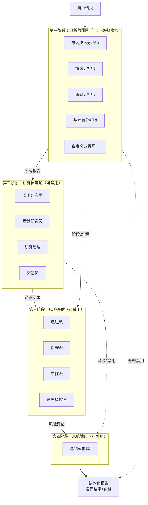

# TradingAgents 智能体系统完整执行逻辑说明文档

> 生成时间：2025-12-25
> 最后更新：2025-12-25
> 文档目的：让程序员能够完全理解并复现整个多智能体股票分析系统的执行过程

---

## 第一部分：系统整体架构概述

### 一、系统的核心设计理念

TradingAgents 是一个基于大语言模型的多智能体协作股票分析系统。整个系统的设计理念是模拟真实投资机构的决策流程：首先由多位专业分析师从不同角度收集和分析数据，然后由研究员进行多空辩论，接着由风险管理团队评估风险，最后生成综合投资建议。

系统采用四阶段流水线架构，每个阶段都有明确的职责分工，阶段之间通过状态对象传递信息。这种设计使得系统具有良好的可扩展性和可维护性。

### 二、四个阶段的职责划分

**第一阶段：分析师团队**（可配置多个）
负责从各个维度收集和分析股票数据。采用工厂模式动态创建分析师，每个分析师专注于特定领域的分析工作。

**第二阶段：研究员辩论**（可禁用）
由看涨研究员和看跌研究员进行多轮辩论，最后由研究经理做出裁决，交易员根据裁决结果制定具体的交易计划。

**第三阶段：风险评估**（可禁用）
由激进派、保守派和中性派三位风险分析师进行讨论，最后由首席风控官综合各方意见做出最终的风险评估。

**第四阶段：总结输出**（可禁用）
由总结智能体汇总所有分析结果，生成结构化的投资建议报告（推荐结果+价格）。

### 三、整体架构流程图



### 四、核心目录结构

```
backend/modules/trading_agents/
├── core/                      # 核心组件
│   ├── agent_engine.py        # 智能体执行引擎（LangGraph）
│   ├── task_manager.py        # 任务管理器
│   ├── concurrency.py         # 并发控制器（公共模型资源池）
│   └── state.py               # 状态定义和合并函数
│
├── agents/                    # 智能体实现
│   ├── base.py                # 智能体基类
│   ├── phase1/                # 第一阶段智能体
│   │   ├── analyst.py         # 动态分析师工厂
│   │   └── scheduler.py       # 分析师调度器
│   ├── phase2/                # 第二阶段智能体
│   ├── phase3/                # 第三阶段智能体
│   └── phase4/                # 第四阶段智能体
│
├── tools/                     # 工具管理
│   ├── registry.py            # 工具注册表
│   ├── mcp_adapter.py         # MCP 适配器
│   ├── loop_detector.py       # 工具循环检测器
│   └── local_tools.py         # 本地工具接口（预留）
│
├── llm/                       # LLM 管理
│   ├── provider.py            # LLM 提供者抽象
│   └── openai_compat.py       # OpenAI 兼容实现
│
├── config/                    # 配置管理
│   ├── loader.py              # 配置加载器
│   └── templates/
│       └── agents.yaml        # 默认智能体配置
│
└── websocket/                 # 实时通信
    ├── manager.py             # WebSocket 管理器（按需连接）
    └── events.py              # 事件定义
```

---

## 第二部分：第一阶段工厂模式架构

### 一、工厂模式设计思想

第一阶段采用**工厂模式 + 通用模板 + 调度器**的设计，实现了动态分析师的灵活创建：

```
配置文件 (agents.yaml)
     ↓
工厂类 (AnalystFactory)
     ↓
通用分析师模板 (GenericAnalystTemplate)
     ↓
调度器 (AnalystScheduler)
     ↓
并行执行 → 汇总报告
```

### 二、工厂模式实现代码

```python
class AnalystFactory:
    """第一阶段分析师工厂 - 根据配置动态创建智能体"""

    def __init__(self, llm_provider, tool_registry):
        self.llm = llm_provider
        self.tools = tool_registry

    def create_analysts(self, config: PhaseConfig) -> List[GenericAnalystTemplate]:
        """
        根据配置创建分析师列表

        Args:
            config: 第一阶段配置，包含 agents 列表

        Returns:
            分析师实例列表
        """
        analysts = []

        for agent_cfg in config.agents:
            if not agent_cfg.enabled:
                continue

            # 使用通用模板类，仅替换提示词和工具
            analyst = GenericAnalystTemplate(
                slug=agent_cfg.slug,
                name=agent_cfg.name,
                prompt=agent_cfg.role_definition,
                tools=self._get_tools_for_agent(agent_cfg),
                llm=self._get_llm_for_agent(config.model_id)
            )

            analysts.append(analyst)

        return analysts

    def _get_tools_for_agent(self, agent_cfg: AgentConfig) -> List[Tool]:
        """根据智能体配置获取可用工具"""
        # 从 enabled_mcp_servers 和 enabled_local_tools 获取工具
        tools = []

        for server_name in agent_cfg.enabled_mcp_servers:
            tools.extend(self.tools.get_mcp_tools(server_name))

        for tool_name in agent_cfg.enabled_local_tools:
            tool = self.tools.get_local_tool(tool_name)
            if tool:
                tools.append(tool)

        return tools

    def _get_llm_for_agent(self, model_id: str) -> LLMProvider:
        """获取指定模型实例"""
        return self.llm.get_model(model_id)
```

### 三、通用分析师模板

```python
class GenericAnalystTemplate:
    """通用分析师模板 - 所有第一阶段分析师共用"""

    def __init__(
        self,
        slug: str,
        name: str,
        prompt: str,
        tools: List[Tool],
        llm: LLMProvider
    ):
        self.slug = slug                # 唯一标识
        self.name = name                # 显示名称
        self.prompt = prompt            # 系统提示词
        self.tools = tools              # 可用工具
        self.llm = lln                  # LLM 实例

    async def run(self, state: AgentState) -> str:
        """
        执行分析

        Args:
            state: 当前工作流状态

        Returns:
            分析报告内容
        """
        # 1. 构建系统消息
        system_message = self._build_system_message()

        # 2. 构建用户消息（包含上下文）
        user_message = self._build_user_message(state)

        # 3. 调用 LLM
        messages = [
            {"role": "system", "content": system_message},
            {"role": "user", "content": user_message}
        ]

        response = await self.llm.chat_completion(
            messages=messages,
            tools=self.tools,
            temperature=0.5
        )

        # 4. 提取报告内容
        report = self._extract_report(response)

        return report

    def _build_system_message(self) -> str:
        """构建系统消息（直接使用配置的 prompt）"""
        return self.prompt

    def _build_user_message(self, state: AgentState) -> str:
        """构建用户消息（注入股票代码等上下文）"""
        return f"""
请分析以下股票：
- 股票代码：{state['stock_code']}
- 交易日期：{state['trade_date']}

请生成专业的分析报告。
"""

    def _extract_report(self, response) -> str:
        """从 LLM 响应中提取报告内容"""
        return response.get("content", "")
```

### 四、分析师调度器

```python
class AnalystScheduler:
    """第一阶段调度器 - 并行执行所有分析师"""

    def __init__(self, factory: AnalystFactory):
        self.factory = factory

    async def run_phase1(
        self,
        state: AgentState,
        config: PhaseConfig
    ) -> Dict[str, str]:
        """
        执行第一阶段：并行运行所有分析师

        Args:
            state: 初始状态
            config: 第一阶段配置

        Returns:
            所有分析师报告的字典 {slug: report}
        """
        # 1. 使用工厂创建所有分析师
        analysts = self.factory.create_analysts(config)

        # 2. 根据并发配置分组执行
        max_concurrency = config.max_concurrency

        reports = {}

        if max_concurrency == 1:
            # 串行执行
            for analyst in analysts:
                report = await analyst.run(state)
                reports[analyst.slug] = report
        else:
            # 并行执行（使用 Semaphore 限制并发数）
            semaphore = asyncio.Semaphore(max_concurrency)

            async def run_with_limit(analyst):
                async with semaphore:
                    return analyst.slug, await analyst.run(state)

            tasks = [run_with_limit(a) for a in analysts]
            results = await asyncio.gather(*tasks)

            reports = dict(results)

        # 3. 汇总报告到状态
        state["reports"].update(reports)

        return reports
```

### 五、配置文件示例

```yaml
# config/templates/agents.yaml
phase1:
  enabled: true
  model_id: "qwen-max"          # 使用的 AI 模型
  max_concurrency: 3            # 智能体最大并发数
  max_rounds: 1

  agents:
    - slug: market_technical
      name: 市场技术分析师
      role_definition: |
        你是一位专业的市场技术分析师。
        你的职责是通过K线图、技术指标等分析股票的走势。
        请重点关注价格趋势、成交量变化、关键支撑位和阻力位。
      when_to_use: 分析股票技术走势时使用
      enabled_mcp_servers:
        - finance_mcp
      enabled_local_tools: []
      enabled: true

    - slug: sentiment
      name: 情绪分析师
      role_definition: |
        你是一位专业的市场情绪分析师。
        你的职责是分析市场情绪和投资者情绪。
        请关注社交媒体情绪、投资者情绪指数等。
      when_toUse: 分析市场情绪时使用
      enabled_mcp_servers:
        - finance_mcp
      enabled_local_tools: []
      enabled: true

    - slug: fundamentals
      name: 基本面分析师
      role_definition: |
        你是一位专业的基本面分析师。
        你的职责是分析公司的基本面情况。
        请关注财务数据、估值水平、行业地位等。
      whenToUse: 分析公司基本面时使用
      enabled_mcp_servers:
        - finance_mcp
      enabled_local_tools: []
      enabled: true

phase2:
  enabled: true
  model_id: "qwen-max"
  max_rounds: 2                  # 辩论轮次
  agents:
    - slug: bull_researcher
      name: 看涨研究员
      role_definition: |
        你是一位看涨研究员。
        请从看涨角度分析投资机会。
      enabled: true

    # ... 其他智能体配置
```

---

## 第三部分：公共模型资源池管理

### 一、资源池设计思想

公共模型采用**槽位管理 + 健壮并发锁**机制，确保公平分配资源给所有用户：

- **总并发上限**：管理员设置（如 5 个槽位）
- **每用户限制**：每个用户最多占用 1 个槽位
- **FIFO 队列**：槽位满时按提交时间排队，使用 `BLPOP` 阻塞获取。
- **TTL 自动过期锁**：使用 `SET NX EX` 防止死锁，默认 5 分钟过期。
- **看门狗机制**：后台进程定期为运行中的任务续期，防止长任务被误杀。

### 二、并发控制器实现

```python
class ConcurrencyManager:
    """并发控制器 - 管理公共模型资源池 (Robust Version)"""

    def __init__(self, redis: Redis):
        self.redis = redis

    async def acquire_lock(self, user_id: str, model_id: str) -> bool:
        """
        获取分布式锁（带 TTL 和看门狗机制）
        """
        key = f"lock:{model_id}:{user_id}"
        # 设置 300秒 过期时间，防止死锁
        return await self.redis.set(key, "locked", nx=True, ex=300)

    # ... (其他方法：release_lock, watchdog_loop)

    async def release_public_quota(
        self,
        model_id: str,
        user_id: str
    ) -> None:
        """释放公共模型配额"""
        user_key = f"model:{model_id}:user:{user_id}"
        queue_key = f"model:{model_id}:queue"

        # 释放用户槽位
        await self.redis.delete(user_key)
        await self.redis.decr(f"model:{model_id}:occupied")

        # 唤醒队列中的下一个任务
        next_user = await self.redis.rpop(queue_key)
        if next_user:
            next_user_key = f"model:{model_id}:user:{next_user.decode()}"
            await self.redis.setex(next_user_key, 3600, "1")
            await self.redis.incr(f"model:{model_id}:occupied")

    async def get_queue_position(
        self,
        model_id: str,
        user_id: str
    ) -> Optional[int]:
        """获取用户在队列中的位置"""
        queue_key = f"model:{model_id}:queue"
        queue = await self.redis.lrange(queue_key, 0, -1)

        try:
            return queue.index(user_id.encode()) + 1
        except ValueError:
            return None
```

### 三、批量任务限制实现

```python
class BatchTaskManager:
    """批量任务管理器 - 实现批量任务限制"""

    async def submit_batch(
        self,
        user_id: str,
        stock_codes: List[str],
        model_id: str,
        is_public_model: bool
    ) -> BatchTaskResult:
        """
        提交批量任务

        Args:
            user_id: 用户 ID
            stock_codes: 股票代码列表
            model_id: 使用的模型 ID
            is_public_model: 是否为公共模型

        Returns:
            批量任务结果
        """
        if is_public_model:
            # 公共模型：最多 5 个任务同时执行
            max_concurrent = 5
        else:
            # 自定义模型：无限制
            max_concurrent = len(stock_codes)

        # 计算可立即执行的任务数
        immediate_count = min(max_concurrent, len(stock_codes))

        # 创建立即执行的任务
        immediate_tasks = stock_codes[:immediate_count]

        # 剩余任务等待
        waiting_tasks = stock_codes[immediate_count:]

        return BatchTaskResult(
            immediate_tasks=immediate_tasks,
            waiting_tasks=waiting_tasks
        )
```

### 四、执行流程图

```
公共模型资源池执行流程：

┌─────────────────────────────────────────────────────────────┐
│ 用户A 提交任务 → 检查槽位                                   │
│   ├─ A当前使用=0 → 分配槽位1 (剩余4)                        │
│   └─ A当前使用=1 → 加入队列，位置=N                        │
│                                                             │
│ 用户B 提交任务 → 检查槽位                                   │
│   ├─ B当前使用=0 → 分配槽位2 (剩余3)                        │
│   └─ B当前使用=1 → 加入队列                                │
│                                                             │
│ 用户A 任务完成 → 释放槽位1 → 唤醒队列第一个                 │
│                                                             │
│ 批量任务限制（使用公共模型）：                               │
│   - 最多同时执行 5 个任务                                   │
│   - 超过 5 个需等待前序任务完成                             │
│                                                             │
│ 自定义模型：                                                │
│   - 不占用公共槽位                                          │
│   - 使用用户独立的并发配额                                  │
└─────────────────────────────────────────────────────────────┘
```

---

## 第四部分：工具循环检测机制

### 一、循环检测逻辑

系统检测工具调用的无限循环，当满足以下**全部条件**时触发：

1. 同一个智能体
2. 连续 3 次调用同一个工具
3. 3 次调用的参数完全相同（JSON 比较）

### 二、循环检测器实现

```python
class ToolLoopDetector:
    """工具循环检测器"""

    def __init__(self):
        # {task_id: {agent_slug: [(tool_name, args), ...]}}
        self.call_history: Dict[str, Dict[str, List[Tuple[str, Dict]]]] = {}

    def record_call(
        self,
        task_id: str,
        agent_slug: str,
        tool_name: str,
        arguments: Dict
    ) -> Optional[str]:
        """
        记录工具调用并检测循环

        Returns:
            如果检测到循环，返回被禁用的工具名称；否则返回 None
        """
        if task_id not in self.call_history:
            self.call_history[task_id] = {}

        if agent_slug not in self.call_history[task_id]:
            self.call_history[task_id][agent_slug] = []

        history = self.call_history[task_id][agent_slug]

        # 添加当前调用记录
        call_record = (tool_name, self._normalize_args(arguments))
        history.append(call_record)

        # 保留最近 3 次调用记录
        if len(history) > 3:
            history.pop(0)

        # 检测循环：连续 3 次相同调用
        if len(history) == 3:
            if (history[0][0] == history[1][0] == history[2][0] and
                history[0][1] == history[1][1] == history[2][1]):
                # 检测到循环
                logger.warning(
                    f"检测到工具循环: task={task_id}, agent={agent_slug}, "
                    f"tool={tool_name}, 连续调用3次，参数完全相同"
                )
                return tool_name

        return None

    def _normalize_args(self, args: Dict) -> Dict:
        """标准化参数用于比较（JSON 序列化后排序）"""
        import json
        return json.loads(json.dumps(args, sort_keys=True))

    def clear_history(self, task_id: str, agent_slug: str) -> None:
        """
        清除历史记录（智能体完成后调用）

        Args:
            task_id: 任务 ID
            agent_slug: 智能体标识
        """
        if task_id in self.call_history:
            if agent_slug in self.call_history[task_id]:
                del self.call_history[task_id][agent_slug]
```

### 三、与智能体集成

```python
class BaseAgent:
    """智能体基类 - 集成循环检测"""

    async def call_tool(
        self,
        tool_name: str,
        arguments: Dict,
        loop_detector: ToolLoopDetector
    ) -> ToolResult:
        """
        调用工具（带循环检测）

        Args:
            tool_name: 工具名称
            arguments: 工具参数
            loop_detector: 循环检测器

        Returns:
            工具执行结果
        """
        # 检测循环
        disabled_tool = loop_detector.record_call(
            task_id=self.state["task_id"],
            agent_slug=self.slug,
            tool_name=tool_name,
            arguments=arguments
        )

        if disabled_tool:
            # 工具被循环检测禁用
            return ToolResult(
                success=False,
                error=f"工具 {disabled_tool} 已被禁用，请尝试其他方法"
            )

        # 调用工具
        try:
            result = await self.tool_registry.call_tool(tool_name, arguments)
            return result
        except Exception as e:
            logger.error(f"工具调用失败: {tool_name}, 错误: {e}")
            return ToolResult(success=False, error=str(e))
```

---

## 第五部分：任务恢复机制

### 一、恢复策略设计

系统重启时，自动恢复进行中的任务：

1. **查询 running 状态的任务**
2. **加载配置快照**
3. **检查智能体是否存在**
4. **从当前阶段的当前智能体继续执行**
5. **已完成的报告保留**

### 二、任务恢复实现

```python
class TaskRecoveryManager:
    """任务恢复管理器"""

    async def restore_running_tasks(self) -> List[str]:
        """
        系统启动时恢复进行中的任务

        Returns:
            成功恢复的任务 ID 列表
        """
        # 查询所有 running 状态的任务
        running_tasks = await self.db.find_many(
            "analysis_tasks",
            {"status": "running"}
        )

        restored = []

        for task in running_tasks:
            try:
                success = await self._restore_single_task(task)
                if success:
                    restored.append(task["id"])
            except Exception as e:
                logger.error(f"任务 {task['id']} 恢复失败: {e}")
                # 标记任务失败
                await self._mark_task_failed(
                    task["id"],
                    reason="任务恢复失败"
                )

        return restored

    async def _restore_single_task(self, task: Dict) -> bool:
        """恢复单个任务"""
        task_id = task["id"]
        config_snapshot = task.get("config_snapshot")

        if not config_snapshot:
            # 无配置快照，无法恢复
            await self._mark_task_failed(
                task_id,
                reason="缺少配置快照"
            )
            return False

        # 检查配置中的智能体是否存在
        current_phase = task.get("current_phase", 1)
        current_agent = task.get("current_agent")

        if not await self._validate_agent_exists(
            config_snapshot,
            current_phase,
            current_agent
        ):
            await self._mark_task_failed(
                task_id,
                reason="配置的智能体已被删除"
            )
            return False

        # 从当前阶段继续执行
        await self.agent_engine.resume_task(
            task_id=task_id,
            state=task,
            checkpoint={"reports": task.get("reports", {})}
        )

        return True

    async def _validate_agent_exists(
        self,
        config_snapshot: Dict,
        phase: int,
        agent_slug: str
    ) -> bool:
        """验证智能体是否存在"""
        phase_key = f"phase{phase}"
        phase_config = config_snapshot.get(phase_key)

        if not phase_config:
            return False

        for agent in phase_config.get("agents", []):
            if agent.get("slug") == agent_slug:
                return True

        return False

    async def _mark_task_failed(self, task_id: str, reason: str):
        """标记任务失败"""
        await self.db.update(
            "analysis_tasks",
            {"id": task_id},
            {
                "$set": {
                    "status": "failed",
                    "error_message": reason,
                    "completed_at": datetime.utcnow()
                }
            }
        )
```

---

## 第六部分：WebSocket 按需连接

### 一、按需连接策略

WebSocket 连接仅在用户打开分析详情页面时建立：

- **连接时机**：用户打开分析详情页面
- **断开时机**：用户离开页面或关闭浏览器
- **连接限制**：单用户最多 5 个连接，超过时断开最早的连接
- **事件策略**：无连接时不缓存事件，直接丢弃

### 二、WebSocket 管理器

```python
class WebSocketManager:
    """WebSocket 管理器 - 按需连接"""

    def __init__(self):
        # {task_id: {user_id: Set[websocket]}}
        self.connections: Dict[str, Dict[str, Set]] = defaultdict(lambda: defaultdict(set))

    async def connect(
        self,
        websocket: WebSocket,
        task_id: str,
        user_id: str
    ) -> None:
        """
        用户打开分析详情页面时建立连接

        Args:
            websocket: WebSocket 连接对象
            task_id: 任务 ID
            user_id: 用户 ID
        """
        # 检查用户连接数
        user_connections = self._get_user_connection_count(user_id)

        if user_connections >= 5:
            # 超过限制，断开最早的连接
            await self._disconnect_oldest(user_id)

        # 添加新连接
        self.connections[task_id][user_id].add(websocket)

        logger.info(
            f"WebSocket 连接建立: task={task_id}, user={user_id}, "
            f"当前连接数={user_connections + 1}"
        )

    async def disconnect(
        self,
        websocket: WebSocket,
        task_id: str,
        user_id: str
    ) -> None:
        """断开连接"""
        if task_id in self.connections:
            if user_id in self.connections[task_id]:
                self.connections[task_id][user_id].discard(websocket)

                # 清理空集合
                if not self.connections[task_id][user_id]:
                    del self.connections[task_id][user_id]

                if not self.connections[task_id]:
                    del self.connections[task_id]

    async def broadcast_event(
        self,
        task_id: str,
        event: TaskEvent
    ) -> None:
        """
        广播事件到订阅该任务的连接

        如果没有连接，则丢弃事件（不缓存）
        """
        if task_id not in self.connections:
            # 没有连接，丢弃事件
            return

        # 向所有连接的客户端推送事件
        for user_id, websockets in self.connections[task_id].items():
            for ws in websockets:
                try:
                    await ws.send_json(event.dict())
                except Exception as e:
                    logger.warning(f"WebSocket 发送失败: {e}")
                    # 自动断开无效连接
                    await self.disconnect(ws, task_id, user_id)

    def _get_user_connection_count(self, user_id: str) -> int:
        """获取用户当前连接数"""
        count = 0
        for task_connections in self.connections.values():
            count += len(task_connections.get(user_id, set()))
        return count

    async def _disconnect_oldest(self, user_id: str) -> None:
        """断开用户最早的连接"""
        # 找到最早的连接并断开
        for task_id, task_connections in self.connections.items():
            if user_id in task_connections:
                for ws in list(task_connections[user_id]):
                    await ws.close()
                    task_connections[user_id].discard(ws)
                    logger.info(f"断开旧连接: user={user_id}, task={task_id}")
                    return
```

---

## 第七部分：推荐结果与价格输出

### 一、推荐结果枚举

```python
class RecommendationEnum(str, Enum):
    """推荐结果枚举"""
    BUY = "买入"      # 建议买入
    SELL = "卖出"     # 建议卖出
    HOLD = "持有"     # 建议持有
```

### 二、分析任务数据模型

```python
class AnalysisTask(BaseModel):
    """分析任务"""
    id: str
    user_id: str
    stock_code: str
    trade_date: str
    status: str

    # 配置快照
    config_snapshot: Dict

    # 结果
    reports: Dict[str, str]          # 各智能体报告
    final_recommendation: Optional[RecommendationEnum]  # 最终推荐
    buy_price: Optional[float]       # 建议买入价格
    sell_price: Optional[float]      # 建议卖出价格

    # 错误信息
    error_message: Optional[str]

    # 时间戳
    created_at: datetime
    started_at: Optional[datetime]
    completed_at: Optional[datetime]
```

---

## 第八部分：阶段跳转逻辑

### 一、阶段跳转流程

```
┌─────────────────────────────────────────────────────────────┐
│ 阶段跳转条件路由                                            │
├─────────────────────────────────────────────────────────────┤
│                                                             │
│  阶段1完成                                                  │
│       │                                                     │
│       ▼                                                     │
│  检查 phase2_enabled                                        │
│       ├─ True → 执行阶段2                                  │
│       │       │                                            │
│       │       ▼                                            │
│       │   阶段2完成                                        │
│       │       │                                            │
│       │       ▼                                            │
│       │   检查 phase3_enabled                              │
│       │       ├─ True → 执行阶段3                         │
│       │       │       │                                    │
│       │       │       ▼                                    │
│       │       │   阶段3完成                                │
│       │       │       │                                    │
│       │       │       ▼                                    │
│       │       │   检查 phase4_enabled                      │
│       │       │       ├─ True → 执行阶段4 → 完成         │
│       │       │       └─ False → 使用已有报告 → 完成      │
│       │       │                                            │
│       │       └─ False → 跳到阶段4检查                     │
│       │                                                    │
│       └─ False → 检查 phase3_enabled                       │
│               ├─ True → 执行阶段3 → (跳过2)                │
│               └─ False → 检查 phase4_enabled               │
│                       ├─ True → 执行阶段4                   │
│                       └─ False → 使用阶段1报告 → 完成      │
│                                                             │
│  注意：后置阶段智能体应基于可用数据生成报告                 │
│                                                             │
└─────────────────────────────────────────────────────────────┘
```

---

## 第九部分：API Key 存储策略

### 一、存储方式

**API Key 明文存储，日志脱敏**

```python
class APIKeyManager:
    """API Key 管理"""

    @staticmethod
    def mask_api_key(api_key: str) -> str:
        """
        脱敏显示 API Key

        Returns:
            脱敏后的 Key（如 sk-****1234）
        """
        if not api_key:
            return ""

        if len(api_key) <= 8:
            return "****"

        return f"{api_key[:4]}****{api_key[-4:]}"

    def store_api_key(self, api_key: str) -> str:
        """
        存储 API Key（明文存储）

        Returns:
            脱敏后的 Key 用于显示
        """
        # 明文存储到数据库
        masked = self.mask_api_key(api_key)
        return masked

    def log_model_config(self, config: Dict) -> Dict:
        """
        记录日志时脱敏 API Key

        Returns:
            脱敏后的配置
        """
        log_config = config.copy()

        if "api_key" in log_config:
            log_config["api_key"] = "[REDACTED]"

        return log_config
```

---

## 第十部分：完整执行流程总结

### 一、系统启动阶段

```
系统启动
    ↓
加载默认智能体配置 (agents.yaml)
    ↓
检测 MCP 服务器可用性
    ├─ 可用 → 注册工具
    └─ 不可用 → 自动禁用
    ↓
构建智能体映射表
    ↓
系统就绪
```

### 二、分析请求处理阶段

```
收到分析请求
    ↓
创建分析任务
    ↓
检查模型类型（公共/自定义）
    ├─ 公共模型 → 检查槽位
    │   ├─ 有槽位 → 分配槽位
    │   └─ 无槽位 → 加入队列，返回排队位置
    └─ 自定义模型 → 直接执行
    ↓
使用工厂创建第一阶段分析师
    ↓
并行执行分析师
    ├─ 工具调用循环检测
    └─ 记录调用历史
    ↓
汇总报告
    ↓
执行后续阶段（如果启用）
    ↓
生成最终推荐结果
    ↓
释放模型配额
```

---

## 结语

本文档详细描述了 TradingAgents 多智能体股票分析系统的核心执行逻辑，重点关注以下设计：

1. **第一阶段工厂模式**：配置驱动、动态创建、灵活扩展
2. **公共模型资源池**：槽位管理、FIFO 队列、批量任务限制
3. **工具循环检测**：3次连续相同调用自动禁用
4. **任务恢复机制**：从检查点继续、智能体删除则失败
5. **WebSocket 按需连接**：打开详情页连接、离开断开、单用户最多5个连接
6. **推荐结果输出**：枚举类型 + 价格目标

系统的核心设计理念是**简化设计、按需连接、公平分配**。通过配置文件驱动智能体的创建，通过资源池管理并发，通过循环检测防止死循环，系统实现了高效、稳定、可扩展的多智能体协作。
