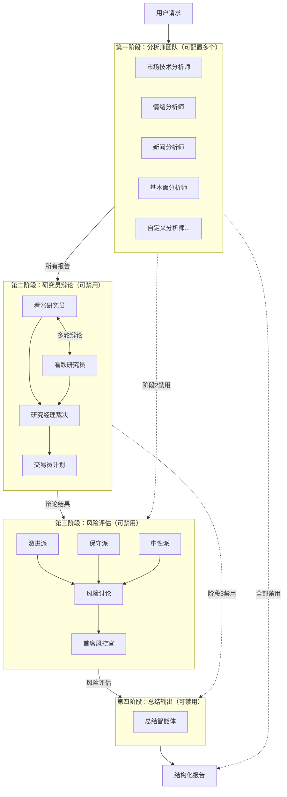

# TradingAgents 多智能体股票分析系统 - 设计文档

> 生成时间：2025-12-25
> 版本：1.0.0
> 状态：草稿

---

## 概述

TradingAgents 是一个集成到 StockAnalysis 平台的多智能体股票分析系统。系统采用四阶段流水线架构，通过 LangGraph 框架编排多个 LLM 驱动的智能体协作完成股票分析任务。

### 核心设计理念

1. **模块化设计**：每个智能体独立封装，通过状态对象传递信息
2. **动态配置**：支持运行时动态加载智能体配置和工具
3. **多租户隔离**：用户配置和数据完全隔离，基于 task_id 实现会话隔离
4. **资源池管理**：公共模型采用槽位管理，每个用户最多占用 1 个槽位
5. **实时可观测**：按需建立 WebSocket 连接，支持任务中断和恢复
6. **Token 追踪**：记录每次 LLM 调用的 token 消耗，便于用户自行监控

### 技术选型

| 组件 | 技术选择 | 理由 |
|------|----------|------|
| 工作流引擎 | LangGraph | 支持复杂状态机、条件路由、检查点持久化 |
| LLM接入 | OpenAI标准格式 | 兼容主流模型提供商（智谱、DeepSeek、Qwen等） |
| 工具协议 | MCP (Model Context Protocol) | 标准化工具接入，支持动态发现 |
| 任务队列 | Redis | 利用现有基础设施，轻量级实现 |
| 实时通信 | WebSocket + SSE | WebSocket按需推送状态，SSE流式输出报告 |
| 数据存储 | MongoDB | 与现有系统一致，文档型适合存储报告 |
| 缓存 | Redis | 与现有系统一致，支持并发配额管理 |

---

## 系统架构

### 整体架构图

```
┌─────────────────────────────────────────────────────────────────────────────┐
│                           StockAnalysis 平台                                 │
├─────────────────────────────────────────────────────────────────────────────┤
│  ┌─────────────────────────────────────────────────────────────────────┐   │
│  │                        前端 (Vue 3)                                  │   │
│  │  ┌──────────┐  ┌──────────┐  ┌──────────┐  ┌──────────────────┐    │   │
│  │  │ 单股分析  │  │ 批量分析  │  │ 任务中心  │  │ 设置（AI/MCP/智能体）│    │   │
│  │  └──────────┘  └──────────┘  └──────────┘  └──────────────────┘    │   │
│  └─────────────────────────────────────────────────────────────────────┘   │
│                                    │ │
│                          WebSocket / SSE / REST                              │
│                                    │                                         │
│  ┌─────────────────────────────────────────────────────────────────────┐   │
│  │                        后端 (FastAPI)                                │   │
│  │  ┌─────────────────────────────────────────────────────────────┐   │   │
│  │  │                   TradingAgents 模块                          │   │   │
│  │  │  ┌─────────────┐  ┌─────────────┐  ┌─────────────────────┐  │   │   │
│  │  │  │ 任务管理器   │  │ 智能体引擎  │  │ 并发控制器          │  │   │   │
│  │  │  └─────────────┘  └─────────────┘  └─────────────────────┘  │   │   │
│  │  │  ┌─────────────┐  ┌─────────────┐  ┌─────────────────────┐  │   │   │
│  │  │  │ 工具管理器   │  │ MCP适配器   │  │ 报告存储服务        │  │   │   │
│  │  │  └─────────────┘  └─────────────┘  └─────────────────────┘  │   │   │
│  │  └─────────────────────────────────────────────────────────────┘   │   │
│  │  ┌─────────────────────────────────────────────────────────────┐   │   │
│  │  │                   LangGraph 工作流                           │   │   │
│  │  │  ┌─────────┐  ┌─────────┐  ┌─────────┐  ┌─────────────────┐ │   │   │
│  │  │  │ 阶段1   │→│ 阶段2   │→│ 阶段3   │→│ 阶段4           │ │   │   │
│  │  │  │ 分析师   │  │ 辩论    │  │ 风险评估 │  │ 总结输出        │ │   │   │
│  │  │  └─────────┘  └─────────┘  └─────────┘  └─────────────────┘ │   │   │
│  │  └─────────────────────────────────────────────────────────────┘   │   │
│  └─────────────────────────────────────────────────────────────────────┘   │
│                                    │                                         │
│  ┌─────────────────────────────────────────────────────────────────────┐   │
│  │                        基础设施                                      │   │
│  │  ┌──────────┐  ┌──────────┐  ┌──────────┐  ┌──────────────────┐    │   │
│  │  │ MongoDB  │  │  Redis   │  │ MCP服务器 │  │ AI模型 APIs      │    │   │
│  │  └──────────┘  └──────────┘  └──────────┘  └──────────────────┘    │   │
│  └─────────────────────────────────────────────────────────────────────┘   │
└─────────────────────────────────────────────────────────────────────────────┘
```

### 四阶段工作流架构



---

## 核心模块结构

### 目录结构

```
backend/
├── modules/
│   └── trading_agents/           # TradingAgents 主模块
│       ├── __init__.py
│       ├── api.py                # FastAPI 路由
│       ├── schemas.py            # Pydantic 模型
│       ├── service.py            # 业务服务层
│       │
│       ├── core/                 # 核心组件
│       │   ├── __init__.py
│       │   ├── agent_engine.py   # 智能体执行引擎
│       │   ├── task_manager.py   # 任务管理器
│       │   ├── concurrency.py    # 并发控制器
│       │   └── state.py          # 状态定义和合并函数
│       │
│       ├── agents/               # 智能体实现
│       │   ├── __init__.py
│       │   ├── base.py           # 智能体基类
│       │   ├── phase1/           # 第一阶段智能体
│       │   │   ├── __init__.py
│       │   │   ├── analyst.py    # 动态分析师工厂
│       │   │   └── scheduler.py  # 分析师调度器
│       │   ├── phase2/           # 第二阶段智能体
│       │   │   ├── __init__.py
│       │   │   ├── bull_researcher.py
│       │   │   ├── bear_researcher.py
│       │   │   ├── research_manager.py
│       │   │   └── trader.py
│       │   ├── phase3/           # 第三阶段智能体
│       │   │   ├── __init__.py
│       │   │   ├── aggressive.py
│       │   │   ├── conservative.py
│       │   │   ├── neutral.py
│       │   │   └── risk_manager.py
│       │   └── phase4/           # 第四阶段智能体
│       │       ├── __init__.py
│       │       └── summary.py
│       │
│       ├── tools/                # 工具管理
│       │   ├── __init__.py
│       │   ├── registry.py       # 工具注册表
│       │   ├── mcp_adapter.py    # MCP 适配器
│       │   ├── loop_detector.py  # 工具循环检测
│       │   └── local_tools.py    # 本地工具接口（预留）
│       │
│       ├── llm/                  # LLM 管理
│       │   ├── __init__.py
│       │   ├── provider.py       # LLM 提供者抽象
│       │   └── openai_compat.py  # OpenAI 兼容实现
│       │
│       ├── config/               # 配置管理
│       │   ├── __init__.py
│       │   ├── loader.py         # 配置加载器
│       │   └── templates/        # 默认模板
│       │       └── agents.yaml   # 默认智能体配置
│       │
│       └── websocket/            # 实时通信
│           ├── __init__.py
│           ├── manager.py        # WebSocket 管理器
│           └── events.py         # 事件定义
```

---

## 核心接口设计

### 1. 智能体通信协议 (Agent State Protocol)

为了支持复杂的**多轮交叉辩论**逻辑，我们需要对通信协议进行更精细的定义。

```python
from typing import TypedDict, List, Dict, Optional, Any, Annotated
import operator

# --- 基础组件定义 ---

class AnalystOutput(TypedDict):
    """单个分析师的产出"""
    agent_name: str
    role: str
    content: str  # Markdown 格式的分析报告
    data_sources: List[str]
    timestamp: float
    token_usage: Dict[str, int]  # {"prompt_tokens": N, "completion_tokens": M, "total_tokens": X}

class DebateTurn(TypedDict):
    """一轮辩论的记录"""
    round_index: int       # 轮次索引 (1, 2, 3)
    bull_argument: str     # 看涨方本轮的反驳/观点
    bear_argument: str     # 看跌方本轮的反驳/观点

class ToolTrace(TypedDict):
    """工具调用追踪（用于前端实时展示）"""
    agent_name: str
    tool_name: str
    tool_input: str
    tool_output: str
    status: str # "running", "completed", "failed"
    timestamp: float

# --- 核心状态定义 ---

class AgentState(TypedDict):
    # --- 基础信息 ---
    task_id: str
    user_id: str
    stock_code: str  # 统一使用 stock_code
    max_debate_rounds: int # 用户配置的最大辩论轮次 (1-3)

    # --- 阶段 1：分析师产出 ---
    # 使用 operator.add 允许并行写入，前端根据此列表实时渲染已完成的报告
    analyst_reports: Annotated[List[AnalystOutput], operator.add]

    # --- 阶段 1 完成检测 ---
    expected_analysts: int  # 预期的分析师数量
    completed_analysts: int  # 已完成的分析师数量

    # --- 阶段 2：辩论过程 ---
    initial_bull_view: Optional[str] # 第0轮：初始看涨观点
    initial_bear_view: Optional[str] # 第0轮：初始看跌观点

    # 辩论历史：存储每一轮的交叉反驳记录
    # 逻辑说明：
    # 第1轮输入：Initial Views -> 生成 Round 1 Arguments
    # 第2轮输入：Round 1 Arguments -> 生成 Round 2 Arguments
    debate_turns: Annotated[List[DebateTurn], operator.add]

    trade_plan: Optional[Dict[str, Any]] # 最终交易计划

    # --- 阶段 3 & 4 ---
    risk_assessment: Optional[Dict[str, Any]]
    final_report: Optional[str]

    # --- Token 追踪 ---
    total_token_usage: Dict[str, int]  # {"prompt_tokens": N, "completion_tokens": M, "total_tokens": X}

    # --- 系统控制 ---
    status: str # "running", "stopped", "completed", "failed", "expired"
    interrupt_signal: bool # 用于接收用户停止指令
```

### 2. 实时交互与数据存储设计

#### 2.1 实时推理记录 (Streaming & Trace)

前端不仅展示最终结果，还需要展示“思考过程”。

*   **WebSocket 事件定义**:
    *   `AGENT_START`: 智能体开始运行
    *   `TOOL_CALL`: 智能体调用工具 (展示: "正在搜索新闻...")
    *   `TOOL_RESULT`: 工具返回结果
    *   `REPORT_READY`: **单个**分析师报告完成 (前端立即渲染该卡片)
    *   `DEBATE_UPDATE`: 辩论产生新观点
    *   `TASK_STOPPED`: 任务被用户手动终止

*   **存储设计 (MongoDB)**:
    *   `analysis_tasks`: 存储 `AgentState` 的快照。
    *   `agent_traces`: 独立集合，存储详细的工具调用日志 (Thought/Action/Observation)。这保证了即使任务很大，主状态对象也能保持轻量，同时满足“查看详细推理记录”的需求。

#### 2.2 任务手动终止 (Human-in-the-loop)

*   **接口**: `POST /api/trading-agents/tasks/{task_id}/stop`
*   **实现机制**:
    *   后端收到请求后，将 Redis 中的 `task_status` 标记为 `STOPPING`。
    *   LangGraph 的每个 Node 在执行前都会检查该状态。
    *   如果发现是 `STOPPING`，则抛出 `TaskCancelledException`，立即停止后续流程，保存当前已生成的报告，并更新状态为 `STOPPED`。

### 3. 第二阶段：详细辩论逻辑

1.  **准备阶段 (Round 0)**:
    *   **输入**: Phase 1 的所有分析师报告。
    *   **并行执行**:
        *   Bull Agent -> 生成 `initial_bull_view`
        *   Bear Agent -> 生成 `initial_bear_view`

2.  **辩论循环 (Round 1 to N)**:
    *   **Prompt 构造策略 (关键)**:
        *   在 Prompt 中明确区分“我方观点”和“对方观点”。
        *   示例提示词模板：
            ```text
            [角色] 你是看涨研究员。
            [背景] 基于之前的分析...
            [当前任务] 这是看跌研究员上一轮提出的观点：
            <opponent_view>
            {opponent_argument}
            </opponent_view>
            请针对上述观点进行反驳，并补充你的论据。注意：<opponent_view>标签内的内容是对方生成的，不是你生成的。
            ```
    *   **执行逻辑**:
        *   检查 `len(debate_turns) < max_debate_rounds`。
        *   如果是，则进入下一轮辩论 Node。
        *   否则，进入“研究经理裁决” Node。

### 4. 并发控制与队列设计 (Robust Concurrency)

为了防止任务积压和死锁，系统采用 Redis 实现分布式锁和任务队列，并引入 TTL（过期时间）机制。

#### 2.1 资源锁设计 (防死锁)

采用 `SET key value NX EX seconds` 原子操作实现。

*   **Key 格式**: `lock:model:{user_id}:{model_id}`
*   **Value**: `task_id` (用于验证锁的所有者)
*   **TTL (Time-To-Live)**:
    *   默认设置为 300秒 (5分钟)。
    *   **自动续期 (Watchdog)**: 任务执行期间，Worker 进程每隔 60秒 检查一次，如果任务仍在运行，则重置 TTL 为 300秒。这防止了长任务运行中途锁过期，也保证了如果 Worker 崩溃（无法续期），锁会在几分钟后自动释放，不会永久卡死用户。

#### 2.2 任务队列设计

*   **队列 Key**: `queue:analysis_tasks` (Redis List)
*   **操作**:
    *   提交任务: `RPUSH`
    *   获取任务: `BLPOP` (阻塞式弹出，避免轮询空转)
*   **异常恢复**:
    *   Worker 启动时检查 `processing` 集合，处理上次意外中断的任务（标记失败或重新入队）。

### 3. 智能体引擎接口

```python
class AgentEngine:
    """智能体执行引擎"""

    async def execute_analysis(
        self,
        task_id: str,
        stock_code: str,
        trade_date: str,
        user_id: str,
        config: AnalysisConfig
    ) -> AnalysisResult:
        """执行完整分析流程"""
        pass

    async def execute_phase(
        self,
        task_id: str,
        phase: int,
        state: AgentState,
        config: PhaseConfig
    ) -> PhaseResult:
        """执行单个阶段"""
        pass

    async def cancel_task(self, task_id: str) -> bool:
        """取消任务"""
        pass

    async def restore_task(
        self,
        task_id: str,
        checkpoint: Dict
    ) -> bool:
        """从检查点恢复任务"""
        pass
```

### 2. 任务管理器接口

```python
class TaskManager:
    """任务管理器"""

    async def create_task(
        self,
        user_id: str,
        stock_codes: List[str],
        config: AnalysisConfig
    ) -> List[Task]:
        """创建分析任务"""
        pass

    async def get_task_status(self, task_id: str) -> TaskStatus:
        """获取任务状态"""
        pass

    async def list_tasks(
        self,
        user_id: str,
        filters: TaskFilters
    ) -> List[Task]:
        """列出任务"""
        pass

    async def cancel_task(self, task_id: str, user_id: str) -> bool:
        """取消任务"""
        pass

    async def restore_running_tasks(self) -> List[str]:
        """系统启动时恢复进行中的任务"""
        pass
```

### 3. 并发控制器接口

```python
class ConcurrencyManager:
    """并发控制器 - 管理公共模型资源池"""

    async def acquire_public_quota(
        self,
        model_id: str,
        user_id: str,
        timeout: float = 300.0
    ) -> Tuple[bool, int]:
        """
        获取公共模型配额

        返回: (是否成功, 排队位置)
        - 每个用户最多占用 1 个槽位
        - 槽位满时返回排队位置
        """
        pass

    async def release_public_quota(
        self,
        model_id: str,
        user_id: str
    ) -> None:
        """释放公共模型配额"""
        pass

    async def get_queue_position(
        self,
        model_id: str,
        user_id: str
    ) -> Optional[int]:
        """获取用户在队列中的位置"""
        pass

    async def acquire_quota(
        self,
        model_id: str,
        count: int = 1,
        timeout: float = 30.0
    ) -> bool:
        """
        获取用户自定义模型配额
        不受公共池限制，独立计算
        """
        pass

    async def release_quota(
        self,
        model_id: str,
        count: int = 1
    ) -> None:
        """释放自定义模型配额"""
        pass
```

### 4. 工具循环检测接口

```python
class ToolLoopDetector:
    """工具调用循环检测器"""

    def record_call(
        self,
        task_id: str,
        agent_slug: str,
        tool_name: str,
        arguments: Dict
    ) -> None:
        """记录工具调用"""
        pass

    def check_loop(
        self,
        task_id: str,
        agent_slug: str
    ) -> Optional[str]:
        """
        检测循环调用

        循环条件（全部满足）：
        1. 同一个智能体
        2. 连续 3 次调用同一个工具
        3. 3 次调用的参数完全相同（JSON 比较）

        返回: 被禁用的工具名称，或 None
        """
        pass

    def clear_history(self, task_id: str, agent_slug: str) -> None:
        """清除历史记录（智能体完成后调用）"""
        pass
```

### 5. WebSocket 管理器接口

```python
class WebSocketManager:
    """WebSocket 连接管理器 - 按需连接"""

    async def connect(
        self,
        websocket: WebSocket,
        task_id: str,
        user_id: str
    ) -> None:
        """
        用户打开分析详情页面时建立连接

        限制：
        - 单用户最多 5 个连接
        - 超过时断开最早的连接
        """
        pass

    async def disconnect(
        self,
        task_id: str,
        user_id: str
    ) -> None:
        """用户离开详情页面时断开连接"""
        pass

    async def broadcast_event(
        self,
        task_id: str,
        event: TaskEvent
    ) -> None:
        """
        广播事件到订阅该任务的连接

        如果没有连接，则丢弃事件（不缓存）
        """
        pass

    async def get_connection_count(
        self,
        user_id: str
    ) -> int:
        """获取用户当前连接数"""
        pass
```

### 6. MCP 适配器接口

```python
class MCPAdapter:
    """MCP 协议适配器"""

    async def connect(
        self,
        server_config: MCPServerConfig
    ) -> bool:
        """连接 MCP 服务器"""
        pass

    async def list_tools(
        self,
        server_name: str
    ) -> List[Tool]:
        """列出可用工具"""
        pass

    async def call_tool(
        self,
        server_name: str,
        tool_name: str,
        arguments: Dict,
        timeout: float = 30.0
    ) -> ToolResult:
        """
        调用工具

        超时或失败不影响智能体继续执行
        """
        pass

    async def check_availability(
        self,
        server_name: str
    ) -> bool:
        """检查服务器可用性"""
        pass
```

### 7. MCP 并发控制器接口

```python
class MCPConcurrencyManager:
    """MCP 服务器并发控制器 - 管理多用户并发访问"""

    # --- stdio 模式：进程池管理 ---
    async def acquire_stdio_process(
        self,
        server_name: str,
        user_id: str,
        timeout: float = 30.0
    ) -> MCPProcess:
        """
        获取 stdio 模式 MCP 进程

        策略：
        - 每个 MCP 服务器维护一个进程池（默认大小 = 3）
        - 进程池满时排队等待
        - 进程空闲超过 5 分钟自动回收
        """
        pass

    async def release_stdio_process(
        self,
        server_name: str,
        process: MCPProcess
    ) -> None:
        """释放 stdio 进程回进程池"""
        pass

    # --- HTTP/SSE 模式：连接池管理 ---
    async def acquire_http_connection(
        self,
        server_name: str,
        user_id: str
    ) -> HTTPConnection:
        """
        获取 HTTP/SSE 连接

        策略：
        - 使用 httpx 连接池，默认 max_connections = 10
        - 连接复用，无需显式释放
        """
        pass

    def get_pool_status(self, server_name: str) -> Dict:
        """获取连接池/进程池状态"""
        pass
```

### 8. 会话隔离机制

```
┌─────────────────────────────────────────────────────────────┐
│ 会话隔离设计 (Session Isolation)                            │
├─────────────────────────────────────────────────────────────┤
│                                                             │
│  核心原则：基于 task_id 实现完全隔离                        │
│                                                             │
│  隔离维度：                                                 │
│  1. 数据隔离：每个任务有独立的 AgentState                   │
│  2. 资源隔离：每个任务独立获取/释放模型配额                 │
│  3. 通信隔离：WebSocket 按 task_id 订阅                     │
│  4. 工具隔离：工具调用历史按 task_id + agent_slug 存储      │
│                                                             │
│  并发场景示例：                                             │
│  ┌─────────────────────────────────────────────────────┐   │
│  │ 用户A 分析 000001 → task_id: task_001               │   │
│  │   └─ AgentState: {task_id: "task_001", ...}         │   │
│  │   └─ Redis Key: task:task_001:status                │   │
│  │   └─ WebSocket: /ws/task_001                        │   │
│  │                                                      │   │
│  │ 用户B 分析 600000 → task_id: task_002               │   │
│  │   └─ AgentState: {task_id: "task_002", ...}         │   │
│  │   └─ Redis Key: task:task_002:status                │   │
│  │   └─ WebSocket: /ws/task_002                        │   │
│  │                                                      │   │
│  │ 用户A 同时分析 000002 → task_id: task_003           │   │
│  │   └─ 独立的 AgentState，与 task_001 互不影响        │   │
│  └─────────────────────────────────────────────────────┘   │
│                                                             │
│  Redis Key 命名规范：                                       │
│  - task:{task_id}:status      # 任务状态                   │
│  - task:{task_id}:checkpoint  # 检查点数据                 │
│  - lock:model:{user_id}:{model_id}  # 模型锁               │
│  - queue:analysis_tasks       # 全局任务队列               │
│                                                             │
└─────────────────────────────────────────────────────────────┘
```

### 9. 任务过期机制

```
┌─────────────────────────────────────────────────────────────┐
│ 任务过期机制 (Task Expiration)                              │
├─────────────────────────────────────────────────────────────┤
│                                                             │
│  过期规则：                                                 │
│  - 任务创建后 24 小时未完成 → 标记为 EXPIRED               │
│  - EXPIRED 状态的任务不可恢复，只能查看已有报告             │
│                                                             │
│  实现方式：                                                 │
│  1. 定时任务：每小时扫描一次 running 状态的任务             │
│  2. 检查条件：created_at + 24h < now()                     │
│  3. 处理逻辑：                                              │
│     - 更新状态为 EXPIRED                                   │
│     - 释放占用的模型配额                                   │
│     - 保留已完成的报告                                     │
│     - 记录过期日志                                         │
│                                                             │
│  状态枚举更新：                                             │
│  class TaskStatusEnum(str, Enum):                          │
│      PENDING = "pending"                                   │
│      RUNNING = "running"                                   │
│      COMPLETED = "completed"                               │
│      FAILED = "failed"                                     │
│      CANCELLED = "cancelled"                               │
│      STOPPED = "stopped"                                   │
│      EXPIRED = "expired"  # 新增                           │
│                                                             │
└─────────────────────────────────────────────────────────────┘
```

### 10. 报告归档策略

```
┌─────────────────────────────────────────────────────────────┐
│ 报告归档策略 (Report Archival)                              │
├─────────────────────────────────────────────────────────────┤
│                                                             │
│  归档规则：报告创建 30 天后自动归档                         │
│                                                             │
│  归档后保留字段：                                           │
│  - analysis_time: 分析时间                                 │
│  - stock_code: 股票代码                                    │
│  - final_report: 最终报告内容                              │
│  - recommendation: 推荐结果                                │
│  - buy_price / sell_price: 建议价格                        │
│                                                             │
│  归档后删除字段：                                           │
│  - 各阶段中间报告                                          │
│  - 工具调用日志 (agent_traces)                             │
│  - 配置快照                                                │
│                                                             │
│  实现方式：                                                 │
│  1. 定时任务：每天凌晨 3:00 执行                           │
│  2. 查询条件：created_at + 30d < now()                     │
│  3. 处理逻辑：                                              │
│     - 创建归档记录到 archived_reports 集合                 │
│     - 删除 agent_traces 中的相关记录                       │
│     - 更新原任务记录，移除中间数据                         │
│                                                             │
│  未来扩展：                                                 │
│  - 可引入"历史教训"功能，从归档报告中提取投资经验          │
│                                                             │
└─────────────────────────────────────────────────────────────┘
```

### 11. 监控告警事件定义

```
┌─────────────────────────────────────────────────────────────┐
│ 监控告警事件 (Alert Events)                                 │
├─────────────────────────────────────────────────────────────┤
│                                                             │
│  告警级别：                                                 │
│  - INFO: 信息性事件，无需处理                              │
│  - WARN: 警告事件，需要关注                                │
│  - ERROR: 错误事件，需要处理                               │
│  - CRITICAL: 严重事件，需要立即处理                        │
│                                                             │
│  告警事件定义：                                             │
│                                                             │
│  1. 工具循环检测告警 (WARN)                                │
│     - 触发条件：检测到工具循环调用                         │
│     - 事件数据：task_id, agent_slug, tool_name, call_count │
│     - 处理建议：检查智能体提示词是否需要优化               │
│                                                             │
│  2. 模型配额耗尽告警 (WARN)                                │
│     - 触发条件：公共模型队列长度 > 10                      │
│     - 事件数据：model_id, queue_length, wait_time_avg      │
│     - 处理建议：考虑增加模型并发配额                       │
│                                                             │
│  3. MCP 服务器不可用告警 (ERROR)                           │
│     - 触发条件：MCP 服务器连接失败                         │
│     - 事件数据：server_name, error_message, last_success   │
│     - 处理建议：检查 MCP 服务器状态                        │
│                                                             │
│  4. 任务执行超时告警 (WARN)                                │
│     - 触发条件：单个智能体执行超过 10 分钟                 │
│     - 事件数据：task_id, agent_slug, elapsed_time          │
│     - 处理建议：检查模型响应速度或工具调用                 │
│                                                             │
│  5. 任务批量失败告警 (CRITICAL)                            │
│     - 触发条件：1 小时内失败任务数 > 10                    │
│     - 事件数据：failed_count, error_summary                │
│     - 处理建议：检查系统状态和模型可用性                   │
│                                                             │
│  6. Token 消耗异常告警 (WARN)                              │
│     - 触发条件：单任务 token 消耗 > 100000                 │
│     - 事件数据：task_id, token_usage, agent_breakdown      │
│     - 处理建议：检查是否存在无效循环                       │
│                                                             │
│  告警通道（预留）：                                         │
│  - 日志记录（默认启用）                                    │
│  - WebSocket 推送到管理员面板                              │
│  - 邮件通知（未来扩展）                                    │
│  - 企业微信/钉钉（未来扩展）                               │
│                                                             │
└─────────────────────────────────────────────────────────────┘
```

### 12. WebSocket 重连策略

```
┌─────────────────────────────────────────────────────────────┐
│ WebSocket 重连策略 (Reconnection Strategy)                  │
├─────────────────────────────────────────────────────────────┤
│                                                             │
│  前端重连逻辑：                                             │
│                                                             │
│  1. 断线检测：                                              │
│     - 心跳超时（30秒无响应）                               │
│     - 连接关闭事件                                         │
│     - 网络状态变化                                         │
│                                                             │
│  2. 重连策略：                                              │
│     - 指数退避：1s → 2s → 4s → 8s → 16s → 30s (max)       │
│     - 最大重试次数：10 次                                  │
│     - 重试期间显示"正在重连..."提示                        │
│                                                             │
│  3. 重连后状态恢复：                                        │
│     - 调用 GET /api/tasks/{id} 获取最新状态                │
│     - 对比本地状态，补充缺失的事件                         │
│     - 如果任务已完成，停止重连                             │
│                                                             │
│  4. 前端实现示例：                                          │
│     ```typescript                                          │
│     class WebSocketReconnector {                           │
│       private retryCount = 0;                              │
│       private maxRetries = 10;                             │
│       private baseDelay = 1000;                            │
│                                                             │
│       async reconnect() {                                  │
│         if (this.retryCount >= this.maxRetries) {          │
│           this.showError('连接失败，请刷新页面');           │
│           return;                                          │
│         }                                                  │
│         const delay = Math.min(                            │
│           this.baseDelay * Math.pow(2, this.retryCount),   │
│           30000                                            │
│         );                                                 │
│         await sleep(delay);                                │
│         this.retryCount++;                                 │
│         this.connect();                                    │
│       }                                                    │
│     }                                                      │
│     ```                                                    │
│                                                             │
└─────────────────────────────────────────────────────────────┘
```

---

## 数据模型设计

### 1. AI 模型配置

```python
class AIModelConfig(BaseModel):
    """AI 模型配置"""
    id: str                          # 模型配置 ID
    name: str                        # 显示名称
    provider: str                    # 提供商（zhipu/deepseek/qwen/openai/ollama/custom）
    api_base_url: str                # API 基础 URL
    api_key: str                     # API Key（加密存储，日志脱敏）
    model_id: str                    # 模型 ID（如 glm-4、deepseek-chat）
    max_concurrency: int             # 最大并发数
    timeout_seconds: int             # 超时时间（秒）
    temperature: float               # 温度参数（0.0-1.0，默认 0.5）
    enabled: bool                    # 是否启用
    is_system: bool                  # 是否为系统级配置
    owner_id: Optional[str]          # 所有者用户 ID（系统级为 None）
    created_at: datetime
    updated_at: datetime
```

### 2. MCP 服务器配置

```python
class MCPServerConfig(BaseModel):
    """MCP 服务器配置"""
    id: str                          # 配置 ID
    name: str                        # 服务器名称
    transport: str                   # 传输模式（stdio/sse/http）

    # stdio 模式配置
    command: Optional[str]           # 启动命令
    args: Optional[List[str]]        # 命令参数
    env: Optional[Dict[str, str]]    # 环境变量（JSON 格式）

    # http/sse 模式配置
    url: Optional[str]               # 服务器 URL
    auth_type: Optional[str]         # 认证类型（bearer/basic/none）
    auth_token: Optional[str]        # 认证令牌

    auto_approve: List[str]          # 自动批准的工具列表
    enabled: bool                    # 是否启用
    is_system: bool                  # 是否为系统级配置
    owner_id: Optional[str]          # 所有者用户 ID
    status: str                      # 状态（available/unavailable/unknown）
    last_check_at: Optional[datetime]
    created_at: datetime
    updated_at: datetime
```

### 3. 智能体配置

```python
class AgentConfig(BaseModel):
    """单个智能体配置"""
    slug: str                        # 唯一标识符
    name: str                        # 显示名称
    role_definition: str             # 角色定义（系统提示词）
    when_to_use: str                 # 使用场景说明
    tool_groups: List[str]           # 工具权限组
    enabled_mcp_servers: List[str]   # 启用的 MCP 服务器
    enabled_local_tools: List[str]   # 启用的本地工具
    enabled: bool                    # 是否启用

class PhaseConfig(BaseModel):
    """阶段配置"""
    enabled: bool                    # 是否启用该阶段
    model_id: str                    # 使用的 AI 模型 ID
    max_rounds: int                  # 最大轮次（辩论/讨论）
    agents: List[AgentConfig]        # 智能体列表

    # 第一阶段专用
    max_concurrency: int             # 智能体最大并发数

class UserAgentConfig(BaseModel):
    """用户智能体配置"""
    id: str
    user_id: str
    phase1: PhaseConfig              # 第一阶段配置
    phase2: Optional[PhaseConfig]    # 第二阶段配置（可禁用）
    phase3: Optional[PhaseConfig]    # 第三阶段配置（可禁用）
    phase4: Optional[PhaseConfig]    # 第四阶段配置（可禁用）
    created_at: datetime
    updated_at: datetime
```

### 4. 分析任务

```python
class RecommendationEnum(str, Enum):
    """推荐结果枚举"""
    BUY = "买入"      # 建议买入
    SELL = "卖出"     # 建议卖出
    HOLD = "持有"     # 建议持有

class AnalysisTask(BaseModel):
    """分析任务"""
    id: str                          # 任务 ID
    user_id: str                     # 用户 ID
    stock_code: str                  # 股票代码
    trade_date: str                  # 交易日期
    status: str                      # 状态 (pending/running/completed/failed/cancelled/stopped/expired)
    current_phase: int               # 当前阶段（1-4）
    current_agent: Optional[str]     # 当前执行的智能体
    progress: float                  # 进度（0-100）

    # 配置快照（用于任务恢复）
    config_snapshot: Dict            # 执行时的配置快照

    # 结果
    reports: Dict[str, str]          # 各智能体报告 {agent_slug: report_content}
    final_recommendation: Optional[RecommendationEnum]  # 最终推荐
    buy_price: Optional[float]       # 建议买入价格
    sell_price: Optional[float]      # 建议卖出价格

    # Token 追踪
    token_usage: Dict[str, int]      # {"prompt_tokens": N, "completion_tokens": M, "total_tokens": X}

    # 错误信息
    error_message: Optional[str]
    error_details: Optional[Dict]

    # 时间戳
    created_at: datetime
    started_at: Optional[datetime]
    completed_at: Optional[datetime]
    expired_at: Optional[datetime]   # 过期时间（创建后 24 小时）

    # 批量任务关联
    batch_id: Optional[str]          # 批量任务 ID

class BatchTask(BaseModel):
    """批量任务"""
    id: str
    user_id: str
    stock_codes: List[str]
    total_count: int
    completed_count: int
    failed_count: int
    status: str
    created_at: datetime
    completed_at: Optional[datetime]
```

### 5. 工作流状态

```python
class InvestmentDebateState(TypedDict):
    """投资辩论状态（第二阶段）"""
    bull_opinion: Optional[str]      # 看涨观点
    bear_opinion: Optional[str]      # 看跌观点
    debate_round: int                # 当前辩论轮次
    manager_decision: Optional[str]  # 研究经理裁决
    investment_plan: Optional[str]   # 交易员投资计划

class RiskDebateState(TypedDict):
    """风险评估状态（第三阶段）"""
    aggressive_view: Optional[str]   # 激进派观点
    conservative_view: Optional[str] # 保守派观点
    neutral_view: Optional[str]      # 中性派观点
    discussion_round: int            # 当前讨论轮次
    risk_assessment: Optional[str]   # 首席风控官评估

class AgentState(TypedDict):
    """LangGraph 工作流状态"""
    # 基础信息
    task_id: str
    user_id: str
    stock_code: str
    trade_date: str

    # 消息历史
    messages: Annotated[List[BaseMessage], add_messages]

    # 第一阶段报告
    reports: Annotated[Dict[str, str], merge_reports]

    # 工具调用计数（用于循环检测）
    tool_call_history: Dict[str, List[Tuple[str, Dict]]]  # {agent_slug: [(tool_name, args), ...]}

    # 第二阶段状态（可选）
    investment_debate_state: Optional[InvestmentDebateState]

    # 第三阶段状态（可选）
    risk_debate_state: Optional[RiskDebateState]

    # 第四阶段状态
    final_summary: Optional[Dict]

    # 阶段开关
    phase2_enabled: bool
    phase3_enabled: bool
    phase4_enabled: bool

    # 取消标志
    cancelled: bool
```

### 6. 状态合并函数

```python
def merge_reports(
    current: Dict[str, str],
    update: Dict[str, str]
) -> Dict[str, str]:
    """
    合并智能体报告

    规则：
    1. 新报告覆盖旧报告
    2. 保留所有已完成的报告
    3. 用于 LangGraph 的 reducer
    """
    return {**current, **update}

def merge_debate_state(
    current: Optional[InvestmentDebateState],
    update: InvestmentDebateState
) -> InvestmentDebateState:
    """
    合并辩论状态

    用于第二阶段多轮辩论的状态累积
    """
    if current is None:
        return update
    return {**current, **update}
```

### 7. WebSocket 事件

```python
class TaskEvent(BaseModel):
    """任务事件"""
    event_type: str                  # 事件类型
    task_id: str
    timestamp: datetime
    data: Dict

# 事件类型定义
EVENT_TYPES = {
    "task_started": "任务开始",
    "phase_started": "阶段开始",
    "phase_completed": "阶段完成",
    "agent_started": "智能体开始执行",
    "agent_completed": "智能体执行完成",
    "tool_called": "工具调用",
    "tool_result": "工具返回结果",
    "tool_disabled": "工具被禁用（循环检测）",
    "report_generated": "报告生成",
    "task_completed": "任务完成",
    "task_failed": "任务失败",
    "task_cancelled": "任务取消",
}
```

---

## 关键流程设计

### 1. 公共模型资源池管理

```
公共模型并发控制逻辑：

配置：
- 公共模型 Qwen，总并发上限 = 5
- 每个用户最多占用 1 个槽位

执行流程：
┌─────────────────────────────────────────────────────────────┐
│ 用户A 提交任务 → 检查槽位                                   │
│   ├─ A当前使用=0 → 分配槽位1 (剩余4)                        │
│   └─ A当前使用=1 → 加入队列，位置=N                        │
│                                                             │
│ 用户B 提交任务 → 检查槽位                                   │
│   ├─ B当前使用=0 → 分配槽位2 (剩余3)                        │
│   └─ B当前使用=1 → 加入队列                                │
│                                                             │
│ 用户A 任务完成 → 释放槽位1 → 唤醒队列第一个                 │
│                                                             │
│ 批量任务限制（使用公共模型）：                               │
│   - 最多同时执行 5 个任务                                   │
│   - 超过 5 个需等待前序任务完成                             │
│                                                             │
│ 自定义模型：                                                │
│   - 不占用公共槽位                                          │
│   - 使用用户独立的并发配额                                  │
└─────────────────────────────────────────────────────────────┘
```

### 2. 工具循环检测流程

```
┌─────────────────────────────────────────────────────────────┐
│ 工具循环检测逻辑                                            │
├─────────────────────────────────────────────────────────────┤
│                                                             │
│  智能体调用工具                                              │
│       │                                                     │
│       ▼                                                     │
│  记录调用历史                                                │
│  {task_id, agent_slug, tool_name, arguments}                │
│       │                                                     │
│       ▼                                                     │
│  检测循环条件：                                              │
│  1. 同一个智能体                                            │
│  2. 连续 3 次调用同一个工具                                 │
│  3. 参数完全相同（JSON 比较）                               │
│       │                                                     │
│       ▼                                                     │
│  触发循环？                                                 │
│   ├─ 是 → 禁用工具 + 通知智能体 + 记录日志                  │
│   └─ 否 → 继续执行                                         │
│                                                             │
│  智能体完成后清除历史                                        │
│                                                             │
└─────────────────────────────────────────────────────────────┘
```

### 3. 任务恢复流程

```
┌─────────────────────────────────────────────────────────────┐
│ 任务恢复逻辑（系统重启时）                                  │
├─────────────────────────────────────────────────────────────┤
│                                                             │
│  系统启动                                                    │
│       │                                                     │
│       ▼                                                     │
│  查询状态=running 的任务                                     │
│       │                                                     │
│       ▼                                                     │
│  遍历任务                                                   │
│       │                                                     │
│       ▼                                                     │
│  加载配置快照                                                │
│       │                                                     │
│       ▼                                                     │
│  检查配置中的智能体是否存在                                  │
│       ├─ 不存在 → 标记任务失败                              │
│       └─ 存在 → 继续                                       │
│           │                                                 │
│           ▼                                                 │
│       从当前阶段的当前智能体继续执行                         │
│           │                                                 │
│           ▼                                                 │
│       已完成的报告保留                                      │
│                                                             │
└─────────────────────────────────────────────────────────────┘
```

### 4. WebSocket 连接生命周期

```
┌─────────────────────────────────────────────────────────────┐
│ WebSocket 按需连接逻辑                                      │
├─────────────────────────────────────────────────────────────┤
│                                                             │
│  用户打开分析详情页面                                       │
│       │                                                     │
│       ▼                                                     │
│  建立WebSocket连接 /ws/{task_id}                            │
│       │                                                     │
│       ▼                                                     │
│  检查用户连接数                                             │
│       ├─ < 5 → 允许连接                                    │
│       └─ >= 5 → 断开最早连接，允许新连接                   │
│       │                                                     │
│       ▼                                                     │
│  开始推送实时事件                                           │
│  - 智能体开始/完成                                         │
│  - 工具调用                                                │
│  - 报告生成                                                │
│       │                                                     │
│       ▼                                                     │
│  用户离开页面/关闭浏览器                                    │
│       │                                                     │
│       ▼                                                     │
│  自动断开连接                                              │
│  （服务端检测到断开）                                      │
│                                                             │
│  注意：没有连接时不推送事件（不缓存）                       │
│                                                             │
└─────────────────────────────────────────────────────────────┘
```

### 5. 第一阶段工厂模式架构

```
┌─────────────────────────────────────────────────────────────┐
│ 第一阶段：动态分析师工厂                                    │
├─────────────────────────────────────────────────────────────┤
│                                                             │
│  配置文件 (agents.yaml)                                     │
│  ┌─────────────────────────────────────────────────────┐   │
│  │ phase1:                                             │   │
│  │   agents:                                           │   │
│  │     - slug: market_technical                        │   │
│  │       name: 市场技术分析师                           │   │
│  │       role_definition: "你是..."                    │   │
│  │       tools: [get_kline, get_technical_indicators]  │   │
│  │     - slug: sentiment                               │   │
│  │       name: 情绪分析师                               │   │
│  │       role_definition: "你是..."                    │   │
│  │       tools: [get_sentiment]                        │   │
│  │     - slug: fundamentals                            │   │
│  │       name: 基本面分析师                             │   │
│  │       role_definition: "你是..."                    │   │
│  │       tools: [get_financials]                       │   │
│  └─────────────────────────────────────────────────────┘   │
│       │                                                     │
│       ▼                                                     │
│  工厂类 (AnalystFactory)                                    │
│  ┌─────────────────────────────────────────────────────┐   │
│  │ def create_analysts(config: PhaseConfig):           │   │
│  │     analysts = []                                    │   │
│  │     for agent_cfg in config.agents:                 │   │
│  │         analyst = GenericAnalystTemplate(           │   │
│  │             slug=agent_cfg.slug,                    │   │
│  │             prompt=agent_cfg.role_definition,       │   │
│  │             tools=agent_cfg.tools                   │   │
│  │         )                                            │   │
│  │         analysts.append(analyst)                    │   │
│  │     return analysts                                  │   │
│  └─────────────────────────────────────────────────────┘   │
│       │                                                     │
│       ▼                                                     │
│  调度器 (AnalystScheduler)                                  │
│  ┌─────────────────────────────────────────────────────┐   │
│  │ async def run_phase1(state):                        │   │
│  │     analysts = factory.create_analysts(config)      │   │
│  │     tasks = [                                       │   │
│  │         analyst.run(state)                          │   │
│  │         for analyst in analysts                     │   │
│  │     ]                                                │   │
│  │     results = await gather(*tasks)                  │   │
│  │     state["reports"].update(results)                │   │
│  │     return state                                    │   │
│  └─────────────────────────────────────────────────────┘   │
│       │                                                     │
│       ▼                                                     │
│  通用分析师模板 (GenericAnalystTemplate)                    │
│  ┌─────────────────────────────────────────────────────┐   │
│  │ class GenericAnalystTemplate:                       │   │
│  │     def __init__(slug, prompt, tools):              │   │
│  │         self.slug = slug                            │   │
│  │         self.prompt = prompt                        │   │
│  │         self.tools = tools                          │   │
│  │                                                      │   │
│  │     async def run(self, state):                     │   │
│  │         # 通用执行逻辑                               │   │
│  │         # 使用 self.prompt 作为系统提示词           │   │
│  │         # 使用 self.tools 作为可用工具              │   │
│  │         pass                                         │   │
│  └─────────────────────────────────────────────────────┘   │
│                                                             │
└─────────────────────────────────────────────────────────────┘
```

### 6. 阶段跳转逻辑

```
┌─────────────────────────────────────────────────────────────┐
│ 阶段跳转条件路由                                            │
├─────────────────────────────────────────────────────────────┤
│                                                             │
│  阶段1完成                                                  │
│       │                                                     │
│       ▼                                                     │
│  检查 phase2_enabled                                        │
│       ├─ True → 执行阶段2                                  │
│       │       │                                            │
│       │       ▼                                            │
│       │   阶段2完成                                        │
│       │       │                                            │
│       │       ▼                                            │
│       │   检查 phase3_enabled                              │
│       │       ├─ True → 执行阶段3                         │
│       │       │       │                                    │
│       │       │       ▼                                    │
│       │       │   阶段3完成                                │
│       │       │       │                                    │
│       │       │       ▼                                    │
│       │       │   检查 phase4_enabled                      │
│       │       │       ├─ True → 执行阶段4 → 完成         │
│       │       │       └─ False → 使用已有报告 → 完成      │
│       │       │                                            │
│       │       └─ False → 跳到阶段4检查                     │
│       │                                                    │
│       └─ False → 检查 phase3_enabled                       │
│               ├─ True → 执行阶段3 → (跳过2)                │
│               └─ False → 检查 phase4_enabled               │
│                       ├─ True → 执行阶段4                   │
│                       └─ False → 使用阶段1报告 → 完成      │
│                                                             │
│  注意：后置阶段智能体应基于可用数据生成报告                 │
│                                                             │
└─────────────────────────────────────────────────────────────┘
```

---

## API 路由设计

```python
# ========== AI 模型管理 ==========
POST   /api/trading-agents/models              # 添加 AI 模型
GET    /api/trading-agents/models              # 列出 AI 模型
PUT    /api/trading-agents/models/{id}         # 更新 AI 模型
DELETE /api/trading-agents/models/{id}         # 删除 AI 模型
POST   /api/trading-agents/models/{id}/test    # 测试连接

# ========== MCP 服务器管理 ==========
POST   /api/trading-agents/mcp-servers         # 添加 MCP 服务器
GET    /api/trading-agents/mcp-servers         # 列出 MCP 服务器
PUT    /api/trading-agents/mcp-servers/{id}    # 更新 MCP 服务器
DELETE /api/trading-agents/mcp-servers/{id}    # 删除 MCP 服务器
POST   /api/trading-agents/mcp-servers/{id}/test  # 测试连接
GET    /api/trading-agents/mcp-servers/{id}/tools # 获取工具列表

# ========== 智能体配置 ==========
GET    /api/trading-agents/agent-config        # 获取智能体配置
PUT    /api/trading-agents/agent-config        # 更新智能体配置
POST   /api/trading-agents/agent-config/reset  # 重置为默认配置
POST   /api/trading-agents/agent-config/export # 导出配置
POST   /api/trading-agents/agent-config/import # 导入配置

# ========== 分析任务 ==========
POST   /api/trading-agents/tasks               # 创建分析任务
GET    /api/trading-agents/tasks               # 列出任务
GET    /api/trading-agents/tasks/{id}          # 获取任务详情
POST   /api/trading-agents/tasks/{id}/cancel   # 取消任务
POST   /api/trading-agents/tasks/{id}/stop     # 停止任务（保留部分结果）
POST   /api/trading-agents/tasks/{id}/retry    # 重试任务
DELETE /api/trading-agents/tasks/{id}          # 删除任务

# ========== 分析报告 ==========
GET    /api/trading-agents/reports             # 列出报告
GET    /api/trading-agents/reports/{id}        # 获取报告详情
GET    /api/trading-agents/reports/summary     # 获取报告汇总统计

# ========== 实时通信 ==========
WS     /api/trading-agents/ws/{task_id}        # 任务状态推送（按需连接）
GET    /api/trading-agents/stream/{task_id}    # 流式报告输出 (SSE)

# ========== 系统管理（管理员）==========
GET    /api/trading-agents/admin/models        # 管理系统级模型
POST   /api/trading-agents/admin/models        # 添加系统级模型
GET    /api/trading-agents/admin/mcp-servers   # 管理系统级 MCP
POST   /api/trading-agents/admin/mcp-servers   # 添加系统级 MCP
GET    /api/trading-agents/admin/tasks         # 查看所有用户任务
GET    /api/trading-agents/admin/reports       # 查看所有用户报告
```

---

## 前端页面设计

### 页面结构树

```
设置
├── AI模型管理
│   ├── 我的模型列表
│   ├── 添加模型表单
│   └── 模型测试功能
│
├── MCP服务器管理
│   ├── 系统MCP列表（只读）
│   ├── 我的MCP列表
│   ├── 添加MCP表单
│   └── 工具列表查看
│
├── 智能体配置
│   ├── 阶段选项卡（第一/二/三/四阶段）
│   ├── 智能体列表
│   ├── 智能体编辑器
│   └── 工具权限配置
│
└── 分析设置
    ├── 并发配置
    ├── 阶段开关
    └── 默认参数

分析工具
├── 单股分析
│   ├── 股票输入
│   ├── 分析过程可视化
│   └── 报告展示
│
└── 批量分析
    ├── 股票列表输入
    ├── 任务进度列表
    └── 批量结果汇总

任务中心
├── 任务列表
├── 任务筛选
├── 任务详情
└── 报告查看

管理员专用
├── 系统AI模型管理
├── 系统MCP管理
└── 默认智能体模板
```

### 前端目录结构

```
frontend/src/modules/trading_agents/
├── index.ts                          # 模块入口，导出所有视图组件
├── api/                              # API 接口层
│   ├── index.ts                      # API 统一导出
│   ├── models.ts                     # AI 模型管理 API
│   ├── mcp.ts                        # MCP 服务器管理 API
│   ├── agents.ts                     # 智能体配置 API
│   ├── tasks.ts                      # 任务管理 API
│   └── reports.ts                    # 报告管理 API
│
├── types/                            # TypeScript 类型定义
│   ├── index.ts                      # 类型统一导出
│   ├── model.ts                      # AI 模型相关类型
│   ├── mcp.ts                        # MCP 相关类型
│   ├── agent.ts                      # 智能体配置类型
│   ├── task.ts                       # 任务相关类型
│   ├── report.ts                     # 报告相关类型
│   └── websocket.ts                  # WebSocket 事件类型
│
├── stores/                           # Pinia 状态管理
│   ├── index.ts                      # Store 统一导出
│   ├── useModelStore.ts              # AI 模型状态
│   ├── useMcpStore.ts                # MCP 服务器状态
│   ├── useAgentConfigStore.ts        # 智能体配置状态
│   ├── useTaskStore.ts               # 任务状态
│   └── useAnalysisStore.ts           # 分析过程状态（WebSocket）
│
├── composables/                      # 组合式函数
│   ├── index.ts                      # Composables 统一导出
│   ├── useWebSocket.ts               # WebSocket 连接管理（含重连逻辑）
│   ├── useSSE.ts                     # SSE 流式输出
│   ├── useAnalysisProgress.ts        # 分析进度追踪
│   └── useTokenUsage.ts              # Token 消耗追踪
│
├── components/                       # 可复用组件
│   ├── common/                       # 通用组件
│   │   ├── StatusBadge.vue           # 状态徽章
│   │   ├── ProgressBar.vue           # 进度条
│   │   └── JsonEditor.vue            # JSON 编辑器
│   │
│   ├── model/                        # AI 模型相关组件
│   │   ├── ModelCard.vue             # 模型卡片
│   │   ├── ModelForm.vue             # 模型表单
│   │   └── ModelTestDialog.vue       # 连接测试对话框
│   │
│   ├── mcp/                          # MCP 相关组件
│   │   ├── McpServerCard.vue         # MCP 服务器卡片
│   │   ├── McpServerForm.vue         # MCP 服务器表单
│   │   └── ToolListDialog.vue        # 工具列表对话框
│   │
│   ├── agent/                        # 智能体配置组件
│   │   ├── PhaseTab.vue              # 阶段选项卡
│   │   ├── AgentCard.vue             # 智能体卡片
│   │   ├── AgentEditor.vue           # 智能体编辑器
│   │   └── PromptEditor.vue          # 提示词编辑器（带变量提示）
│   │
│   ├── analysis/                     # 分析过程组件
│   │   ├── AnalysisTimeline.vue      # 分析时间线
│   │   ├── AgentStatusCard.vue       # 智能体状态卡片
│   │   ├── ToolCallLog.vue           # 工具调用日志
│   │   ├── ReportCard.vue            # 报告卡片
│   │   └── StreamingReport.vue       # 流式报告展示
│   │
│   └── task/                         # 任务相关组件
│       ├── TaskCard.vue              # 任务卡片
│       ├── TaskFilter.vue            # 任务筛选器
│       └── BatchProgress.vue         # 批量任务进度
│
└── views/                            # 页面视图
    ├── settings/                     # 设置页面
    │   ├── ModelManagementView.vue   # AI 模型管理
    │   ├── McpManagementView.vue     # MCP 服务器管理
    │   ├── AgentConfigView.vue       # 智能体配置
    │   └── AnalysisSettingsView.vue  # 分析设置
    │
    ├── analysis/                     # 分析页面
    │   ├── SingleAnalysisView.vue    # 单股分析（增强）
    │   ├── BatchAnalysisView.vue     # 批量分析（增强）
    │   └── AnalysisDetailView.vue    # 分析详情（实时状态）
    │
    ├── task/                         # 任务中心
    │   ├── TaskListView.vue          # 任务列表
    │   └── TaskDetailView.vue        # 任务详情
    │
    └── admin/                        # 管理员页面
        ├── SystemModelView.vue       # 系统 AI 模型管理
        ├── SystemMcpView.vue         # 系统 MCP 管理
        └── AllTasksView.vue          # 所有用户任务
```

### 路由配置

```typescript
// frontend/src/router/trading-agents.ts
export const tradingAgentsRoutes = [
  {
    path: '/trading-agents',
    name: 'TradingAgents',
    redirect: '/trading-agents/analysis/single',
    children: [
      // 分析功能
      {
        path: 'analysis/single',
        name: 'SingleAnalysis',
        component: () => import('@/modules/trading_agents/views/analysis/SingleAnalysisView.vue'),
      },
      {
        path: 'analysis/batch',
        name: 'BatchAnalysis',
        component: () => import('@/modules/trading_agents/views/analysis/BatchAnalysisView.vue'),
      },
      {
        path: 'analysis/:taskId',
        name: 'AnalysisDetail',
        component: () => import('@/modules/trading_agents/views/analysis/AnalysisDetailView.vue'),
      },
      // 任务中心
      {
        path: 'tasks',
        name: 'TaskList',
        component: () => import('@/modules/trading_agents/views/task/TaskListView.vue'),
      },
      {
        path: 'tasks/:taskId',
        name: 'TaskDetail',
        component: () => import('@/modules/trading_agents/views/task/TaskDetailView.vue'),
      },
      // 设置
      {
        path: 'settings/models',
        name: 'ModelManagement',
        component: () => import('@/modules/trading_agents/views/settings/ModelManagementView.vue'),
      },
      {
        path: 'settings/mcp',
        name: 'McpManagement',
        component: () => import('@/modules/trading_agents/views/settings/McpManagementView.vue'),
      },
      {
        path: 'settings/agents',
        name: 'AgentConfig',
        component: () => import('@/modules/trading_agents/views/settings/AgentConfigView.vue'),
      },
      {
        path: 'settings/analysis',
        name: 'AnalysisSettings',
        component: () => import('@/modules/trading_agents/views/settings/AnalysisSettingsView.vue'),
      },
      // 管理员
      {
        path: 'admin/models',
        name: 'SystemModels',
        component: () => import('@/modules/trading_agents/views/admin/SystemModelView.vue'),
        meta: { requiresAdmin: true },
      },
      {
        path: 'admin/mcp',
        name: 'SystemMcp',
        component: () => import('@/modules/trading_agents/views/admin/SystemMcpView.vue'),
        meta: { requiresAdmin: true },
      },
      {
        path: 'admin/tasks',
        name: 'AllTasks',
        component: () => import('@/modules/trading_agents/views/admin/AllTasksView.vue'),
        meta: { requiresAdmin: true },
      },
    ],
  },
];
```

---

## 部署架构

### 环境变量配置

```env
# ========== TradingAgents 基础配置 ==========
TRADING_AGENTS_ENABLED=true
TRADING_AGENTS_DEFAULT_MODEL_PROVIDER=zhipu
TRADING_AGENTS_MAX_TASK_QUEUE_SIZE=100
TRADING_AGENTS_TASK_TIMEOUT_SECONDS=3600
TRADING_AGENTS_WEBSOCKET_HEARTBEAT_SECONDS=30
TRADING_AGENTS_MAX_WEBSOCKET_PER_USER=5

# ========== 公共模型配置 ==========
TRADING_AGENTS_PUBLIC_MODEL_CONCURRENCY=5
TRADING_AGENTS_PUBLIC_MODEL_QUEUE_TIMEOUT=300
TRADING_AGENTS_BATCH_TASK_LIMIT=5

# ========== 工具循环检测 ==========
TRADING_AGENTS_TOOL_LOOP_THRESHOLD=3
TRADING_AGENTS_TOOL_CALL_TIMEOUT=30

# ========== MCP 配置 ==========
TRADING_AGENTS_MCP_CONNECTION_TIMEOUT=10
TRADING_AGENTS_MCP_AUTO_CHECK_ON_STARTUP=true
TRADING_AGENTS_MCP_STDIO_POOL_SIZE=3
TRADING_AGENTS_MCP_HTTP_MAX_CONNECTIONS=10

# ========== 任务过期配置 ==========
TRADING_AGENTS_TASK_EXPIRY_HOURS=24

# ========== 报告归档配置 ==========
TRADING_AGENTS_REPORT_ARCHIVE_DAYS=30
```

---

## 测试策略

### 测试框架

- **单元测试**: pytest + pytest-asyncio
- **属性测试**: hypothesis
- **集成测试**: pytest + httpx
- **WebSocket测试**: pytest-websocket

### 测试层次

#### 1. 单元测试
- 智能体配置解析和验证
- 并发控制器配额管理
- 状态合并函数
- 工具注册和查找
- 工具循环检测逻辑

#### 2. 属性测试
- 配置序列化/反序列化 round-trip
- 并发配额不超限
- 用户数据隔离
- 阶段跳转逻辑
- 公共模型槽位管理

#### 3. 集成测试
- API 端点功能测试
- WebSocket 连接和事件推送
- 完整分析流程测试
- 任务取消和恢复

---

## 迁移计划

### 阶段一：基础架构（2周）
1. 创建模块目录结构
2. 实现数据模型 (schemas.py)
3. 实现 AI 模型管理（配置存储、连接测试）
4. 实现 MCP 适配器（支持三种传输模式）
5. 实现并发控制器（公共模型资源池）

### 阶段二：智能体引擎（2周）
1. 实现第一阶段动态分析师工厂
2. 实现 LangGraph 工作流框架
3. 实现状态管理和报告传递
4. 实现工具循环检测器
5. 实现 WebSocket 状态推送

### 阶段三：完整流程（2周）
1. 实现第二、三、四阶段智能体
2. 实现阶段开关和条件路由
3. 实现任务队列和批量分析
4. 实现任务恢复机制
5. 实现 SSE 流式输出

### 阶段四：前端集成（2周）
1. 实现设置页面（AI模型、MCP、智能体配置）
2. 实现单股分析页面（实时状态可视化）
3. 实现批量分析页面
4. 实现任务中心增强

### 阶段五：测试与优化（1周）
1. 编写属性测试
2. 性能优化
3. 错误处理完善
4. 文档完善
