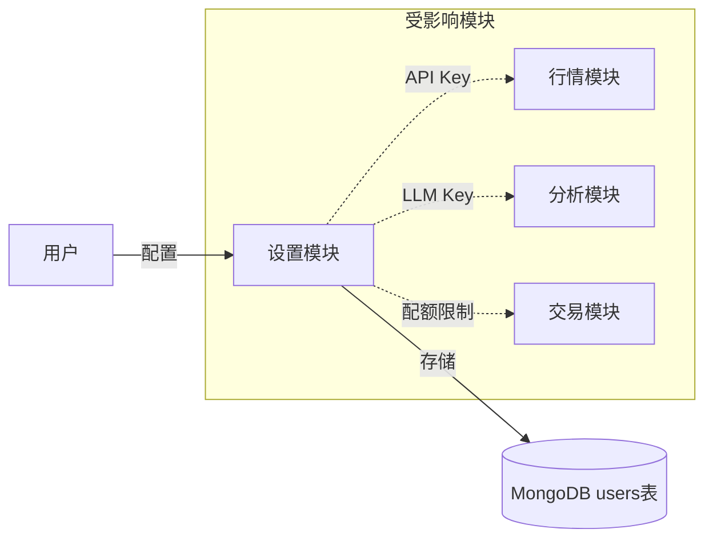

# 06_PAGE_USER_SETTINGS_DESIGN.md

# 前端页面设计：用户与系统设置 (User & System Settings)

## 1. 概述
本模块包含用户个人中心管理以及系统级参数配置。对于初级工程师来说，这是理解**身份验证 (Authentication)**、**权限控制 (Authorization)** 和 **系统配置 (Configuration)** 的最佳入口。

**核心功能**：
1.  **个人设置**：修改密码、偏好设置（如默认市场、主题）。
2.  **API凭证**：管理 Tushare Token 和 OpenAI Key，实现“自带Key”功能。
3.  **系统管理**：管理员专属面板，用于监控系统健康和调整全局配额。

---

## 2. 模块化架构 (Modular Architecture)

本模块在架构上属于 **横切关注点 (Cross-cutting Concerns)**，因为它为所有其他模块提供用户上下文和配置支持。



---

## 3. 📂 代码导航 (Code Navigation)

初级工程师在维护本模块时，主要关注以下文件：

*   **数据模型 (Models)**:
    *   `app/models/user.py`: 定义了 `User` 类和 `UserPreferences` 类。如果要加一个新的用户设置项（比如“是否开启自动交易”），请改这里。
    *   `app/models/system.py`: (如存在) 定义系统全局配置结构。

*   **API 接口 (Routers)**:
    *   `app/routers/auth.py`: 处理登录、注册、JWT Token 生成。
    *   `app/routers/users.py`: 获取当前用户信息、更新偏好设置。
    *   `app/routers/system_config.py`: 管理员接口，用于查看系统状态和修改全局配置。

*   **业务逻辑 (Services)**:
    *   `app/services/user_service.py`: 处理用户数据的增删改查。
    *   `app/auth/security.py`: 密码哈希 (`bcrypt`) 和 Token 验证逻辑。

---

## 4. 页面功能模块详解

### 4.1 个人资料与偏好 (Profile & Preferences)
*   **基础信息**：显示用户名、邮箱、注册时间。
*   **偏好设置**：
    *   **默认市场**：设置默认关注 A股/港股/美股。
    *   **分析深度**：默认 Level 1-5。
    *   **UI 主题**：Light/Dark 模式。
*   **实现细节**：前端提交 JSON 更新 `user.preferences` 字段，后端通过 `UserService.update_preferences` 保存。

### 4.2 API 凭证管理 (API Keys Management)
这是本系统的特色功能，允许用户使用自己的资源。
*   **Tushare Token**: 用户填入后，系统在获取数据时会优先使用该 Token，避免消耗公共池配额。
*   **OpenAI Key**: 用户填入后，分析任务将使用该 Key 调用 LLM。
*   **安全注意**: 这些 Key 在数据库中应当加密存储（当前版本暂为明文，未来需改进）。

### 4.3 系统管理控制台 (Admin Only)
*   **权限要求**: `user.is_admin == True`。
*   **功能**:
    *   **配额管理**: 手动重置某个用户的 `daily_quota`。
    *   **系统健康**: 查看 Redis 连接、Celery 队列长度。

---

## 5. 🚀 初级开发指南 (Junior Developer Guide)

### 任务一：给用户增加一个“手机号”字段
**场景**：产品经理希望用户能绑定手机号，以便接收短信通知。

1.  **Step 1: 修改模型**
    *   打开 `app/models/user.py`。
    *   在 `User` 类中添加 `phone: Optional[str] = None`。

2.  **Step 2: 修改更新接口**
    *   打开 `app/schemas/user.py` (或在 router 中定义的 Request Body)。
    *   在 `UserUpdate` 模型中添加 `phone` 字段。

3.  **Step 3: 验证**
    *   重启服务。
    *   使用 Swagger UI (`/docs`) 调用 `PUT /api/users/me`，传入 `{"phone": "13800138000"}`。
    *   检查 MongoDB，确认字段已写入。

### 任务二：添加一个新的偏好设置“默认首页”
**场景**：用户希望登录后默认跳转到“交易终端”而不是“仪表盘”。

1.  **Step 1: 修改偏好模型**
    *   打开 `app/models/user.py`。
    *   在 `UserPreferences` 类中添加 `default_home_page: str = "dashboard"`。

2.  **Step 2: 前端联调 (可选)**
    *   告知前端同学字段名为 `default_home_page`，可选值为 `dashboard`, `market`, `trading`。

### 任务三：管理员重置用户密码
**场景**：用户忘记密码，且邮件系统故障，管理员需要手动重置。

1.  **Step 1: 找到管理员接口**
    *   打开 `app/routers/admin.py` (或 `users.py` 中的 admin 区域)。
    *   找到 `reset_user_password` 函数。

2.  **Step 2: 理解哈希逻辑**
    *   注意不能直接存明文密码。
    *   必须调用 `get_password_hash("new_password_123")` 得到哈希值后再存入 DB。

---

## 6. 接口设计 (API Specification)

### 6.1 更新用户偏好
*   **URL**: `/api/users/me/preferences`
*   **Method**: `PUT`
*   **Body**:
    ```json
    {
      "default_market": "HK",
      "ui_theme": "dark",
      "notifications_enabled": true
    }
    ```

### 6.2 验证并保存 API Key
*   **URL**: `/api/users/me/keys/{key_type}`
*   **Method**: `POST`
*   **Params**: `key_type` (tushare | openai)
*   **Body**: `{ "key": "sk-..." }`
*   **Logic**:
    *   如果是 `tushare`，后端会尝试调用一次 `ts.get_daily` 验证 Key 是否有效。
    *   验证通过后才保存。

### 6.3 获取系统状态 (Admin)
*   **URL**: `/api/admin/system/status`
*   **Method**: `GET`
*   **Permission**: `is_admin=True`
