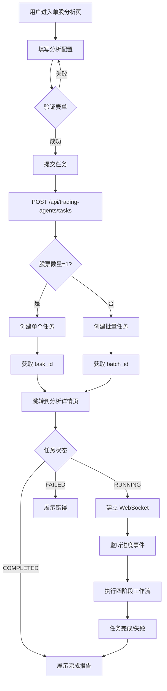
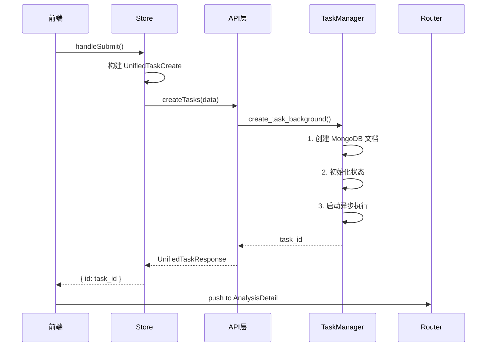
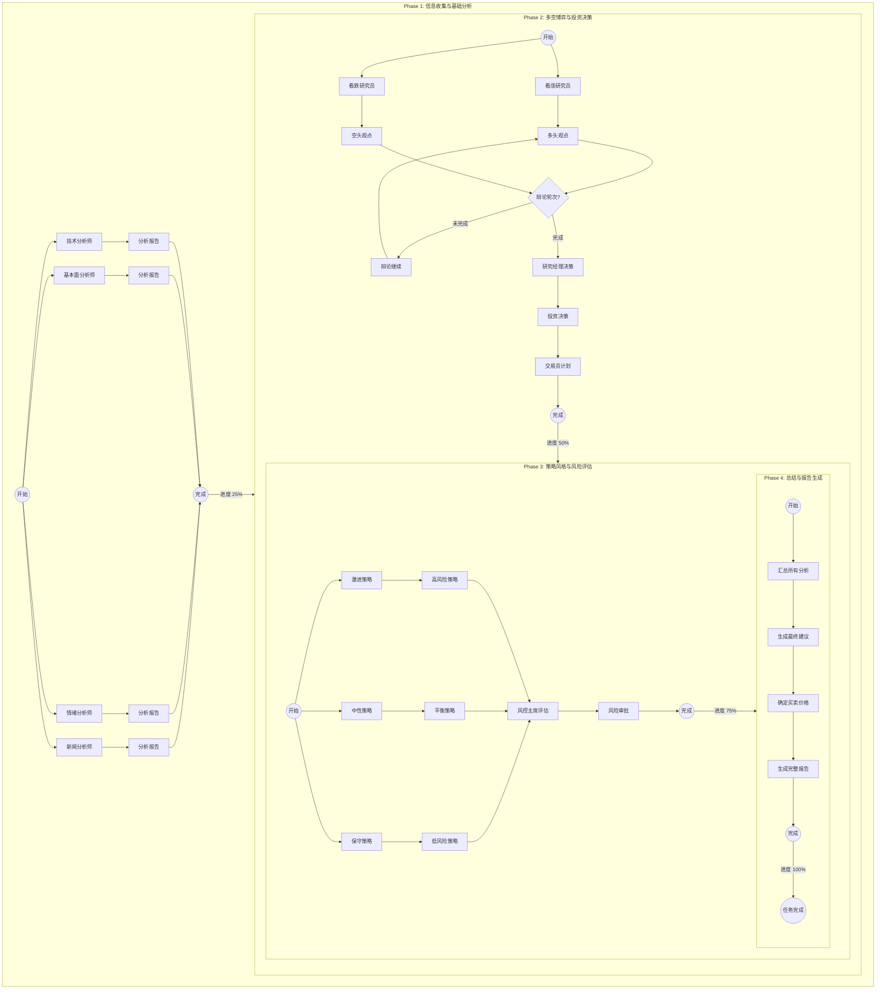
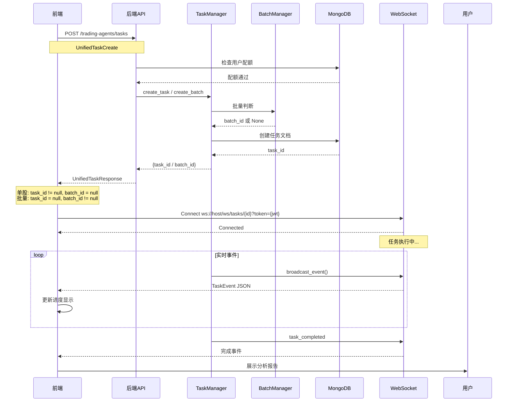
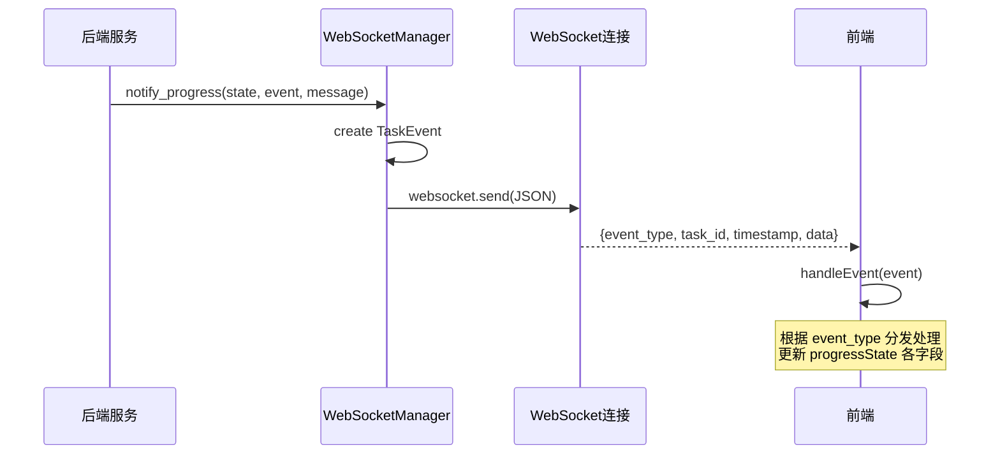
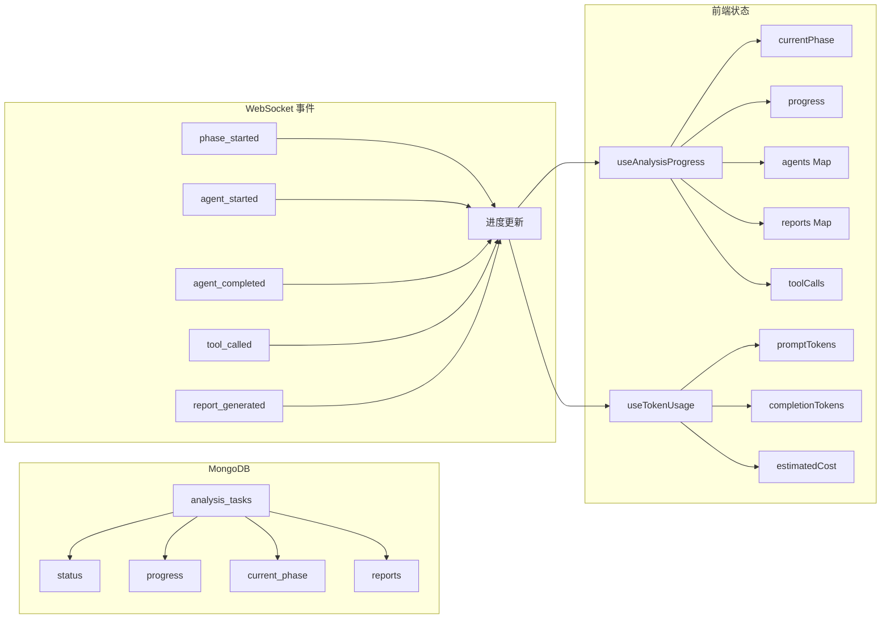
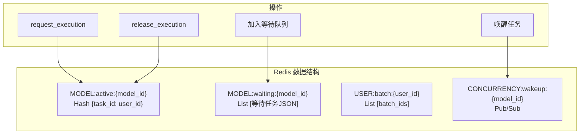
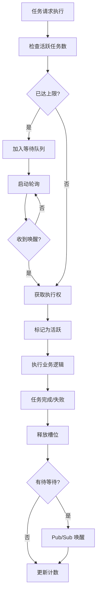
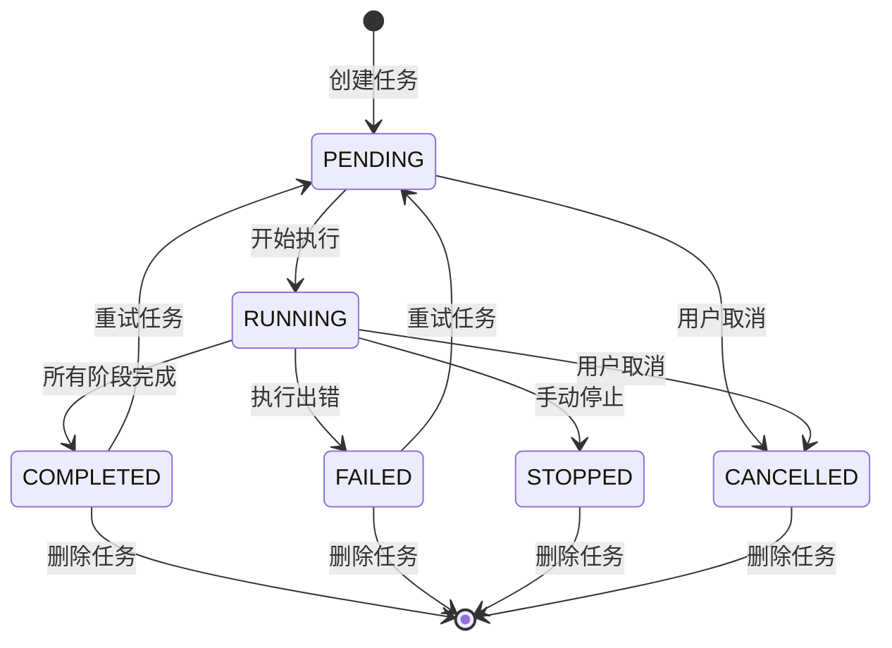

# StockAnalysis 业务逻辑详解

> 文档版本：v1.0  
> 创建日期：2026-02-10  
> 分析范围：单股分析、批量分析业务流程  
> 文档用途：系统架构理解、业务流程参考

---

## 一、系统架构总览

### 1.1 技术架构图

```
┌─────────────────────────────────────────────────────────────────────────┐
│                         前端层 (Vue 3 + TypeScript)                    │
├─────────────────────────────────────────────────────────────────────────┤
│                                                                          │
│   ┌──────────────────────────────────────────────────────────────┐    │
│   │                      Views (视图层)                          │    │
│   │  ┌──────────────┐  ┌──────────────┐  ┌──────────────┐     │    │
│   │  │ SingleAnalysis│  │BatchAnalysis │  │ TaskCenter   │     │    │
│   │  │   单股分析    │  │  批量分析    │  │   任务中心   │     │    │
│   │  └──────────────┘  └──────────────┘  └──────────────┘     │    │
│   └──────────────────────────────────────────────────────────────┘    │
│                              │                                         │
│                              ▼                                         │
│   ┌──────────────────────────────────────────────────────────────┐    │
│   │                 Composables (组合式函数)                       │    │
│   │                                                              │    │
│   │   ┌─────────────┐  ┌─────────────┐  ┌─────────────┐         │    │
│   │   │useWebSocket │  │useAnalysis  │  │useTokenUsage│         │    │
│   │   │ WebSocket   │  │Progress     │  │  Token统计  │         │    │
│   │   │   连接管理   │  │   进度追踪  │  │             │         │    │
│   │   └─────────────┘  └─────────────┘  └─────────────┘         │    │
│   │                                                              │    │
│   │   ┌─────────────┐  ┌─────────────┐                           │    │
│   │   │  useSSE    │  │useBatchWeb  │                           │    │
│   │   │  SSE流式   │  │Socket       │                           │    │
│   │   │            │  │ 批量WebSocket│                           │    │
│   │   └─────────────┘  └─────────────┘                           │    │
│   └──────────────────────────────────────────────────────────────┘    │
│                              │                                         │
│                              ▼                                         │
│   ┌──────────────────────────────────────────────────────────────┐    │
│   │                  Pinia Store (状态管理)                       │    │
│   │                                                              │    │
│   │              useTradingAgentsStore                           │    │
│   │    - MCP 服务器配置          - 用户智能体配置                 │    │
│   │    - 任务列表与状态          - Token 使用统计                 │    │
│   └──────────────────────────────────────────────────────────────┘    │
│                                                                          │
└─────────────────────────────────────────────────────────────────────────┘
                                    │
                                    ▼ HTTPS / WebSocket
┌─────────────────────────────────────────────────────────────────────────┐
│                        后端层 (FastAPI + Python)                        │
├─────────────────────────────────────────────────────────────────────────┤
│                                                                          │
│   ┌──────────────────────────────────────────────────────────────┐    │
│   │                    API Gateway                                 │    │
│   │                                                              │    │
│   │   POST   /trading-agents/tasks        # 创建任务             │    │
│   │   GET    /trading-agents/tasks        # 查询任务列表         │    │
│   │   GET    /trading-agents/tasks/{id}   # 获取任务详情          │    │
│   │   DELETE /trading-agents/tasks/{id}   # 删除任务             │    │
│   │   POST   /trading-agents/tasks/{id}/cancel  # 取消任务        │    │
│   │   WS     /ws/tasks/{taskId}           # WebSocket 连接       │    │
│   │   GET    /tasks/{id}/stream            # SSE 流式输出        │    │
│   │   GET    /tasks/{id}/queue-position   # 队列位置查询        │    │
│   │   POST   /tasks/batch-delete          # 批量删除             │    │
│   └──────────────────────────────────────────────────────────────┘    │
│                              │                                         │
│              ┌───────────────┼───────────────┐                         │
│              ▼               ▼               ▼                         │
│   ┌──────────────┐  ┌──────────────┐  ┌──────────────┐              │
│   │ TaskManager  │  │BatchManager  │  │Concurrency   │              │
│   │   任务管理    │  │  批量任务    │  │Controller    │              │
│   │              │  │    管理      │  │   并发控制   │              │
│   │ - create_task│  │ - create_    │  │ - request_   │              │
│   │ - execute_   │  │   batch      │  │   execution  │              │
│   │   workflow   │  │ - on_task_   │  │ - wait_for_  │              │
│   │ - list_tasks │  │   completed  │  │   execution  │              │
│   └──────────────┘  └──────────────┘  └──────────────┘              │
│                              │                                         │
│              ┌───────────────┼───────────────┐                         │
│              ▼               ▼               ▼                         │
│   ┌──────────────┐  ┌──────────────┐  ┌──────────────┐              │
│   │   Phase 1    │  │   Phase 2    │  │   Phase 3/4  │              │
│   │  信息收集     │  │  多空博弈     │  │  策略/总结   │              │
│   │              │  │              │  │              │              │
│   │ - 并行执行   │  │ - 辩论模式   │  │ - 并行策略   │              │
│   │ - 多角度分析 │  │ - 投资决策   │  │ - 风险评估   │              │
│   │ - 报告汇总   │  │ - 交易计划   │  │ - 最终总结   │              │
│   └──────────────┘  └──────────────┘  └──────────────┘              │
│                                                                          │
└─────────────────────────────────────────────────────────────────────────┘
                                    │
                                    ▼
┌─────────────────────────────────────────────────────────────────────────┐
│                           数据层                                         │
├─────────────────────────────────────────────────────────────────────────┤
│                                                                          │
│   ┌──────────────────┐  ┌──────────────────┐  ┌──────────────────┐  │
│   │     MongoDB      │  │      Redis       │  │   AI Models      │  │
│   │                  │  │                  │  │                  │  │
│   │ - analysis_tasks │  │ - 活跃任务集合   │  │ - GLM-4.6       │  │
│   │ - 任务文档存储   │  │ - 等待队列      │  │ - Claude Sonnet  │  │
│   │                  │  │ - Pub/Sub 通知  │  │ - Claude Haiku   │  │
│   │ - reports 集合   │  │ - 并发状态      │  │                  │  │
│   └──────────────────┘  └──────────────────┘  └──────────────────┘  │
│                                                                          │
└─────────────────────────────────────────────────────────────────────────┘
```

### 1.2 前后端职责划分

| 层级 | 前端职责 | 后端职责 |
|-----|---------|---------|
| **视图层** | 表单渲染、进度展示、报告展示 | - |
| **API 层** | HTTP 请求封装、WebSocket 管理 | 路由处理、业务逻辑 |
| **状态层** | 本地状态管理、缓存 | 会话管理、权限验证 |
| **数据层** | 临时数据缓存 | 持久化存储 |

### 1.3 数据隔离设计

系统采用用户级别数据隔离：

```
MongoDB 隔离：
  每个任务文档包含 user_id 字段
  查询时强制添加 user_id 过滤条件
  
Redis 隔离：
  Key 命名规范：user:{user_id}:{resource}:{id}
  示例：user:123:task:abc123
```

---

## 二、两种分析模式

### 2.1 单股分析 vs 批量分析

| 特性 | 单股分析 | 批量分析 |
|-----|---------|---------|
| **输入** | 1 个股票代码 | 1-50 个股票代码 |
| **执行方式** | 独立任务，直接执行 | 分批并发，智能调度 |
| **返回 ID** | `task_id` | `batch_id` |
| **进度展示** | 单一进度条 | 批量进度汇总 |
| **管理入口** | 分析详情页 | 任务中心 |
| **取消操作** | 单任务取消 | 批量取消 |
| **费用计算** | 单次 Token 统计 | 批量 Token 汇总 |

### 2.2 统一 API 设计

系统使用统一的 API 端点处理两种分析模式：

```typescript
// 请求格式（单股和批量通用）
interface UnifiedTaskCreate {
  stock_codes: string[]    // 1个 = 单股，>1个 = 批量
  market: 'A_STOCK' | 'US_STOCK' | 'HK_STOCK'
  trade_date: string
  data_collection_model?: string
  debate_model?: string
  stages: AnalysisStagesConfig
  batch_name?: string       // 批量任务可选名称
}

// 响应格式（自动判断类型）
interface UnifiedTaskResponse {
  task_id: string | null    // 单股时返回
  batch_id: string | null   // 批量时返回
  stock_codes: string[]
  total_count: number
  message: string
}
```

**自动判断逻辑**：

```
if (stock_codes.length === 1) {
  // 单股分析
  task_id = await create_single_task(...)
  return { task_id, batch_id: null }
} else {
  // 批量分析
  batch_id = await create_batch_task(...)
  return { task_id: null, batch_id }
}
```

---

## 三、单股分析完整流程

### 3.1 流程概览



### 3.2 表单提交阶段

**单股分析表单字段**：

| 字段 | 类型 | 必填 | 说明 |
|-----|------|-----|------|
| `stock_code` | 字符串 | 是 | 6位股票代码 |
| `market` | 枚举 | 是 | A_STOCK/US_STOCK/HK_STOCK |
| `trade_date` | 日期 | 是 | 交易日期 YYYY-MM-DD |
| `data_collection_model` | 字符串 | 否 | Phase 1 使用的模型 |
| `debate_model` | 字符串 | 否 | Phase 2-4 使用的模型 |

**阶段配置**：

```typescript
interface AnalysisStagesConfig {
  stage1: {
    enabled: boolean
    selected_agents: string[]  // 可用智能体
  }
  stage2: {
    enabled: boolean
    debate: {
      enabled: boolean
      rounds: number          // 辩论轮数 1-10
      concurrency: number     // 并发数
    }
  }
  stage3: {
    enabled: boolean
    debate: { ... }
    concurrency: number       // 风险评估并发数
  }
  stage4: {
    enabled: true             // 固定启用
  }
}
```

**可用智能体列表**（与 `config/agents/phase*-default.yaml` 一致）：

| 阶段 | 智能体 ID | 名称 | 说明 |
|-----|----------|------|------|
| Phase 1 | `financial-news-analyst` | 财经新闻分析师 | 财经新闻、公告解读 |
| Phase 1 | `social-media-analyst` | 社交媒体和投资情绪分析师 | 市场情绪、舆情 |
| Phase 1 | `china-market-analyst` | 中国市场分析师 | A股/港股、政策与资金面 |
| Phase 1 | `market-analyst` | 市场技术分析师 | K线形态、技术指标 |
| Phase 1 | `fundamentals-analyst` | 基本面分析师 | 财务数据、估值分析 |
| Phase 1 | `short-term-capital-analyst` | 短线资金分析师 | 资金流向、龙虎榜 |
| Phase 2 | `bull-researcher` | 看涨分析师 | 多头观点 |
| Phase 2 | `bear-researcher` | 看跌分析师 | 空头观点 |
| Phase 2 | `research-manager` | 投资组合经理 | 综合决策 |
| Phase 2 | `trader` | 专业交易员 | 交易执行计划 |
| Phase 3 | `aggressive-debator` | 激进策略分析师 | 高风险高收益 |
| Phase 3 | `neutral-debator` | 中性策略分析师 | 平衡方案 |
| Phase 3 | `conservative-debator` | 保守策略分析师 | 低风险稳健 |
| Phase 3 | `risk-manager` | 风险管理委员会主席 | 风险评估与审查 |
| Phase 4 | `summarizer` | 总结智能体 | 最终报告 |

### 3.3 任务创建阶段

**API 调用序列**：



**任务文档结构**：

```typescript
interface AnalysisTask {
  id: string               // 任务 ID
  user_id: string          // 用户 ID（用于隔离）
  stock_code: string       // 股票代码
  market: StockMarketEnum  // 市场类型
  trade_date: string       // 交易日期
  
  status: TaskStatus       // pending/running/completed/failed
  current_phase: number    // 1-4
  current_agent: string    // 当前执行的智能体
  progress: number         // 0-100
  
  reports: Record<string, string>  // 智能体报告
  final_report?: string    // 最终报告
  final_recommendation?:  // BUY/SELL/HOLD/NOT_CLEAR
  buy_price?: number       // 买入建议价
  sell_price?: number      // 卖出建议价
  risk_level?: string      // 风险等级
  
  token_usage?: {
    prompt_tokens: number
    completion_tokens: number
    total_tokens: number
  }
  
  phase_executions?: PhaseExecution[]  // 阶段执行记录
  tool_calls?: ToolCallRecord[]       // 工具调用记录
  
  created_at: string
  started_at?: string
  completed_at?: string
}
```

---

## 四、四阶段工作流详解

### 4.1 阶段执行流程图



### 4.2 各阶段详细说明

#### Phase 1: 信息收集与基础分析

**执行方式**：所有启用的分析师智能体并行执行

**主要任务**：
```
1. 技术分析师
   - 分析 K 线形态
   - 计算技术指标（MA、MACD、RSI 等）
   - 判断趋势方向
   
2. 基本面分析师
   - 收集财务数据
   - 计算估值指标（P/E、P/B、ROE 等）
   - 分析盈利能力与成长性
   
3. 情绪分析师
   - 分析资金流向
   - 监测市场情绪指标
   - 评估交易活跃度
   
4. 新闻分析师
   - 收集相关新闻
   - 分析公告影响
   - 评估舆情倾向
```

**输出**：`analyst_reports` 数组，包含各分析师的结构化报告

#### Phase 2: 多空博弈与投资决策

**执行方式**：看涨/看跌研究员并行 → 辩论轮次串行 → 经理/交易员串行

**辩论流程**：
```
Round 1:
  看涨研究员提出多头观点
  看跌研究员提出空头观点
  
Round 2-N:
  看跌研究员针对多头观点反驳
  看涨研究员针对空头观点反驳
  ...
  
决策:
  研究经理综合各方观点
  做出投资决策（买入/卖出/持有）
  
执行:
  专业交易员制定交易计划
  确定买入/卖出价格区间
```

**输出**：
- `debate_turns`：辩论轮次记录
- `investment_decision`：投资决策
- `trading_plan`：交易计划

#### Phase 3: 策略风格与风险评估

**执行方式**：三种策略分析师并行 → 风控主席串行

**策略分析**：
```
激进策略分析师
  → 高风险高收益方案
  → 激进仓位配置
  
中性策略分析师
  → 平衡风险收益
  → 适中仓位配置
  
保守策略分析师
  → 低风险稳健方案
  → 保守仓位配置
  
风控主席
  → 评估整体风险
  → 确定风险等级
  → 给出风险审批意见
```

**输出**：
- `strategy_reports`：策略报告数组
- `risk_approval`：风控审批结果

#### Phase 4: 总结智能体

**执行方式**：单一智能体串行执行

**最终报告内容**：
```
1. 执行摘要
   - 分析概要
   - 核心结论
   
2. 投资建议
   - 买卖建议（BUY/SELL/HOLD）
   - 目标价格区间
   - 预期收益率
   
3. 风险提示
   - 风险等级（高/中/低）
   - 主要风险因素
   - 应对策略
   
4. 详细分析
   - 各阶段关键结论
   - 智能体观点汇总
```

**输出**：
- `final_report`：完整报告文本
- `final_recommendation`：买卖建议
- `buy_price`/`sell_price`：目标价格

---

## 五、批量分析完整流程

### 5.1 批量任务创建流程

```mermaid
flowchart TD
    A[用户提交批量任务] --> B[解析股票代码]
    B --> C[去重 & 验证格式]
    C --> D{数量 <= 50?}
    
    D -->|否| E[返回错误]
    D -->|是| F[调用 create_batch]
    
    F --> G[创建 BatchTaskContext]
    G --> H{读取模型配置}
    
    H --> I[获取 batch_concurrency]
    I --> J[计算第一批任务数]
    J --> K[min(并发数, 总数)]
    
    K --> L[创建第一批子任务]
    L --> M[初始化 running_count]
    M --> N[返回 batch_id]
    
    N --> O[跳转到任务中心]
    O --> P[按 batch_id 筛选显示]
```

### 5.2 批量任务调度流程

```mermaid
flowchart TD
    subgraph Init ["初始化"]
        I1[创建 BatchTaskContext] --> I2[stock_codes: A,B,C,D,E...]
        I2 --> I3[created_tasks: []]
        I3 --> I4[pending_stocks: A,B,C,D,E...]
        I4 --> I5[running_count: 0]
        I5 --> I6[max_concurrent: 3]
    end
    
    subgraph Batch1 ["第一批任务"]
        B1[创建任务 A] --> B2[创建任务 B] --> B3[创建任务 C]
        B3 --> B4[running_count: 3]
    end
    
    subgraph Execution ["执行中"]
        E1[task A 完成] --> E2[on_task_completed]
        E2 --> E3{有待处理?}
        E3 -->|是| E4{有槽位?}
        E4 -->|是| E5[创建任务 D]
        E5 --> E6[running_count: 3]
        E4 -->|否| E7[等待槽位]
        E7 --> E4
    end
    
    subgraph Complete ["完成"]
        C1[所有任务完成] --> C2[批量任务完成]
    end
    
    Init --> Batch1 --> Execution --> Complete
```

### 5.3 BatchTaskContext 数据结构

```typescript
interface BatchTaskContext {
  // 标识
  batch_id: string           // 批量任务唯一标识
  user_id: string            // 用户 ID
  
  // 任务列表
  stock_codes: string[]      // 所有待分析股票
  created_tasks: string[]    // 已创建的子任务 ID
  pending_stocks: string[]   // 待处理的股票队列
  
  // 配置
  request: AnalysisTaskCreate  // 原始请求副本
  config: Dict                 // 智能体配置
  max_concurrent: int          // 最大并发数（来自模型配置）
  batch_name?: string         // 批量任务名称
  
  // 状态
  running_count: int         // 当前运行中的任务数
}
```

### 5.4 分批创建算法

```python
async def create_batch(
    user_id: str,
    stock_codes: List[str],
    request: AnalysisTaskCreate,
    config: Dict[str, Any],
    max_concurrent: int,
    batch_name: Optional[str] = None,
) -> Dict[str, Any]:
    """
    批量任务创建算法
    
    步骤：
    1. 生成 batch_id
    2. 创建 BatchTaskContext
    3. 计算第一批应创建任务数
    4. 创建第一批子任务
    5. 返回 batch_id 和任务信息
    """
    
    # 1. 生成批量任务 ID
    batch_id = str(ObjectId())
    
    # 2. 计算第一批任务数
    initial_count = min(max_concurrent, len(stock_codes))
    
    # 3. 分离待处理股票
    initial_stocks = stock_codes[:initial_count]
    pending_stocks = stock_codes[initial_count:]
    
    # 4. 创建上下文
    context = BatchTaskContext(
        batch_id=batch_id,
        user_id=user_id,
        stock_codes=stock_codes,
        created_tasks=[],
        pending_stocks=pending_stocks,
        request=request,
        config=config,
        max_concurrent=max_concurrent,
        batch_name=batch_name,
        running_count=0,
    )
    
    # 5. 创建第一批子任务
    initial_task_ids = []
    for stock_code in initial_stocks:
        task_id = await self._create_single_task(
            user_id=user_id,
            request=request.copy(update={'stock_codes': [stock_code]}),
            config=config,
            batch_id=batch_id,
        )
        initial_task_ids.append(task_id)
        context.created_tasks.append(task_id)
        context.running_count += 1
    
    # 6. 持久化上下文
    await self._save_context(context)
    
    return {
        'batch_id': batch_id,
        'initial_task_ids': initial_task_ids,
        'pending_count': len(pending_stocks),
        'total_count': len(stock_codes),
    }
```

---

## 六、数据流向详解

### 6.1 API 请求响应流



### 6.2 WebSocket 事件流



### 6.3 事件类型说明

| 事件类型 | 说明 | data 内容 |
|---------|------|----------|
| `task_created` | 任务已创建 | 任务基本信息 |
| `task_started` | 任务开始执行 | 开始时间 |
| `phase_started` | 阶段开始 | {phase, phase_name, agents} |
| `phase_completed` | 阶段完成 | {phase, phase_name} |
| `phase_agents` | 阶段智能体列表 | {phase, execution_mode, max_concurrency, agents} |
| `agent_started` | 智能体开始 | {agent_slug, agent_name} |
| `agent_completed` | 智能体完成 | {agent_slug, token_usage} |
| `agent_failed` | 智能体失败 | {agent_slug, error} |
| `tool_called` | 工具调用 | {tool_name, args} |
| `tool_result` | 工具结果 | {tool_name, result} |
| `report_generated` | 报告生成 | {agent_slug} |
| `progress_update` | 进度更新 | {progress, current_phase} |
| `task_completed` | 任务完成 | {final_recommendation, buy_price, sell_price} |
| `task_failed` | 任务失败 | {error_message} |
| `task_cancelled` | 任务取消 | - |

### 6.4 前端状态同步



---

## 七、并发控制机制

### 7.1 三层并发架构

```
┌─────────────────────────────────────────────────────────────┐
│                    三层并发控制                              │
├─────────────────────────────────────────────────────────────┤
│                                                              │
│  Layer 1: 批量级并发                                         │
│  ┌─────────────────────────────────────────────────────┐   │
│  │ 控制单个批量任务同时运行的子任务数量                     │   │
│  │ 配置: batch_concurrency (默认 3)                      │   │
│  │ 示例: 50只股票 → 分 17 批执行 (3+3+3+3+3+3+3+3+3+... │   │
│  └─────────────────────────────────────────────────────┘   │
│                              │                                │
│                              ▼                                │
│  Layer 2: 任务级并发                                         │
│  ┌─────────────────────────────────────────────────────┐   │
│  │ 控制单个任务内各阶段的并行方式                          │   │
│  │ Phase 1: 分析师并发 (可选)                             │   │
│  │ Phase 2: 辩论并发 + 串行                              │   │
│  │ Phase 3: 策略并发 + 串行                              │   │
│  └─────────────────────────────────────────────────────┘   │
│                              │                                │
│                              ▼                                │
│  Layer 3: 模型级并发                                         │
│  ┌─────────────────────────────────────────────────────┐   │
│  │ 控制单个 AI 模型同时处理的任务数                        │   │
│  │ 配置: max_concurrency (默认 40)                        │   │
│  │ 计算: max_running_tasks = max_concurrency // task_    │   │
│  │       concurrency (默认 40 // 2 = 20)                  │   │
│  └─────────────────────────────────────────────────────┘   │
│                                                              │
└─────────────────────────────────────────────────────────────┘
```

### 7.2 Redis 状态存储



### 7.3 槽位分配流程



---

## 八、任务生命周期

### 8.1 状态流转图



### 8.2 状态说明

| 状态 | 说明 | 允许的操作 |
|-----|------|-----------|
| `pending` | 等待执行 | cancel, retry, delete |
| `running` | 正在执行 | cancel, stop |
| `completed` | 已完成 | retry, delete |
| `failed` | 失败 | retry, delete |
| `stopped` | 手动停止 | retry, delete |
| `cancelled` | 已取消 | retry, delete |

### 8.3 进度计算

```
任务进度 = 各阶段进度加权平均

Phase 1: 25%
  各智能体完成比例平均

Phase 2: 25% (累计 50%)
  辩论完成比例 + 决策完成

Phase 3: 25% (累计 75%)
  策略完成比例 + 风控完成

Phase 4: 25% (累计 100%)
  总结报告生成完成
```

---

## 九、快速参考

### 9.1 关键文件速查

| 功能 | 文件路径 |
|-----|---------|
| 后端 API 路由 | `backend/modules/trading_agents/api/tasks.py` |
| 任务管理 | `backend/modules/trading_agents/manager/task_manager.py` |
| 批量管理 | `backend/modules/trading_agents/manager/batch_manager.py` |
| 并发控制 | `backend/modules/trading_agents/manager/concurrency_controller.py` |
| 工作流调度 | `backend/modules/trading_agents/workflow/scheduler.py` |
| 前端 API | `frontend/src/modules/trading_agents/api.ts` |
| 状态管理 | `frontend/src/modules/trading_agents/store.ts` |
| WebSocket | `frontend/src/modules/trading_agents/composables/useWebSocket.ts` |
| 进度追踪 | `frontend/src/modules/trading_agents/composables/useAnalysisProgress.ts` |

### 9.2 核心配置项

#### 后端并发配置

```python
# 模型配置 (config.yaml 或数据库)
max_concurrency = 40       # 模型最大并发数
task_concurrency = 2      # 单任务占用槽位数
batch_concurrency = 3     # 批量并发数

# 计算示例
max_running_tasks = max_concurrency // task_concurrency
# 40 // 2 = 20 个可并行任务
```

#### 前端 WebSocket 配置

```typescript
const WS_CONFIG = {
  HEARTBEAT_INTERVAL: 30,     // 心跳间隔（秒）
  HEARTBEAT_TIMEOUT: 35,       // 心跳超时（秒）
  BASE_RETRY_DELAY: 1000,      // 重连基础延迟（毫秒）
  MAX_RETRY_DELAY: 30000,       // 最大延迟
  MAX_RETRY_COUNT: 10,          // 最大重试次数
}
```

### 9.3 常见问题快速定位

| 症状 | 可能原因 | 排查方向 |
|-----|---------|---------|
| 任务一直 pending | 并发槽位已满 | 检查 Redis 队列长度 |
| WebSocket 频繁断开 | 网络不稳定 | 检查心跳配置 |
| 批量任务卡住 | 某个子任务失败 | 检查失败任务日志 |
| Token 统计为 0 | 模型未返回统计 | 检查响应数据 |

---

> **文档说明**：本文档使用 Mermaid 图表展示业务流程。如需查看问题清单和优化建议，请参阅《问题分析报告.md》。
